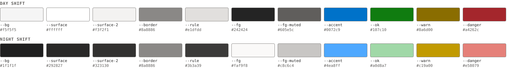
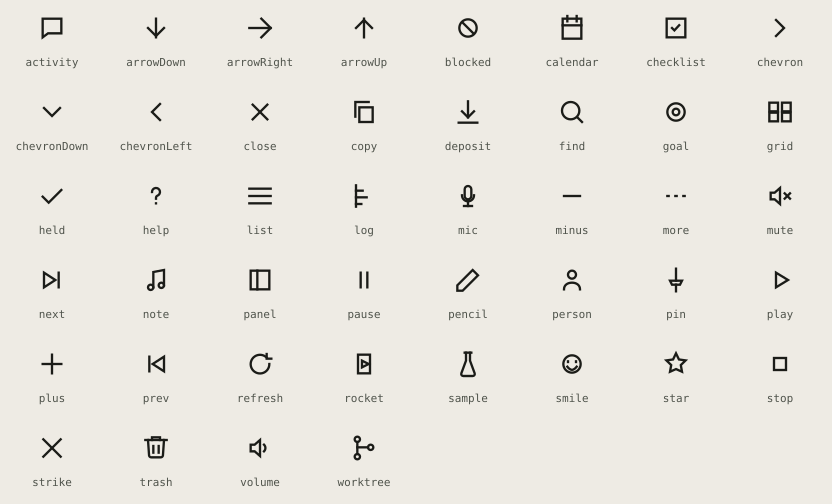
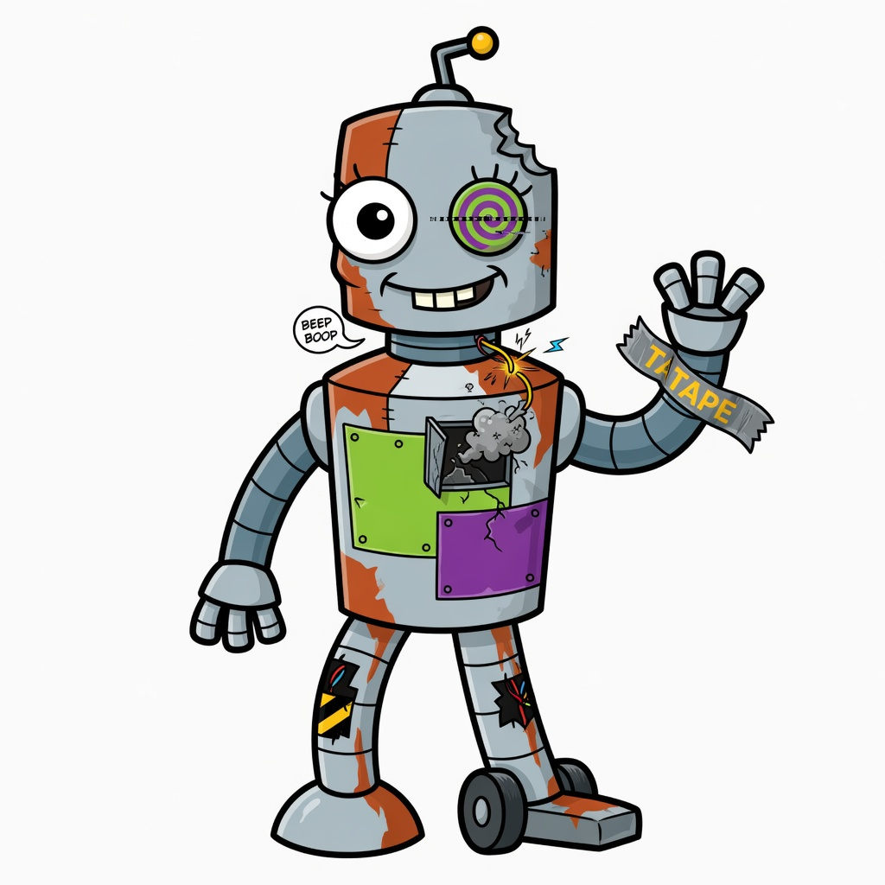

# clanker brand

<picture>
  <source media="(prefers-color-scheme: dark)" srcset="lockup-dark.svg">
  
</picture>

clanker has two registers. The product is a control cabinet: warm grey
panels, engraved labels, and signal lamps that light only when a state
deserves attention ([DESIGN.md](../../DESIGN.md) is the full system). The
project around it is the patched-up robot in the README, the one that says
*embrace the jank*. The first is how clanker looks while it works; the second
is how it introduces itself.

Everything in this directory except this page is generated by
`bun scripts/brand.ts` from the colour tokens in `ui/app/tailwind.src.css`,
the icon grid in `ui/app/core/icons.js`, and the geometry in the script. The
same run writes the web UI's favicon and masthead in `ui/app/index.html`.
`bun scripts/brand.ts --check` fails in CI when any of them is stale, so edit
the source and regenerate; never edit an SVG here by hand.

## Name

Always lowercase: `clanker`, including at the start of a sentence and in
titles. The binary, the repository, the wordmark and the web UI all use the
one spelling.

## Mark

  

A machined plate with a bezel, one lit signal lamp, and a legend strip under
it: the smallest possible panel on the cabinet. The lamp is lit in the IEC
healthy green (`--ok`), shaded the way the UI's `--lamp-dome` shades every
lamp. It works from 16px (the favicon) upwards.

- Keep the plate dark in both themes. The mark is a physical object, not a
  themed surface.
- Leave clear space of at least a quarter of the mark's width on every side.
- Do not recolour the lamp. Green means healthy; a mark in amber or red reads
  as a fault.

## Wordmark

Drawn, not typed: monoline strokes on the same grid logic as the icons, with
square caps and round bowls of one radius. There is no font to substitute.
[`wordmark.svg`](wordmark.svg) is inked for light backgrounds and
[`wordmark-dark.svg`](wordmark-dark.svg) for dark ones; the masthead copy
draws in `currentColor` and follows the theme.

| File | Use |
|---|---|
| [`lockup.svg`](lockup.svg) | mark and wordmark, light backgrounds |
| [`lockup-dark.svg`](lockup-dark.svg) | mark and wordmark, dark backgrounds |
| [`mark.svg`](mark.svg) | the mark alone: favicons, avatars, small spaces |
| [`wordmark.svg`](wordmark.svg), [`wordmark-dark.svg`](wordmark-dark.svg) | the name alone, where the mark already appears |

## Colour

Colour comes from the cabinet tokens and nowhere else. The IEC 60073 rule
from [DESIGN.md](../../DESIGN.md#colors) holds for every surface, including
this guide:

- blue (`--accent`) is operator action: links, focus, primary buttons;
- green (`--ok`) is healthy;
- amber (`--warn`) is abnormal;
- red (`--danger`) is a fault or a destructive action.

None of the four is decoration. Named themes in `themes/` change the
neutrals and the lamps' tint; the roles stay.

## Type

The system sans for prose, the system mono for measurements, code, IDs and
engraved labels. No web fonts. Labels are uppercase mono at `0.75rem` with
`0.06em` tracking; titles are sans at weight 600 with no extra tracking.

## Icons

One 24-unit grid, a 1.75 stroke, square caps and mitred joins, in
`currentColor`. The source is `ICON_PATHS` in `ui/app/core/icons.js`, which
the web UI draws from at runtime; each icon is also exported as its own file
under [`icons/`](icons/) for documents and slides.

Adding an icon: add its paths to `ICON_PATHS` with a one-line comment saying
what it depicts, run `bun scripts/brand.ts`, and commit the new file under
`icons/` with it. Draw it on the grid; never substitute an emoji or a Unicode
symbol, which paint in the platform's colours and break the shared stroke.

## Mascot

The robot belongs to the README, release notes, talks, and the REPL's opt-in
animation (`--mascot`). It never appears in the web UI chrome, in error
messages, or anywhere a user is reading state: it is personality, and the
cabinet is where the work happens.

## Voice

Say what happened, what to do next, and nothing else.

- Name the thing and the number: "3 runs failed", not "some issues occurred".
- An empty state says what is missing and how to add one, once.
- An error names the cause and the recovery, not an apology.
- No exclamation marks, no filler ("seamlessly", "robust", "leverage"), no
  em dashes.
