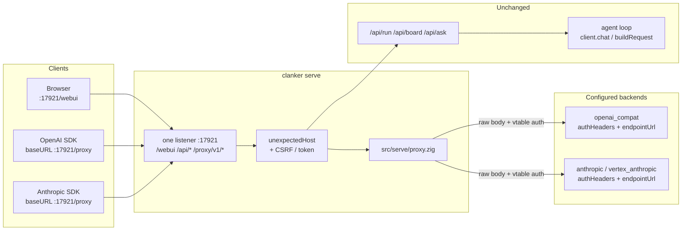
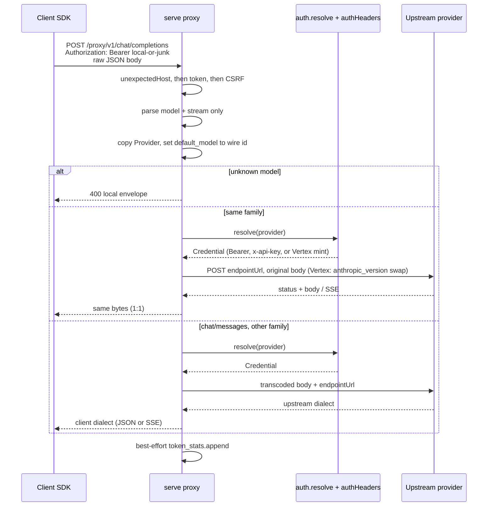

# PRD: LLM compatibility proxy on serve

| Field | Value |
|---|---|
| Number | 0026 |
| Title | LLM compatibility proxy on serve |
| Author | |
| Date | 2026-08-14 |
| Status | In progress |

## Status

In progress. The serve surface is landed and off by default. `clanker serve --proxy` mounts `/proxy/v1/*` on the web UI socket. Same-protocol requests stay 1:1; `POST /v1/chat/completions` and `POST /v1/messages` transcode when the client's family and the provider's kind differ, so an OpenAI SDK or Claude Code can spend Vertex / Anthropic / openai_compat credentials already in `[providers.*]`. Black-box `zig build e2e` for the proxy is not wired yet.

Sources of truth:

- `src/serve/proxy.zig`: route table, model lookup (including haiku/sonnet/opus fallback), 1:1 forward, local envelopes, SSE pipe
- `src/serve/proxy_transcode.zig`: OpenAI↔Anthropic request/response/SSE, Vertex `anthropic_version` body swap
- `src/cli.zig`: `cmdServe`, `resolveListen`, `handleConnection` (Host → token → CSRF → dispatch), `buildServeArgvTail`
- `src/config.zig`: `Serve`, `ServeFields`, `proxy_aliases` as `std.json.ArrayHashMap`
- `src/llm/auth.zig` `resolve`, `src/llm/providers.zig` `forKind`, each kind's `authHeaders` / `endpointUrl`
- `src/stats/tokens.zig` `append`
- `docs/README.md` Binding, `docs/configuration.md` `[serve]`

This is the inverse of `docs/cursor-api-notes.md` (Cursor is not `openai_compat`; consume it with a sidecar). The product shape matches [cursor-openai-api](https://github.com/maci0/cursor-openai-api/tree/fix/cursor-api-compatibility) (OpenAI client → foreign backend + auth) and [claude-code-proxy](https://github.com/fuergaosi233/claude-code-proxy) (Anthropic `/v1/messages` client → openai_compat backend) in one process. It does not implement Cursor's gRPC Connect protocol.

## Problem

Clients that speak the OpenAI Chat Completions API or the Anthropic Messages API cannot point at clanker today. `clanker serve` exposes a private control plane (`/api/run`, `/api/board`, `/api/ask`, …) and the agent loop talks to providers through `types.Message` plus `providers.Provider.buildRequest`. That path is a *rebuild*: it serializes a closed internal schema and drops everything it does not know.

That rebuild is the right design for the agent loop (one internal type, every kind implements a codec). It is the wrong design for a compatibility proxy. A client that sends `tools`, vision content parts, `response_format`, `stop_sequences`, `stream_options`, extra sampling fields, or any vendor key the codec has never heard of would lose those keys if the request went through `client.chat` / `client.chatStream`. Worse, the OpenAI codec *adds* fields the client never sent: `stream_options.include_usage = true` whenever `stream` is true (`src/llm/providers/openai.zig` `~L140-148`), and the Anthropic codec rewrites system text into cache-controlled blocks (`src/llm/providers/anthropic.zig` `~L124-163`). Using that path as a proxy would inject clanker's agent conventions into a third-party client's request.

The practical ask is a **unified auth proxy**: any OpenAI-compat agent (Qwen, the cursor-openai-api SDK snippet) or Anthropic-compat agent (Claude Code, `ANTHROPIC_BASE_URL`) points at this process and spends whatever `[providers.*]` the operator already configured, including Vertex Anthropic GCP minting. Same-protocol requests stay 1:1 (no injected `stream_options`, no extra system prompt). Cross-family chat/messages must transcode, or the whole point fails: an OpenAI SDK cannot POST `/v1/chat/completions` at a Vertex Claude model otherwise.

Constraints that shape the design (not just the desired outcome):

- Provider credentials stay native (ADR 0004). The proxy's job *is* attaching those credentials, so it cannot be a WASM guest.
- `serve` already has a trust model (loopback default, Host/authority check, CSRF on non-GET with Origin) and a binding convention (one `--host`, named ports per surface). The proxy has to live inside that, not next to it as a second daemon with a second host policy.
- `GET /api/providers`, `GET /api/catalog`, and `GET /api/providers/models` already are the model catalog. Discovery on `GET …/v1/models` must project that catalog, not invent a third store.
- Going through `types.Message` on the *same-protocol* path is the injection risk. That path must not call `client.chat` / `client.chatStream` / `buildRequest`. The *cross-family* path is allowed to rebuild: the two wires do not share a JSON schema.

## Goals

1. `clanker serve --proxy` (off by default) mounts the compatibility surface on the existing web UI socket at `/proxy/v1/*`, sharing `--host`, `--webui-port`, and the existing Host/authority checks. A distinct `--proxy-port` is optional and opens a second listener with `/v1/*` at the root.
2. Every official OpenAI and Anthropic `/v1/*` path is mounted. Same-protocol forwards are 1:1 (method, query, body bytes) after attaching vtable auth, with the documented `model` splice / Vertex `anthropic_version` swap. `POST /v1/chat/completions` and `POST /v1/messages` **transcode** when the client family and the provider kind differ (see Design, Unified auth). GET `…/v1/models` and GET `…/v1/models/{id}` stay local projections of the configured catalog. `POST /v1/messages/count_tokens` is answered locally with a byte-length estimate so Claude Code's probe does not 400 against an openai_compat backend.
3. Incoming client `Authorization` / `x-api-key` is never sent upstream. Upstream headers are built from a named allowlist (never copied from the inbound set) plus `auth.resolve` / Vertex minting (see Design, Upstream headers).
4. `GET …/v1/models` lists **every** configured model on both official envelopes (`anthropic-version` only picks the JSON shape). No third catalog. An OpenAI SDK can pick a Vertex Claude id.
5. Same-protocol streaming is a byte-faithful SSE pipe (`headers.accept_encoding = .omit`). Cross-family streaming rewrites events (`OpenaiStream` / `AnthropicStream` in `proxy_transcode.zig`) so each client sees its own SSE dialect. No `client.fetch`. No `client.chat` / `chatStream`.
6. Non-chat routes (embeddings, files, audio, …) still refuse a family mismatch with `400`. Chat/messages never do: that is the unified-auth path.
7. An optional local proxy token (`[serve].proxy_token_env`) can be required so a LAN bind is not an open relay of the operator's provider keys.
8. Agent loop, web UI `/api/*`, A2A, chat, board, and `clanker run` keep their routes and behaviour. Existing `/api/*` is not moved. On the shared socket, path isolation is the `/proxy/v1` prefix. On an optional dedicated port, `/api/*` is not mounted.
9. Proxy completions are recorded in `state/token_stats.jsonl` at the existing choke-point shape (`src/stats/tokens.zig` `Record`) without rewriting the body or the response.

## Non-goals

- A new `clanker proxy` daemon or subcommand. One process, one `--host`, a named port. A second binary would fork the Host/CSRF/hot-reload policy that `cmdServe` already owns.
- Calling `client.chat` / `chatStream` on any proxy path (those retry, accumulate SSE, and record usage for the agent loop). Same-protocol forwards stay raw HTTP. Cross-family chat uses `proxy_transcode.zig` plus `anthropic.buildBody` / `openai.buildRequest` / `parseResponse` / `parseStreamEvent` only, never the client retry loop.
- Transcoding non-chat routes (embeddings, files, audio, images, batches). Those stay same-family 1:1 or `400`.
- Inventing clanker's system prompt, tool catalog, or `agent.tool_catalog` hot-tool subset. Transcode maps the *client's* tools and messages, nothing extra.
- Implementing Cursor's gRPC Connect / protobuf `AgentService/Run` inside clanker. `docs/cursor-api-notes.md` still holds: Cursor is not `openai_compat`. Compatibility here means an OpenAI SDK (including a process that currently points at cursor-openai-api) can point `baseURL` at this proxy.
- Copying agave's inference, KV cache, conversations, web chat UI (`POST /v1/chat`), tokenize/detokenize, embeddings stub, or `system_fingerprint: agave-v…`. Agave *is* the model. Clanker *forwards*.
- Agave-only paths (`/v1/chat`, `/v1/conversations` as agave's own store, `/v1/tokenize`, `/v1/detokenize`, `/v1/kv_cache`). Those are inference-server features, not OpenAI/Anthropic. OpenAI's own `/v1/conversations` (the Responses-adjacent resource) *is* forwarded.
- WebSocket / WebRTC Realtime (`Upgrade: websocket` on `/v1/realtime`). HTTP 1:1 cannot carry a socket upgrade. Local `501` with `unknown_endpoint`.
- OpenAI Administration / org-management hosts that are not `api.openai.com/v1/…` (a different origin). A client that hits `/v1/organization/…` on this proxy is forwarded to the configured `openai_compat` base; if that host is not OpenAI, upstream 404s.
- CORS `Access-Control-Allow-Origin`. Same as serve today: no CORS. A browser on another origin uses a reverse proxy if it must.
- Rate limiting, request queues, or per-client quotas. A 64-connection cap already exists process-wide (`max_connection_threads` in `src/cli.zig`).
- Extracting all of `cmdServe` / `handleConnection` out of `cli.zig`. The proxy is a new file under `src/serve/`; the accept loop stays where it is until a later split.
- Changing how the agent loop, web UI, or `ck_llm` talk to providers.

## Design

**Why this stays native.** AGENTS.md says anything that can be a WASM tool must be one, and native `src/` needs a reason. The reason is the same one ADR 0004 already recorded for the provider vtable: the proxy attaches provider credentials (`auth.resolve`, Vertex `mint`, `api_key_env`) and speaks raw HTTP on the serve socket. Handing either to a guest inverts the sandbox (`env_allow` exists so a tool that declares nothing does *not* see `*_API_KEY`). `ck_llm` is the outbound guest path (a tool asks the host to call a model). This is the inbound HTTP path (a client asks clanker to call a model with the operator's key). They are opposite directions of the same trust boundary, and both stay in the harness.

**Surface and flags.** Attach to `clanker serve`, do not add `clanker proxy`. Flags:

| Flag | Config | Env | Default | Meaning |
|---|---|---|---|---|
| `--proxy` | `[serve].proxy` | (none) | `false` | Enable the proxy surface |
| `--no-proxy` | (forces off) | (none) | (flag absent) | Disable the surface even if the file or env enabled it |
| `--proxy-port <port>` | `[serve].proxy_port` | `CLANKER_PROXY_PORT` | unset (same socket as `--webui-port`) | Optional distinct port. Unset or equal to `webui_port`: shared socket, `/proxy/v1/*`. A *different* usable port: second listener, `/v1/*` at the root |
| (none) | `[serve].proxy_token_env` | the named var (e.g. `CLANKER_PROXY_TOKEN`) | unset | Optional local token |
| (none) | `[serve].proxy_aliases` | (none) | empty | Optional `client_name = "provider/id"` map |

`--proxy` enables the surface on the web UI socket at `/proxy/v1/*`. `--proxy-port` without `--proxy` still enables it (setting a port is intent to listen). `CLANKER_PROXY_PORT` is the same intent: a usable 16-bit port (not `0`) enables the surface and, if it differs from `webui_port`, opens the second listener. A malformed value or `0` warns and is ignored, matching `CLANKER_WEBUI_PORT` (`src/cli.zig` `~L4343-4351`). A config that only sets `proxy_port` does **not** enable it: file-level `proxy` stays the switch.

`Options.proxy` is `?bool` (`null` = flag absent), the same "absent vs set" split `webui_port` already uses (`src/config.zig` `~L370-374`, `src/cli.zig` `~L170-172`). `--proxy` stores `true`, `--no-proxy` stores `false`. A one-off `clanker serve --no-proxy` on a box whose `config.local.toml` has `proxy = true` drops the surface. If both `--proxy` and `--no-proxy` appear, the last one on the command line wins. `--no-proxy` wins over `--proxy-port` / `CLANKER_PROXY_PORT` when `Options.proxy == false`.

Resolution order matches `resolveListen` today (`src/cli.zig` `~L4323-4365`):

```
[serve]  <  CLANKER_HOST / CLANKER_WEBUI_PORT / CLANKER_PROXY_PORT  <  flags
```

`--host` remains the one interface. `Serve` already documents this exact future (`src/config.zig` `~L376-383`): a second surface adds a *port* next to `webui_port`, not a second host.

`parseServe` grows the new keys in `warnUnknownKeys` and returns a `ServeFields` presence mask, the same pattern as `AgentFields` (`src/config.zig` `~L267-292`) and `ModulesFields` (`~L453-474`). `host` / `webui_port` / `proxy_port` / `proxy_token_env` stay optional, so "unset" is distinguishable from a written value and merge can keep copying them only when `!= null`. `proxy` is a real `bool = false`, so absent and `false` look identical after parse. Merge must **not** copy `proxy` whenever `serve_present` is true: a `config.local.toml` that only sets `host` would then turn off a base `proxy = true`. Track `ServeFields.proxy` (and `proxy_aliases`, which is not optional) and apply them only when the local file named the key. `proxy = false` in the local file then disables; omitting the key does not. That is the opposite of "absent and false are the same in toml" for merge purposes.

`proxy_aliases` follows `serve_as` once presence says the table was named: the local table **replaces** the base table rather than unioning keys. A local file that wants to keep a base alias must repeat it. `config.toml` comments the new keys next to the existing `[serve]` block; they stay commented so a stock file does not flip the surface on.

**One socket by default. A second socket only when `--proxy-port` differs.** Today serve "opens exactly one socket" (`docs/README.md` `~L1033`, `docs/configuration.md` `~L251`). `--proxy` keeps that true. Isolation on the shared socket is a path prefix, not a second port: the compatibility surface lives at `/proxy/v1/*` so an SDK `baseURL` of `http://127.0.0.1:17921/proxy` concatenates `/v1/chat/completions` onto `/proxy/v1/chat/completions` and never sits on `/api/run`. Existing `/api/*` is not moved and is not aliased.

`Connection.surface` is a three-value tag:

```zig
pub const Surface = enum { webui, proxy, both };
```

- `--proxy` and `proxy_port` unset or equal to `webui_port`: one socket, `surface = .both`. Dispatch `/proxy/v1/*` to the proxy and everything else as today. Do **not** also mount `/v1/*` on this socket (one prefix, no alias).
- `--proxy-port` set to a *different* port: a second `IpAddress.listen` on the same host. Dedicated accept thread, `surface = .proxy`. That listener serves `/v1/*` at the root plus `/health/live` and `/health/ready`. It 404s `/api/*`, `/webui`, and `/proxy/v1/*`. The web UI listener stays `surface = .webui` and does not mount `/proxy/v1` (the dedicated origin is the proxy). Operators who want a pure OpenAI/Anthropic origin use this.

`max_connection_threads = 64` stays process-wide. Of those 64, `webui_reserved_slots = 8` are held back from `surface = .proxy` accepts only when the second listener exists: `serveConnection` returns the existing `503` when a `.proxy` connection would leave fewer than 8 slots for `.webui` / `.both`. On the default shared socket (`surface = .both`) the full 64 is shared; a `/proxy/v1` flood can 503 the UI, which is the operator's choice for the one-port install.

`buildServeArgvTail` (`src/cli.zig` `~L3412`) must replay `--proxy` / `--no-proxy` and `--proxy-port` (when set) on hot reload, the same way it already pins `--host`, `--webui-port`, and `--serve-as`. A reload that dropped `--proxy` would silently close the surface. A reload that dropped `--no-proxy` would silently reopen it.

Startup log when `--proxy` is on and no distinct port:

```
serve listening on 127.0.0.1:17921
serve proxy at http://127.0.0.1:17921/proxy/v1
http://127.0.0.1:17921/webui
```

When `--proxy-port` is a different port, also log `serve proxy listening on 127.0.0.1:<proxy-port>`.

If the bind host is not loopback and `proxy_token_env` is unset, log a warning: the proxy is an unauthenticated relay of every configured provider key.

**Trust model, reused not forked.** `handleConnection` today runs `unexpectedHost` then `crossOriginRequest` on every non-GET/HEAD *before* any route dispatch (`src/cli.zig` `~L4603-4616`). Token-skips-CSRF cannot live only inside `proxy.handle`: CSRF would already have returned 403. The accept-path order becomes:

1. **Host** (`unexpectedHost` with *that listener's port* and the same `serve_as_hosts`). Fail: existing `421` serve JSON `{"ok":false,"error":"invalid host"}`. No agave envelope here (the check runs before we know we will mint one).
2. **Proxy token**, only when `isProxyPath(path, surface)` and `proxy_token_env` is configured. Implemented as `proxy.authorize(headers_raw, expected)` called from `handleConnection`, not from `handle`. Missing or wrong: `401` with the route's agave envelope (`code: invalid_api_key`). Applies to `GET …/v1/models` as well as the POST routes. Valid: mark the request authorized and skip step 3.
3. **CSRF** (`crossOriginRequest`) on non-GET/HEAD, only when step 2 did not authorize. Fail: existing `403` serve JSON `{"ok":false,"error":"cross-origin request refused"}`. An OpenAI/Anthropic SDK (curl, Node, Python) sends no `Origin` and is let through, same as `/api/run` today. A browser that sends a foreign `Origin` *and* a valid token passes because the secret is the CSRF defense, matching how agave treats `--api-key`.
4. **Dispatch** (`proxy.handle` on `/proxy/v1/*` when `surface` is `.both`, or on `/v1/*` when `surface` is `.proxy`). Strip the `/proxy` prefix before the route table so `handle` always sees `/v1/…`.

When no token is configured, any inbound Bearer / `x-api-key` is discarded (not forwarded, not checked). That is what lets `new OpenAI({ apiKey: "anything", baseURL: "http://127.0.0.1:17921/proxy" })` work on loopback, the same pattern cursor-openai-api documents.

Accept-path errors that fire before dispatch (413 body too large at `~L4569-4571`, 421 Host, 403 CSRF, 503 connection cap at `serveConnection` `~L4480-4484`) keep today's serve JSON. `proxy.handle` is the only place that mints agave envelopes. Do not promise the other shape for the accept path unless a later change actually branches those `respond` calls on `surface`.



**Route table (proxy surface).** After stripping `/proxy` on `surface = .both`, the table is the same on both sockets. Local errors use agave's envelopes (see Error envelopes). Upstream responses are passed through.

| Method | Path after strip | Shared socket (`:17921`) | Dedicated `--proxy-port` |
|---|---|---|---|
| `GET` | `/v1/models`, `/v1/models/{id}` | local catalog (OpenAI or Anthropic envelope) | same |
| `POST` | `/v1/chat/completions`, `/v1/messages` | 1:1 if families match; transcode if they differ | same |
| `POST` | `/v1/messages/count_tokens` | local `{input_tokens}` estimate (Claude Code probe) | same |
| any | other `/v1/<rest>` | 1:1 forward to a same-family backend | same |
| `GET` | `/health/live`, `/health/ready` | Existing web UI handlers | Same handlers, so a probe does not need the control-plane port. GET only. A POST still falls through to the existing generic 404 (`src/cli.zig` `~L4672-4675`); health is not a "known proxy path" for `405`. |
| any | `/v1/realtime` with `Upgrade: websocket` | `501 unknown_endpoint` (not an HTTP resource) | same |
| other | (any) | existing `/api/*` / `/webui` / 404 | `404`, including `/api/*`, `/webui`, and `/proxy/v1/*` |
| wrong method on `GET /v1/models` | (local catalog) | `405` + `Allow: GET` | same |

On the shared socket, `/v1/…` (no `/proxy` prefix) is **not** a proxy route. It 404s like any unknown path. That is the isolation: an SDK pointed at `http://127.0.0.1:17921/v1` misses on purpose.

Catch-all, not a closed list. New official `/v1/…` resources (an OpenAI `/v1/videos` or an Anthropic `/v1/skills`) work the day the backend ships them, because the proxy never has to name them. Agave-only paths (`/v1/tokenize`, `/v1/kv_cache`) 404 at the backend if a client hits them; we do not special-case them.

**Protocol family.** The inbound path (after the `/proxy` strip) picks the family first; the `anthropic-version` header breaks ties on shared paths:

- Anthropic-only prefixes: `/v1/messages`, `/v1/complete`, `/v1/skills`, `/v1/agents`, `/v1/sessions`, `/v1/environments`. Always Anthropic (or `vertex_anthropic` for `/v1/messages` only).
- Shared: `/v1/models`, `/v1/files`. `anthropic-version` present → Anthropic; absent → OpenAI.
- Everything else under `/v1/` is OpenAI (`/chat/completions`, `/completions`, `/responses`, `/embeddings`, `/audio/*`, `/images/*`, `/moderations`, `/batches`, `/fine_tuning/*`, `/vector_stores/*`, `/assistants`, `/threads`, `/conversations`, `/evals`, `/videos`, `/uploads`, `/containers`, …).

On **chat/messages**, family is the *client* dialect, not a filter on which provider may be chosen. Lookup is across every configured provider; if the provider's kind differs from the client family, `src/serve/proxy_transcode.zig` rebuilds the body and the SSE. `vertex_anthropic` only has a Vertex URL for chat/messages (`:rawPredict` / `:streamRawPredict`). Any other Anthropic path resolved to a Vertex provider is `400 unknown_endpoint`.

**Unified auth (the whole point).** Two faces, one process:

| Client (like) | Inbound | Backend example |
|---|---|---|
| [cursor-openai-api](https://github.com/maci0/cursor-openai-api/tree/fix/cursor-api-compatibility) | OpenAI `POST /v1/chat/completions` | `vertex_anthropic`, `anthropic`, or `openai_compat` |
| [claude-code-proxy](https://github.com/fuergaosi233/claude-code-proxy) | Anthropic `POST /v1/messages` | `openai_compat` (Qwen, Ollama, OpenAI) or Vertex/Anthropic |

Same-protocol stays 1:1. Cross-family chat:

1. Parse the client body into `types.Message` / tools / sampling (`proxy_transcode.zig`).
2. Build the upstream body with `anthropic.buildBody` (Vertex: `anthropic_version = vertex-2023-10-16`, no `model`) or `openai.buildRequest`.
3. URL from `endpointUrl` on the copied `Provider` (Vertex `:rawPredict` / `:streamRawPredict` from the inbound `stream` flag).
4. Auth from `auth.resolve` + vtable `authHeaders` (GCP mint, Anthropic OAuth beta, Bearer, `x-api-key`).
5. Non-stream: `parseResponse` then `openaiCompletion` / `anthropicMessage`.
6. Stream: `parseStreamEvent` then `OpenaiStream` / `AnthropicStream` (OpenAI `data:` chunks + `[DONE]`, or Anthropic `event: message_start` / `content_block_*` / `message_stop`).

Unknown keys that have no counterpart on the other wire are dropped. That is unavoidable and is why same-protocol is still 1:1.

**1:1 forward (same family).** For every `/v1/*` that is not the local models catalog and does not need transcode, the proxy:

1. Reads the raw body bytes already buffered by `handleConnection` (same `rawhttp.max_body_bytes` cap, 24 MiB). A 413 at this layer is the existing serve JSON (see Trust model). Multipart (audio transcriptions, image edits, file uploads) is forwarded as-is: `Content-Type` including the boundary is allowlisted.
2. If the body is JSON, parses *only* enough to read `model` (optional string) and `stream` (optional). If `stream` is absent, treat it as `false` unless `Accept` is `text/event-stream` or the path ends in `/events/stream`. If `stream` is present and is not a JSON bool (`"true"`, `1`, an object, …): `400 malformed_request`, no upstream call. The parse is a read. The bytes that go upstream are the bytes that arrived, except the one `model` rewrite below. Non-JSON bodies (multipart, empty GET/DELETE) skip the parse.
3. Resolves the provider (Model routing). A JSON `model` uses the lookup below. A request with no `model` (GET/DELETE, list, files, multipart without a JSON body) uses the unique configured provider of that family, or `400 missing_required_parameter` if more than one provider speaks it. On mismatch or unknown model, returns a local `400` and does not contact upstream. The inbound method (GET/POST/PUT/PATCH/DELETE/HEAD) and query string are preserved on the upstream request.
4. Builds upstream headers from scratch (see **Upstream headers**). Never copies the inbound header set.
5. Builds the upstream URL from the vtable, not by appending the inbound path. The `Provider` passed in is the *copy* from Model routing, so `endpointUrl` sees the requested wire id:
   - `openai_compat`: `endpointUrl(..., streaming=false)` which is `joinBaseAndPath` + `/chat/completions` or `provider.path` (`src/llm/providers/openai.zig` `~L33-37`). Blindly appending `/v1/chat/completions` would double `/v1` on a `base_url` that already ends in `/v1`.
   - `anthropic`: `endpointUrl` → `/v1/messages` or `provider.path`.
   - `vertex_anthropic`: `endpointUrl(..., streaming)` so `:rawPredict` vs `:streamRawPredict` is chosen by the inbound `stream` flag, not by rewriting the body (`src/llm/providers/vertex.zig` `~L55-69`).
6. Issues the inbound method with `std.http.Client.request` + `receiveHead` for **both** stream and non-stream. Do not call `client.fetch` (it buffers into `resp_cap` = 8 MiB, `src/llm/client.zig` `~L124-125`, `~L441-462`, and cannot be an unbounded SSE pipe). Do not call `client.chat` / `chatStream`.
7. Writes the inbound HTTP response as specified under **Inbound response framing**. Same-protocol `stream: true` is a raw SSE pipe: if the upstream sent `[DONE]`, the client sees `[DONE]`; Anthropic events stay Anthropic. Cross-family stream rewrites as above. `respond()` is not used for a successful forward.
8. Does **not** run `client.zig`'s `max_attempts = 3` retry loop. Completions are not idempotent. A `429`/`5xx` is forwarded. The caller retries if they want.

**Upstream headers.** Built from an allowlist, never by subtracting names from the inbound set. A denylist would leak `Host`, `Content-Length`, `Transfer-Encoding`, `Connection`, `Accept-Encoding`, `Cookie` variants, `Proxy-Authorization`, and `x-stainless-*` onto the provider request.

Allowlist, in order:

| Header | Source |
|---|---|
| `Content-Type` | Client value if present, else `application/json` |
| `Accept` | Client value if present, else omitted |
| `User-Agent` | Client value if present, else `clanker/` + `build_options.version` (same string `client.zig` `~L19-22` uses) |
| `Authorization` / `x-api-key` | Only from `auth.resolve` + the vtable, never from the client |
| `anthropic-version` | Client value if present, else the vtable default `2023-06-01` (`anthropic.zig` `~L79-80`) on Anthropic-family requests |
| `anthropic-beta` | Merge (see below) |
| `openai-organization`, `openai-project`, `openai-beta`, `x-client-request-id` | Client value if present, else omitted |

Never sent upstream: `Authorization` (client's), `x-api-key` (client's), `Cookie`, `Cookie2`, `Proxy-Authorization`, `Host`, `Content-Length`, `Transfer-Encoding`, `Connection`, `Keep-Alive`, `Upgrade`, `TE`, `Trailer`, `Proxy-Connection`, and every other inbound header not in the allowlist.

Leaving `Accept-Encoding` out of `extra_headers` is **not** enough. Zig 0.16 `std.http.Client.Request.Headers.accept_encoding` defaults to `.default` (`lib/std/http/Client.zig` L850), and `.default` emits `accept-encoding: gzip, deflate` (L831-837, L1041-1053). `chatStream` already hits this (`src/llm/client.zig` `~L549-552`, `~L589-592`) and has to decompress. The proxy must set `headers.accept_encoding = .omit` on the `Request.Headers` value passed to `client.request` (Zig 0.16 `Request.Headers.Value`). Keep it out of `extra_headers` too. If the proxy advertised gzip and still copied `Content-Encoding: gzip`, SDKs would double-decode. If it advertised gzip and forwarded compressed bytes as identity, SDKs would see binary. Forcing identity is the one non-1:1 *header* choice that makes the *body* 1:1. The PR 3 mock assertion is: captured upstream request has no `Accept-Encoding` (the field is `.omit`, not merely missing from `extra_headers`), and the inbound response has no `Content-Encoding: gzip` even if the mock would gzip when asked.

`anthropic-beta` is merged, not replaced. Anthropic accepts a single comma-separated header. `authHeaders` on the OAuth path already spends a slot on `oauth-2025-04-20` (`anthropic.zig` `~L72-75`); dropping it makes the token fail, and replacing a client `prompt-caching-…` / `computer-use-…` beta is injection-by-omission. Union the client betas with `oauth-2025-04-20` when the resolved strategy is `oauth_static` or `oauth_refresh`. De-dupe. On the api_key path, forward the client beta list as-is (or omit if the client sent none).

`authHeaders` is capacity-bound: `max_extra_headers = 2` (`src/llm/providers/api.zig` `~L36-40`). Anthropic's api_key path already fills both slots (`x-api-key` + `anthropic-version`). The proxy must **not** widen `ExtraHeaders` (the agent path stays at 2). It allocates its own extra-header buffer (8 slots) in `proxy.zig`. It may call `impl.authHeaders` into a scratch `ExtraHeaders` and copy the result, then overlay `anthropic-version` / `anthropic-beta` per the merge rules.

**Inbound response framing.**

- Copy upstream status and `Content-Type` (default `application/json` if the provider omitted it).
- Always set `X-Content-Type-Options: nosniff` and `X-Request-ID` (serve already does this on `respond`).
- Do not copy `Content-Encoding` or `Transfer-Encoding`. We frame the inbound response ourselves and we did not ask for gzip.
- `stream: true`, same family: no `Content-Length`, `Connection: close`, write body chunks as they arrive. Cap the *accumulated* stream at `rawhttp.max_body_bytes` (24 MiB). A missing `[DONE]` is preserved.
- `stream: true`, cross-family: same framing, but each upstream SSE payload is parsed and rewritten (`OpenaiStream` / `AnthropicStream`). OpenAI clients get `[DONE]` when the Anthropic stream ends. Anthropic clients get `message_stop` when the OpenAI stream ends.
- `stream: false`: read the upstream body into a buffer capped at 24 MiB (same inbound cap, not `resp_cap`'s 8 MiB), then send `Content-Length` and `Connection: close`. Over the cap: local `502` agave envelope, no partial body.
- On inbound client close or a write error mid-pipe: cancel the upstream request (`client.Abort.trigger`, `shutdown(2)`) and release the connection slot. Do not wait for the provider to finish.

**Upstream deadlines.** `std.http.Client` has no working read timeout (`ConnectTcpOptions.timeout` is declared and unused; `client.zig` `~L32-43`). A silent upstream plus a few streaming POSTs occupies every slot and 503s `/api/run` / `/health/ready`. The proxy owns a deadline thread per forward. One number for "no bytes either direction" is wrong: it conflates connect, time-to-first-byte, and inter-chunk idle. The agent loop has no idle cap on `chatStream`. `agent.ask_timeout_seconds` is 120s and is only the browser-confirm wait (`src/config.zig` `~L233`). `provider_check_timeout_seconds = 10` is a ping, not a completion. A 60s cap on first byte would 504 a correct `stream: true` request to a thinking model (Goal 5).

Split the three clocks:

| Clock | Default | Config | What it covers |
|---|---|---|---|
| Connect | 10s | (constant, same as `provider_check_timeout_seconds`) | TCP/TLS handshake only |
| First byte | 300s | `[serve].proxy_first_byte_timeout_s` (`?u32`, `0` = no ceiling) | After the request is flushed, until the first upstream body byte (reasoning / long-context prefills) |
| Inter-chunk idle | 60s | `[serve].proxy_idle_timeout_s` (`?u32`, `0` = no ceiling) | After the first byte, gap between subsequent reads. A stalled mid-stream, not a thinking pause |

On fire: `Abort.trigger`. Local `504` agave envelope if no status line has been written yet; if headers already went to the client, just close.

**Arming `Abort`.** `trigger` is `pub` (`src/llm/client.zig` `~L86-101`). `arm` and `disarm` are file-private (`fn`, `~L69-81`). `trigger` on an unarmed handle is a no-op (`self.client orelse return`). Only `chat` / `chatStream` call `arm` today (`~L216-217`, `~L516-517`). The proxy must not copy the `connection_pool.used` shutdown loop. PR 3 makes `Abort.arm` and `Abort.disarm` public and lists `src/llm/client.zig`. The proxy uses the same arm / disarm / `defer` order as `chat`, so a timeout thread cannot `trigger` after `client.deinit`:

```zig
var http_client: std.http.Client = .{ .allocator = gpa, .io = io };
defer http_client.deinit();
// LIFO: disarm runs *before* deinit. disarm takes Abort.mutex, so it
// blocks until an in-flight trigger finishes with this client.
var abort: client.Abort = .{};
abort.arm(io, &http_client);
defer abort.disarm(io);
```

The deadline thread and the inbound-close path both call `abort.trigger(io)` only. A mock that accepts and never writes must fail by the first-byte budget (default 300s in production; tests pass a short override), not hang `zig build test`. A mock that writes its first byte at T+90s must succeed under the default first-byte budget.



What this deliberately does *not* do, with the code that would have done it:

| Temptation | Where it lives today | Why the proxy skips it |
|---|---|---|
| Rebuild a *same-protocol* body from `types.Message` | `openai.buildRequest`, `anthropic.buildBody` | Drops unknown keys; that path is 1:1. Cross-family chat *does* rebuild, in `proxy_transcode.zig`. |
| Add `stream_options.include_usage` on a 1:1 OpenAI forward | `openai.zig` `~L140-148` | Client did not send it |
| Call `client.chat` / `chatStream` | `src/llm/client.zig` | Retries and accumulates; not a proxy |
| Inject clanker's tool catalog or system prompt | agent loop | The proxy is not the agent |
| Buffer the whole response with `client.fetch` | `doFetch` / `resp_cap` 8 MiB | Not a pipe; silently truncates; cannot stream |
| Retry three times | `client.zig` `max_attempts = 3` | Doubles billable completions |

**Model routing.** The inbound `model` string maps onto `[models."<provider>/<id>"]` after `distributeModels` has filed each entry into `Provider.models`. On chat/messages, lookup is across **every** configured provider (no family filter). On other routes, lookup is family-filtered and a kind mismatch is still `400`. Order:

1. **Unique wire id.** Exactly one configured model has `id == model` (under the filter, if any).
2. **Composite `provider/id`.** Same rule `Config.resolveProvider` already uses for `--model zai/glm-5.2`. Empty `models` map (ollama) accepts the tail as a live id.
3. **Exact `[serve].proxy_aliases` key.** `client_facing_name = "provider/id"`.
4. **Claude Code size fallback** (chat/messages only). If the name contains `haiku` / `sonnet` / `opus` (case-insensitive), try aliases `haiku`/`small`, `sonnet`/`middle`, `opus`/`big`, then the unique configured provider if there is exactly one. Same idea as claude-code-proxy's `SMALL_MODEL` / `MIDDLE_MODEL` / `BIG_MODEL`.
5. Else `400` (`code: model_not_found`).

**After every successful lookup, copy the `Provider` and set `default_model` to the resolved wire id on that copy.** This is the `resolveProvider` pattern (`src/config.zig` `~L571-573`). `cmdServe` documents that config is immutable for the server lifetime (`src/cli.zig` `~L4394-4398`); mutating `cfg.providers` in place would race every other connection. `vertex_anthropic.endpointUrl` embeds `p.activeModelName()` in the path (`src/llm/providers/vertex.zig` `~L55-69`), and `activeModelName` is just `default_model` (`src/config.zig` `~L143-145`). A unique-wire-id hit that "used that provider" without this copy would call the configured default model regardless of the client's `model`. The same copy is what `totalCost` and `auth.resolve` see. Unit-test: a `vertex_anthropic` provider whose default is `claude-opus-4-6` and whose request asks for another configured id must produce a captured upstream URL containing the requested id.

**Body mutations, in order of how much they rewrite.**

- Same family, wire id already correct: bit-identical.
- Same family, composite or alias: splice only the top-level JSON `model` string.
- Same family, `vertex_anthropic` on `/v1/messages`: drop `model`, set `anthropic_version` to `vertex-2023-10-16`, keep every other key (`rewriteVertexBody`).
- Cross-family chat/messages: full rebuild in `proxy_transcode.zig`.

Two providers sharing a wire id (`gpt-4o` on both `openai` and `openrouter`) are not unique under (1). Clients must send `openai/gpt-4o` or an alias. Discovery advertises the composite in that case so `GET /v1/models` never returns an ambiguous id.

**Model discovery.** `GET /v1/models` does not call upstream and does not invent a store. It projects `cfg.providers` / `Provider.models`, the same data `handleProviders` (`src/cli.zig` `~L7187`) already JSON-encodes for the web UI.

Both official clients use the path `GET /v1/models` and expect different envelopes. Discriminate on the inbound `anthropic-version` header (the Anthropic SDK always sends it; the OpenAI SDK never does):

- **No `anthropic-version`:** OpenAI list envelope, **every** configured model (including Vertex Claude).
- **`anthropic-version` present:** Anthropic list envelope, **every** configured model.

```json
{"object":"list","data":[
  {"id":"kimi-k3","object":"model","created":0,"owned_by":"kimi-k3"},
  {"id":"claude-sonnet-4","object":"model","created":0,"owned_by":"vertex"}
]}
```

Anthropic envelope (header present):

```json
{"data":[
  {"id":"claude-sonnet-4","type":"model","display_name":"Claude Sonnet 4","created_at":"1970-01-01T00:00:00Z"}
],"has_more":false}
```

`id` is the advertised string from Model routing (wire id if unique across all providers, else `provider/id`). `display_name` / `owned_by` come from `Model.display` or the provider name. `created` / `created_at` are zeros: we do not have a provision time and will not mint a fake one from the wall clock on every request (that would make ETags and client caches lie).

`GET /api/catalog` (models.dev search) and `GET /api/providers/models` (live upstream `/models`) stay on the web UI port. The proxy does not call them. A provider with an empty `models` map (live ollama) appears on `/v1/models` only if we choose to hit its `/models` the way `writeLiveModels` does. **Decision:** do not. Live listing belongs on `/api/providers/models`. `/v1/models` is the configured set, deterministic, offline, and the same source `--model` already accepts. An ollama user who wants those ids on the proxy adds `[models."ollama/<id>"]` rows, or a `proxy_aliases` entry.

**Vertex.** `vertex_anthropic` addresses the model in the URL and wants `anthropic_version` in the body instead of `model`. The proxy always uses `endpointUrl` on the copied `Provider` so the URL names the requested id. An Anthropic-client body is rewritten with `rewriteVertexBody` (drop `model`, set `anthropic_version = vertex-2023-10-16`). An OpenAI-client body is transcoded through `openaiToAnthropic(..., vertex_body=true)`. Vertex models appear on both `GET …/v1/models` envelopes.

**Error envelopes.** Two layers, two shapes. Do not mix them.

**(a) `proxy.handle` and `proxy.authorize` mint agave envelopes** so an SDK's error parser works. Upstream error *bodies* still pass through with their status; these codes are for failures that never leave the process, or for the 401 token check.

OpenAI (every local error except on `/v1/messages`, and on `GET /v1/models` without `anthropic-version`):

```json
{"error":{"message":"Unknown model 'foo' for POST /v1/chat/completions","type":"invalid_request_error","param":"model","code":"model_not_found"}}
```

Anthropic (`/v1/messages`, and `GET /v1/models` with `anthropic-version`):

```json
{"type":"error","error":{"type":"invalid_request_error","message":"Unknown model 'foo' for POST /v1/messages"}}
```

Codes minted here, stable:

| code | when |
|---|---|
| `missing_required_parameter` | no `model`, or `model` is not a string |
| `model_not_found` | lookup failed |
| `protocol_mismatch` | non-chat route whose kind does not speak that family |
| `invalid_api_key` | proxy token configured and missing/wrong (`GET /v1/models` included) |
| `unknown_endpoint` | `/v1/*` we do not serve |
| `method_not_allowed` | known `/v1/*` path, wrong verb (`405` + `Allow`) |
| `malformed_request` | body is not JSON, or `stream` is present and not a JSON bool |
| (none, status `502`) | upstream connect/TLS failure |
| (none, status `504`) | connect, first-byte, or inter-chunk idle timeout, no status line written yet |

**(b) The accept path keeps today's serve JSON.** `unexpectedHost` is `421` `{"ok":false,"error":"invalid host"}`. Body-too-large is `413` `{"ok":false,"error":"request body too large"}`. CSRF is `403` `{"ok":false,"error":"cross-origin request refused"}`. The 64-connection cap is `503` `{"ok":false,"error":"too many concurrent connections"}`. These fire before `proxy.handle`. This PRD does not rewrite them into agave envelopes.

**cursor-openai-api as a client.** That project's documented SDK snippet is:

```javascript
const client = new OpenAI({
  apiKey: "cursor",
  baseURL: "http://127.0.0.1:17921/proxy",
})
await client.chat.completions.create({
  model: "kimi-k3",
  messages: [{ role: "user", content: "Hello" }],
  stream: true,
  tools: [/* ... */],
})
```

The SDK appends `/v1/chat/completions` onto `baseURL`, so the request hits `POST /proxy/v1/chat/completions`. On a dedicated `--proxy-port`, `baseURL` is `http://127.0.0.1:<port>/v1`. `model` may be an openai_compat wire id **or** a Vertex/Anthropic id; the latter transcodes. We do not implement Cursor's Connect/protobuf backend.

**claude-code-proxy as a client.**

```sh
clanker serve --proxy
ANTHROPIC_BASE_URL=http://127.0.0.1:17921/proxy ANTHROPIC_API_KEY=x claude
```

Claude Code still sends `claude-…sonnet…` / haiku / opus. Map those with `[serve.proxy_aliases]` (`sonnet = "kimi-k3/kimi-k3"`, or `sonnet = "vertex/claude-sonnet-4"`). Stream comes back as Anthropic `event:` frames, not OpenAI chunks. `POST /v1/messages/count_tokens` is a local estimate.

**Reuse from agave vs stay clanker-native.**

Reuse (protocol surface only):

- Endpoint names: `POST /v1/chat/completions`, `POST /v1/messages`, `GET /v1/models`
- OpenAI and Anthropic error envelopes (above)
- SSE framing expectation: OpenAI `data: {…}` plus optional `data: [DONE]`; Anthropic `message_start` → `content_block_*` → `message_delta` → `message_stop`
- `405` + `Allow` on wrong method
- Token on `Authorization: Bearer` or `x-api-key`
- CSRF when no token is configured

Do not copy from agave (`src/server/server.zig` and friends):

- Inference, sampling, grammars, KV cache, prefix cache
- Conversations, `POST /v1/chat`, regenerate, web UI
- `/v1/tokenize`, `/v1/detokenize`, `/v1/embeddings` 501 stub
- `system_fingerprint: agave-v…`
- Rate-limit buckets, sleep-after, `/ready` degraded-for-KV
- Agave's listen/auth flags (`AGAVE_API_KEY`, port `49453`)

Stay clanker-native:

- `auth.resolve` / `authHeaders` / Vertex mint (ADR 0005)
- `config.Provider` / `Model` / `distributeModels`
- `unexpectedHost` / `crossOriginRequest` / `--serve-as`
- `token_stats.append` at the existing Record shape
- `cmdServe` accept pool, hot reload, `rawhttp` body cap

**Usage recording without rewriting.** `client.recordUsage` / `recordFailure` (`src/llm/client.zig` `~L346-389`) are private and tied to `types.Usage` after a parse. The proxy calls `token_stats.append` directly with the same `Record`. It does **not** call `parseResponse` (that rebuilds a `ChatResponse`). It peeks usage fields only:

- On a non-stream success, parse `usage` from a copy of the response that already went to the client.
  - OpenAI: `prompt_tokens`, `completion_tokens`, `total_tokens`, plus `prompt_cache_hit_tokens` / `cached_tokens` the way `openai.zig` already folds them.
  - Anthropic: `input_tokens`, `output_tokens`, `cache_read_input_tokens`, `cache_creation_input_tokens`, mapped exactly as `anthropic.Usage.prompt()` does (`src/llm/providers/anthropic.zig` `~L336-350`): `prompt_tokens = input + cache_read + cache_creation`, `cache_hit = cache_read`, `cache_miss = input + cache_creation`.
- On a stream success, scan the last `data:` payload for the same objects (OpenAI final chunk, Anthropic `message_delta` / `message_start`). If none, record `ok: true` with zeros (duration still useful). Do not wait to rewrite a chunk.
- `cost` is `client.totalCost` (`src/llm/client.zig` `~L297-303`) on the *copied* `Provider` (so `activeModel()` is the requested id's pricing, not the configured default). Zero when pricing is absent or the peek failed.
- On transport or local failure, `ok: false`, `http_status`, short `err`, tokens and cost zero. Never the request body.
- `provider` and `model` are the resolved config names, not the inbound alias.
- Skip when `modules.token_stats` is off, same guard as `recordUsage`.

`llm_requests_total` / `llm_errors_total` (`client.zig` `~L131-133`) stay the agent-loop counters. The proxy increments the existing HTTP counters in `handleConnection` (`http_requests_total`, latency buckets) because it is an HTTP request. A dedicated `proxy_forwards_total` is optional and listed under Observability.

**Config sketch.**

```toml
[serve]
host = "127.0.0.1"
webui_port = 17921
proxy = false
# proxy_port left unset: same socket as webui_port, paths under /proxy/v1
# proxy_port = 17922   # optional dedicated listener, /v1 at the root
# proxy_first_byte_timeout_s = 300
# proxy_idle_timeout_s = 60
# proxy_token_env = "CLANKER_PROXY_TOKEN"
# [serve.proxy_aliases]
# "claude-4-sonnet" = "anthropic/claude-sonnet-4-20250514"

[providers.kimi-k3]
kind = "openai_compat"
base_url = "https://api.moonshot.ai/v1"
api_key_env = "MOONSHOT_API_KEY"

[models."kimi-k3/kimi-k3"]
provider = "kimi-k3"
```

**Module layout.** `src/serve/proxy.zig` (routes, lookup including Claude Code size fallback, 1:1 forward, envelopes, discovery, `authorize`, deadlines). `src/serve/proxy_transcode.zig` (OpenAI↔Anthropic request/response/SSE, Vertex body swap). Both are in `src/main.zig`'s `comptime` test import. `cli.zig` grows flags (including `--no-proxy`), `resolveListen` fields (`proxy_enabled`, `proxy_port` optional), a second listen/accept only when `proxy_port` differs from `webui_port`, `Connection.surface: enum { webui, proxy, both }`, the reserved-slot check in `serveConnection` (dedicated listener only), and the Host → `proxy.authorize` → CSRF → dispatch order in `handleConnection`. No `switch (provider.kind)` is added anywhere; kind checks go through `providers.forKind` and compare `impl.kind`.

**What a caller types.**

```sh
clanker serve --proxy
# OpenAI SDK:    baseURL http://127.0.0.1:17921/proxy
# Anthropic SDK: baseURL http://127.0.0.1:17921/proxy

clanker serve --proxy --proxy-port 17922
# dedicated origin: OpenAI baseURL http://127.0.0.1:17922/v1
#                   Anthropic baseURL http://127.0.0.1:17922

clanker serve --host 0.0.0.0 --serve-as clanker.lan --proxy
# pair with [serve].proxy_token_env so the LAN bind is not an open relay

# Claude Code (claude-code-proxy shape)
ANTHROPIC_BASE_URL=http://127.0.0.1:17921/proxy ANTHROPIC_API_KEY=x claude
```

**Dependencies.** Soft: PRD 0025 (fallback chain) is intentionally *not* on the proxy path — see Open questions. Hard: ADR 0004 / 0005 (native provider vtable + auth axis), existing `cmdServe` / `resolveListen` / Host+CSRF trust model in `src/cli.zig`, provider `authHeaders` / `endpointUrl` vtable, `src/stats/tokens.zig` for usage recording. No other Draft PRD blocks starting PR 1 of the PR Plan.

**Implementation.** The four PRs under **PR Plan** landed in-tree (listen/flags, discovery/routing, forward+token+deadlines, docs). Cross-family transcode and Claude Code SSE/aliases followed in the same surface. Remaining: black-box `zig build e2e` (`tests/e2e/serve_proxy_test.zig` is still listed).

## Key Decisions

1. **`serve --proxy` + `--proxy-port`, not `clanker proxy`.** The binding docs and `Serve` comments already reserved a named port next to `webui_port` and a shared `--host`. A second command would duplicate Host/CSRF/hot-reload and leave `clanker serve` users running two processes to get one machine's UI plus one machine's SDK endpoint.

2. **Same port by default, `/proxy/v1` prefix for isolation. Dedicated `--proxy-port` is opt-in.** An SDK `baseURL` of `http://127.0.0.1:17921/proxy` never sits on `/api/run`. Existing `/api/*` is not moved. A second listener with `/v1` at the root is available when the operator wants a pure OpenAI origin. The shared socket mounts `/proxy/v1` only, not both prefixes.

3. **Raw forward of every official `/v1/*` path, never `client.chat` / `buildRequest`.** The agent codec rebuilds a closed schema and injects `stream_options`, `cache_control`, and clamped `max_tokens`. That is correct for clanker-as-agent and fatal for clanker-as-proxy. The vtable is still used, but only for `authHeaders` and `endpointUrl` (chat/completions and messages). Every other `/v1/*` resource is `base_url` plus the inbound suffix, so embeddings, responses, files, batches, count_tokens, skills, sessions, and whatever the vendor ships next do not need a code change.

4. **Same-protocol stays 1:1. Chat/messages across families transcode.** An OpenAI-compat agent (Qwen, etc.) naming a Vertex Claude model is the point of a unified auth proxy: clanker attaches GCP/OAuth/API-key credentials and rewrites only what that backend's wire requires (Anthropic messages body, Vertex `anthropic_version` + `:rawPredict` URL, OpenAI SSE on the way back). Same-family forwards still do not inject `stream_options`. Non-chat routes (embeddings, files) still refuse a family mismatch.

5. **Discovery lists every configured model on both envelopes.** `GET …/v1/models` is still two official shapes (`anthropic-version` picks Anthropic vs OpenAI), but the `data` array is the full `[models.*]` catalog so an OpenAI SDK can pick a Vertex Claude id.

6. **Optional local token, required-in-spirit on a non-loopback bind.** Serve itself is unauthenticated and relies on loopback + Host + CSRF. The proxy spends *provider* keys, so a LAN bind without a token is an open relay. The token is an env-named secret (`proxy_token_env`), never a value in toml, matching how providers already refuse to store keys. The check runs in `handleConnection` *before* CSRF. Token enforcement ships in the same PR as the forwarder so a merge never leaves `--host 0.0.0.0 --proxy` a silent relay.

7. **Same-protocol body mutations stay tiny (model splice, Vertex field swap). Cross-family chat rebuilds.** A same-family client that sends the wire id is bit-identical. Composite/alias splices one JSON string. Vertex always swaps `model` → `anthropic_version`. OpenAI↔Anthropic chat is a rebuild because the wires do not share a schema.

8. **Native module under `src/serve/`, not a WASM tool.** Credentials and the HTTP listener are the harness. See Design, Why this stays native.

9. **Upstream headers are an allowlist built from scratch.** Copying inbound headers minus a denylist leaks hop-by-hop fields and client SDK junk. `authHeaders` stays at `max_extra_headers = 2` on the agent path; the proxy has its own 8-slot buffer and merges `anthropic-version` / `anthropic-beta` in one place. Compression is disabled with `headers.accept_encoding = .omit`, not by leaving the name out of `extra_headers` (Zig 0.16 `.default` still emits `gzip, deflate`).

10. **`--no-proxy` is a real off-switch.** `Options.proxy: ?bool` matches `resolveListen`. File `proxy = true` is not sticky against a flag.

11. **Copy the `Provider` after lookup.** `cfg` is immutable for the serve lifetime. Vertex's URL (and `totalCost`) read `default_model` on that copy.

12. **Three clocks, not one idle-read.** Connect 10s, first-byte 300s (thinking models), inter-chunk idle 60s. A single 60s "no bytes" cap would 504 a correct streaming completion.

13. **`ServeFields.proxy` for two-file merge.** `proxy: bool = false` cannot use the optional-field trick `host` uses. Merge copies it only when the local file named the key, same as `ModulesFields`.

## Alternatives Considered

### 1. New `clanker proxy` subcommand vs `serve --proxy` / `--proxy-port`

**`clanker proxy` (rejected).** A dedicated command is easy to explain and would not touch `cmdServe`. It would also copy `resolveListen`, `unexpectedHost`, `crossOriginRequest`, the accept-thread pool, hot reload argv, and the `[serve]` layering, or it would invent a second, slightly different trust model. Two binaries to bind two ports on one host is the opposite of "one `--host`, named ports per surface" (`docs/README.md` `~L1068`, serve spec `src/cli.zig` `~L1331`). Operators who already run `clanker serve` for the web UI would start a second long-lived process just to expose `/v1`.

**`serve --proxy` on the existing socket, optional `--proxy-port` (chosen).** Off by default, so existing service files do not grow `/proxy/v1` they did not ask for. Hot reload already rebuilds a `serve …` argv tail. A second port remains available; it is not the default.

**`--enable-proxy` as the spelling (rejected).** Longer, no clearer, and every other serve flag is the noun (`--host`, `--webui-port`, `--serve-as`). `--proxy` is the noun.

**Sidecar (cursor-openai-api / LiteLLM / nginx) and do not put a relay in `cmdServe` (rejected).** A sidecar already speaks OpenAI. It cannot call `auth.resolve`, mint a Vertex token, project `[models.*]`, share `unexpectedHost` / `--serve-as`, or ride `buildServeArgvTail` on hot reload. Operators would keep two long-lived processes and two credential stores (clanker's `*_API_KEY` / service account, plus whatever the sidecar reads). That is the same cost Alternative 1 rejects for a second command, plus a second place keys can leak. The native-module section answers WASM, not this; the reason to be in-process is those four harness pieces, not "we like writing HTTP servers."

### 2. Translate through `types.Message` + `buildRequest` vs raw forward

**Always translate (rejected).** That is the agent loop. Same-protocol clients would lose unknown keys and pick up `stream_options` / `cache_control`.

**Always 1:1, refuse mismatch (rejected after operator pushback).** That cannot be a unified auth proxy: an OpenAI SDK cannot reach Vertex Claude, and Claude Code cannot reach Qwen.

**1:1 when families match; transcode only chat/messages when they differ (chosen).** Same-protocol stays a raw forward. Cross-family uses `proxy_transcode.zig` plus the existing codecs, never `client.chat`.

### 3. Same port as the web UI vs dedicated `--proxy-port`

**`/v1` next to `/api` on `:17921` (rejected).** An SDK `baseURL` of `:17921/v1` sits on the same origin as `/api/run`. Anyone who can reach the proxy can probe the control plane. Moving `/api/*` to isolate `/v1` would break the web UI.

**Dedicated port as the default (rejected by the operator).** A second listener is real isolation, but it is a second firewall hole and a second URL. The default install should stay one socket.

**Same port, `/proxy/v1` prefix (chosen).** Isolation by path. OpenAI `baseURL` ends in `/proxy` and concatenates `/v1/…` correctly. `/api/*` stays. Optional `--proxy-port` still opens a second listener with `/v1` at the root for a pure origin. The shared socket does not also mount `/v1`.

### 4. Transcode OpenAI↔Anthropic vs refuse protocol mismatch

**Refuse every mismatch (rejected).** That was the first draft. It made `--proxy` useless for the stated product (Qwen / Claude Code / Vertex on one socket).

**Transcode every `/v1/*` (rejected).** Embeddings, files, and audio have no honest mapping onto the other family.

**Transcode chat/messages only; refuse the rest (chosen).** Matches cursor-openai-api + claude-code-proxy. Unknown keys on the transcode path are dropped; that is documented. Same-protocol still does not invent `stream_options`.

### 5. Copy agave `server.zig` vs a thin forwarder next to `handleConnection`

**Copy `server.zig` (rejected).** Agave is an inference server. Its `/v1/*` handlers parse every sampling field, run a model, manage KV cache, mint `system_fingerprint: agave-v…`, and stub embeddings. Copying it would import a product we are not. The listen/CSRF/token code is the part that looks reusable, and clanker already has the equivalent in `handleConnection`.

**Thin forwarder in `src/serve/proxy.zig` (chosen).** Reuse agave's *protocol surface* (paths, envelopes, SSE event names) as a written contract, not as source. Wire it into the existing accept path with a `surface` tag. Small enough to unit-test the lookup and the "body in == body out" invariant against `src/llm/mock_server.zig` without standing up inference.

## API / Interface Changes

CLI (`src/cli.zig` `Flag`, serve `Spec`):

```
serve [--host <addr>] [--serve-as <name>]... [--webui-port <port>]
      [--proxy] [--no-proxy] [--proxy-port <port>]
```

`Options` gains `proxy: ?bool = null` and `proxy_port: ?u16 = null` (null = flag absent, so config/env still apply). `ListenPolicy` gains `proxy_enabled: bool` and `proxy_port: u16`.

The serve `Spec` `detail` string and the `--webui-port` parser comment (`src/cli.zig` `~L436-440`, `~L1331`) currently say a future split-out API port "would be `--api-port`". This surface is `--proxy-port` (the existing `/api/*` stays on `webui_port`). Those two sentences are rewritten in PR 1, the living-document slice AGENTS.md asks for when a turn surfaces a stale name.

`config.Serve`:

```zig
pub const ServeFields = struct {
    host: bool = false,
    webui_port: bool = false,
    serve_as: bool = false,
    proxy: bool = false,
    proxy_port: bool = false,
    proxy_token_env: bool = false,
    proxy_aliases: bool = false,
    proxy_first_byte_timeout_s: bool = false,
    proxy_idle_timeout_s: bool = false,
};

pub const Serve = struct {
    host: ?[]const u8 = null,
    webui_port: ?u16 = null,
    serve_as: []const []const u8 = &.{},
    proxy: bool = false,
    proxy_port: ?u16 = null,
    proxy_token_env: ?[]const u8 = null,
    proxy_aliases: std.StringArrayHashMapUnmanaged([]const u8) = .empty,
    /// Seconds to wait for the first upstream body byte. Null means the
    /// 300s default. 0 means no ceiling.
    proxy_first_byte_timeout_s: ?u32 = null,
    /// Seconds of silence after the first byte. Null means the 60s default.
    /// 0 means no ceiling.
    proxy_idle_timeout_s: ?u32 = null,
};
```

`parseServe` returns `{ .serve, .fields }` like `parseAgent`. `Config` grows `serve_fields: ServeFields`. Merge (`src/config.zig` `~L1381-1385`) becomes `if (src.serve_present) applyServeFields(...)`: optional fields still copy when `!= null`, but `proxy` copies only when `src.serve_fields.proxy`. A local `[serve]` that only sets `host` leaves a base `proxy = true` on. `proxy = false` in the local file disables. The *flag* is still `Options.proxy: ?bool` so `--no-proxy` can force off at resolve time.

`proxy_port` / timeout fields stay optional so env/flags and two-file merge can override a written value without a presence bit, but tracking them in `ServeFields` anyway keeps one apply function.

Public functions the accept path calls (sketch, names indicative):

```zig
// src/serve/proxy.zig
pub const Surface = enum { webui, proxy, both };

pub fn isProxyPath(path: []const u8, surface: Surface) bool {
    return switch (surface) {
        .webui => false,
        .both => std.mem.startsWith(u8, path, "/proxy/v1/"),
        .proxy => std.mem.startsWith(u8, path, "/v1/"),
    };
}

/// On `.both`, strip the `/proxy` prefix so handle sees `/v1/…`.
pub fn stripProxyPrefix(path: []const u8, surface: Surface) []const u8 {
    if (surface == .both and std.mem.startsWith(u8, path, "/proxy")) return path["/proxy".len..];
    return path;
}

/// Called from handleConnection after unexpectedHost and before CSRF.
/// `expected` is the value of the env named by proxy_token_env.
pub fn authorize(headers_raw: []const u8, expected: []const u8) enum { missing, mismatch, ok };

pub fn handle(
    io: std.Io,
    gpa: std.mem.Allocator,
    cfg: *const config.Config,
    environ_map: *std.process.Environ.Map,
    method: []const u8,
    path: []const u8,
    headers_raw: []const u8,
    body: []const u8,
    stream: std.Io.net.Stream,
) void;
```

No change to `providers.Provider` vtable. No new `ProviderKind`. No new `ck_*` host function.

## Data Model Changes

No new state files. No migration.

`state/token_stats.jsonl` lines keep the existing `Record` schema. Proxy calls are indistinguishable from agent calls in the aggregator except by `request_id` (`http-N`, already set in `handleConnection`). A future `source: "proxy"` field is deliberately not added here (it would break older readers for a distinction `clanker stats` does not yet show).

`[serve].proxy_aliases` is config, not a durable store.

## Security & Privacy Considerations

**Threat: open relay.** The proxy spends the operator's provider keys on whoever can POST to `/proxy/v1/*` (or to a dedicated `--proxy-port`). Severity: high on a non-loopback bind, low on `127.0.0.1`. Mitigation: off by default; default bind remains loopback; optional `proxy_token_env`; startup warning when host is not loopback and no token is set.

**Threat: client `Authorization` forwarded upstream.** A junk SDK key (`"cursor"`, `"sk-dummy"`) would replace a real key and fail, or a stolen key in the client would leak to the provider's logs. Severity: high if it happened. Mitigation: upstream headers are an allowlist built from scratch (Design, Upstream headers). Client `Authorization`, `x-api-key`, `Cookie` / `Cookie2`, `Proxy-Authorization` are never copied. Only `auth.resolve` output is attached.

**Threat: DNS rebinding / CSRF.** Same as serve today, plus the token check *before* CSRF on proxy paths (Trust model order). `unexpectedHost` on every request. Severity: high without these, already solved for `/api/*`.

**Threat: hung upstream / client-gone DoS.** `std.http.Client` has no read timeout (`client.zig` `~L32-43`). A few streaming POSTs to a silent provider fill all 64 slots and 503 the web UI and `/health/ready`. Severity: high on a shared process. Mitigation: connect 10s, first-byte 300s (thinking models), inter-chunk idle 60s, `Abort.trigger` on inbound close, `webui_reserved_slots = 8` so a dedicated proxy listener cannot take the last eight slots. `arm` / `disarm` are made public so the proxy can reuse `Abort` instead of forking the pool walk.

**Threat: an SDK `baseURL` on the web UI origin probes `/api/run`.** Severity: medium. Mitigation: default `baseURL` is `http://127.0.0.1:17921/proxy`, so the SDK's `/v1/…` concatenations land on `/proxy/v1/…` and never on `/api/*`. `GET /v1/models` without the prefix 404s on the shared socket. Dedicated `--proxy-port` does not mount `/api/*` at all. `/api/*` is not moved.

**Threat: body logged.** `CLANKER_DEBUG_BODY` today logs provider name and byte count, never content (`client.zig` `~L535-538`). The proxy follows that. Token-stats `err` is a short name, never a body.

**Threat: proxy token in argv.** `proxy_token_env` names an environment variable. There is no `--proxy-token <secret>` flag, so the secret does not appear in `ps`. Same reason agave prefers `AGAVE_API_KEY` over `--api-key`.

**Data handling.** Request bodies (prompts, images, tools) transit memory and the upstream connection. They are not written to `state/`. Usage numbers are.

**WASM boundary.** Unchanged. Guests still cannot see `*_API_KEY`. This feature does not add a `ck_*` that would let them.

## Observability

**Logs** (existing `log.log`, request id already set to `http-N` or an inbound correlation header):

- `info`: proxy listen line; one line per forward `proxy method=POST path=/proxy/v1/chat/completions model=kimi-k3 provider=kimi-k3 stream=true status=200 duration_ms=N`
- `warn`: non-loopback bind without a token; alias that points at an unknown provider (skipped, like a bad `fallback_providers` name in PRD 0025)
- `error_`: upstream connect failure, local 5xx
- `debug` under `CLANKER_DEBUG_BODY`: provider + byte count, no body

**Metrics.** Existing `http_requests_total` / latency buckets / `http_errors_total` already wrap `handleConnection`. Optional additions, low cardinality (no model label):

- `proxy_forwards_total`
- `proxy_forward_errors_total`
- `proxy_protocol_mismatch_total`

Exposed on the existing `GET /api/metrics` of the web UI port, not on the proxy port (the proxy port is for SDKs, not Prometheus). A later change can add `GET /metrics` on the proxy port if someone wants to scrape it in isolation.

**Token stats.** `state/token_stats.jsonl` via `token_stats.append`. Failures recorded (`ok: false`). `clanker stats` and `GET /api/stats` then include proxy traffic automatically.

**Alerting.** None in-process. The existing "is the provider down?" question is answered by `ok:false` lines plus `http_status`, which is why `recordFailure` exists (`src/llm/client.zig` `~L371-374`). The proxy writes the same shape.

**Latency target.** Proxy overhead (parse `model`/`stream`, resolve auth, splice alias) should stay well under 5 ms on loopback before the upstream connect. End-to-end TTFB is the provider's. Streaming first byte is a function of `std.http.Client` read size on the `request` / `receiveHead` path (not `fetch`, not an accumulator). Connect gives up at 10s. First body byte may take up to 300s (thinking / long prefill). After that, 60s of silence is a stall.

## Failure modes

| Condition | Behavior |
|---|---|
| `--proxy` not given and `[serve].proxy` is false | Unchanged serve. One socket. `/proxy/v1/*` and `/v1/*` 404. |
| `[serve].proxy = true` and the operator passes `--no-proxy` | Surface off. Flag wins. |
| `CLANKER_PROXY_PORT=17922` (differs from webui) and no `--no-proxy` | Surface on, dedicated listener on 17922 with `/v1/*` at the root. A value of `0` or a non-integer warns and is ignored. |
| `--proxy` on, no `--proxy-port` | One socket on `:17921`, `surface = .both`. Routes at `/proxy/v1/*`. `/v1/*` (no prefix) 404s. `/api/*` unchanged. |
| `--proxy-port` equals `--webui-port` | Same as no `--proxy-port`: one socket, `/proxy/v1/*` only. Not both prefixes. |
| `--proxy --proxy-port 17922` | Two sockets. Dedicated `.proxy` listener serves `/v1/*` and 404s `/api/*`. Web UI listener does not mount `/proxy/v1`. |
| Client sends a unique wire id | Body forwarded bit-identically. Auth replaced. |
| Client sends `provider/id` or an alias | Only the JSON `model` string is rewritten to the wire id. |
| Two providers share a wire id and the client sent that bare id | `400 model_not_found` (not unique). Discovery advertised the composites. |
| `anthropic` / `vertex_anthropic` model on `POST /v1/chat/completions` | Transcode to Anthropic/Vertex. OpenAI JSON or SSE comes back. |
| `openai_compat` model on `POST /v1/messages` | Transcode to OpenAI chat/completions. Anthropic JSON or `event:` SSE comes back. |
| Claude Code model `claude-3-5-sonnet-…` with `[serve.proxy_aliases] sonnet = "kimi-k3/kimi-k3"` | Routes to that backend. |
| `POST /v1/messages/count_tokens` | Local `{input_tokens}` estimate. No upstream. |
| `openai_compat` model on `POST /v1/messages` | `400 protocol_mismatch`. No upstream call. |
| Unknown `model` | `400 model_not_found`. |
| Body not JSON, or `model` missing/not a string | `400 malformed_request` / `missing_required_parameter` (agave envelope from `proxy.handle`). |
| `stream` present and not a JSON bool | `400 malformed_request`. No upstream call. Vertex verb and inbound framing are not guessed. |
| `stream: true`, same family | Raw SSE pipe. No invented `[DONE]`, no event rewrite, no `Content-Encoding: gzip`. |
| `stream: true`, cross-family | SSE rewritten to the client dialect. |
| Upstream `429` / `5xx` / `4xx` | Status and body forwarded. No retry. |
| Upstream connect/TLS failure | Local `502` with envelope (`message` names the provider, not the key). `token_stats` `ok: false`. |
| Hung upstream (accepts, never writes) | First-byte budget (default 300s). `Abort.trigger`. `504` if no status line yet. Slot released. |
| Silent-but-open upstream past first-byte budget | `504`. Same as hung. A T+90s first byte under the default succeeds. |
| Stall mid-stream (no bytes for 60s after first byte) | `Abort.trigger`. Close both sides. `token_stats` `ok: false`. |
| `[serve].proxy_first_byte_timeout_s = 0` | No first-byte ceiling. Inter-chunk idle still applies unless also 0. |
| Inbound client closes mid-SSE | `Abort.trigger` on the upstream request. Slot released. Provider is not drained to completion. |
| Dedicated proxy listener at 56+ in-flight | New `.proxy` accept is `503` (8 slots reserved for `.webui` / `.both`). |
| Vertex model on `/v1/messages` | Copied `Provider`, URL contains the requested id, body gets `anthropic_version` and loses `model`. |
| Vertex model on `/v1/chat/completions` | Same URL/auth; body transcoded OpenAI → Vertex Anthropic. Response transcoded back. |
| Proxy token configured, missing/wrong | `401 invalid_api_key` (agave envelope from `proxy.authorize` in `handleConnection`). Includes `GET /v1/models`. No upstream call. CSRF not reached. |
| Proxy token configured, correct | CSRF skipped. Token not forwarded. |
| No token, loopback, SDK `apiKey: "x"` | Accepted. Inbound Bearer discarded. |
| No token, `--host 0.0.0.0` | Accepted (serve is unauthenticated). Startup warning. Anyone on the LAN spends the operator's keys. |
| Browser POST from a foreign `Origin`, no token | `403` CSRF, same as `/api/run`. |
| `unexpectedHost` | `421` serve JSON `{"ok":false,"error":"invalid host"}`. Not an agave envelope. |
| Body larger than `rawhttp.max_body_bytes` (24 MiB) | `413` serve JSON, existing `handleConnection` path. |
| 64 connections already in flight (`.webui` / `.both`) | `503` serve JSON, existing pool. |
| `GET /proxy/v1/models` (shared) or `GET /v1/models` (dedicated) | Every configured model. Envelope shape from `anthropic-version`. No upstream. Empty `data` if none. Token required when `proxy_token_env` is set. |
| `GET /v1/models` on the shared socket (no `/proxy` prefix) | Existing generic 404. Not a proxy route. |
| `POST /health/live` or `POST /health/ready` | Existing generic 404, same as the web UI listener. Not `405`. |
| `POST /proxy/v1/embeddings` against an `openai_compat` backend | 1:1 forward to `/embeddings`. |
| `POST /proxy/v1/embeddings` with only a Vertex/Anthropic model | `400 protocol_mismatch` (non-chat). |
| `modules.token_stats = false` | No jsonl line. Forward still happens. |
| Alias points at an unknown `provider/id` | Skipped with a warning at first use (or at listen time). Lookup falls through to `model_not_found`. |
| Hot reload after `--proxy` | Child is re-exec'd with `--proxy` and `--proxy-port` only when a distinct port was resolved, so the surface cannot silently disappear or grow a second socket. |

## Acceptance criteria

Traceable to Goals. Boxes that the unit suite already covers are checked. End-to-end against a spawned `clanker serve` is not.

- [x] Flags, `ServeFields` merge, `--no-proxy`, `CLANKER_PROXY_PORT`, one vs two sockets (Goal 1).
- [x] `lookup` unique wire id, composite, alias, Claude Code `sonnet`/`haiku`/`opus` fallback, copy-not-mutate `cfg` (Goal 2).
- [x] Same-family OpenAI body stays free of injected `stream_options` when transcoding *to* Anthropic is tested; Vertex body has `anthropic_version` and no `model` (Goal 2).
- [x] OpenAI chat transcodes to Anthropic/Vertex (tools, system, stream); OpenAI completion JSON maps `tool_use` → `tool_calls` (Goal 2, Goal 6).
- [x] `OpenaiStream` / `AnthropicStream` emit the client dialect (`[DONE]` vs `message_start`/`message_stop`) (Goal 5).
- [x] `joinUpstream` does not double `/v1`; embeddings/files/count_tokens stay off the chat path (Goal 2).
- [x] `authorize` accepts Bearer and `x-api-key` (Goal 7).
- [ ] `clanker serve --proxy` log line and live `/proxy/v1` dispatch, verified by `zig build e2e` / `spawnServe` (Goal 1).
- [ ] On the shared socket, `GET /v1/models` (no `/proxy` prefix) is 404 and `/api/run` still works (Goal 8).
- [ ] Mock-server 1:1 capture: inbound Bearer absent, no `Accept-Encoding`, provider header present (Goal 3).
- [ ] `GET /proxy/v1/models` lists every configured model on both envelopes; neither calls models.dev (Goal 4).
- [ ] An `anthropic` / Vertex model on `POST /proxy/v1/chat/completions` transcodes (does **not** 400 `protocol_mismatch`) (Goal 6).
- [ ] An `openai_compat` model on `POST /proxy/v1/messages` transcodes and streams Anthropic `event:` frames (Goal 6).
- [ ] `POST /proxy/v1/messages/count_tokens` returns local `{input_tokens}` (Goal 2).
- [ ] `POST /proxy/v1/embeddings` against only a Vertex model is `400 protocol_mismatch` (Goal 6).
- [ ] Token, CSRF-skip, hung-upstream first-byte, T+90s first byte, `token_stats` lines (Goals 5, 7, 9).
- [ ] `zig build e2e` drives `harness.spawnServe` plus `tests/e2e/serve_proxy_test.zig` against `mock_llm.zig`.

## Open questions / future work

Listen default (shared socket + `/proxy/v1`), Vertex advertise, and chat/messages transcode are decided in Key Decisions / Design — not repeated here.

- **Live `/models` for empty `Provider.models`.** `handleProviders` already fetches live ids for ollama-style providers. Doing the same on `GET …/v1/models` would make discovery match the picker, at the cost of a networked, non-deterministic list and a third caller of that fetch. Left out on purpose. A follow-up can share `writeLiveModels` if operators actually miss it.

- **`source: "proxy"` on token_stats.** Useful the first time someone asks "how much did the SDK burn vs the agent?" Requires a schema bump and a `clanker stats` column. Not needed to ship the forwarder.

- **OPTIONS / CORS.** Not in this PRD. If a browser app needs to call the proxy from another origin, the answer is a reverse proxy or an explicit later flag, not a silent `Access-Control-Allow-Origin: *` on a credential relay.

- **Retry / fallback chain (PRD 0025).** The proxy does not participate in the agent fallback chain. A follow-up could, but only for connect-level failures with no bytes delivered, and never by rewriting the body onto a different *kind*.

## References

- `docs/prds/TEMPLATE.md`, `docs/prds/0025-fallback-provider-chain.md` (house style)
- `docs/adrs/0004-providers-are-a-native-vtable-not-wasm.md`
- `docs/adrs/0005-auth-is-a-strategy-axis-separate-from-wire-kind.md`
- `docs/cursor-api-notes.md` (Cursor is not `openai_compat`; this PRD is the inverse direction)
- `docs/README.md` Binding and the trust model (`~L1030-1068`)
- `docs/configuration.md` `[serve]` (`~L245-258`)
- `AGENTS.md` (WASM by default; native needs a reason)
- `src/llm/providers/api.zig`, `src/llm/providers.zig`, `src/llm/client.zig`
- `src/llm/providers/openai.zig` `buildRequest` / `stream_options` (`~L140-148`)
- `src/llm/providers/anthropic.zig` `buildBody` / `authHeaders` / `endpointUrl`
- `src/llm/providers/vertex.zig` `endpointUrl` (`:rawPredict` / `:streamRawPredict`)
- `src/llm/auth.zig` `resolve`
- `src/cli.zig` `cmdServe`, `handleConnection`, `unexpectedHost`, `crossOriginRequest`, `handleProviders`, `handleProviderModels`, `handleCatalog`
- `src/config.zig` `Serve`, `Provider`, `Model`, `ProviderKind`, `resolveProvider`
- `src/stats/tokens.zig`
- `src/serve/proxy.zig`, `src/serve/proxy_transcode.zig`
- `src/llm/mock_server.zig`, `tests/e2e/mock_llm.zig`
- [agave `docs/API.md`](https://github.com/maci0/agave/blob/main/docs/API.md) (protocol surface only)
- [cursor-openai-api `fix/cursor-api-compatibility`](https://github.com/maci0/cursor-openai-api/tree/fix/cursor-api-compatibility) (OpenAI client bar)
- [claude-code-proxy](https://github.com/fuergaosi233/claude-code-proxy) (Anthropic `/v1/messages` client bar, haiku/sonnet/opus mapping)

## PR Plan

Four incremental PRs as originally planned. They landed in-tree together with a follow-up that added cross-family transcode (`proxy_transcode.zig`), Claude Code SSE, haiku/sonnet/opus aliases, and local `count_tokens`. The surface is still off by default.

### PR 1: serve: proxy listen policy and flags

- **Title:** `serve: add --proxy / --no-proxy / --proxy-port listen policy`
- **Files:** `src/cli.zig` (`Flag`, `Options`, serve `Spec` / help text, `--webui-port` comment that currently says `--api-port`, `resolveListen`, `buildServeArgvTail`, `cmdServe` second listen + `Connection.surface: enum { webui, proxy, both }`, `serveConnection` reserved-slot check, existing `resolveListen` tests), `src/config.zig` (`Serve`, `ServeFields`, `parseServe` returning fields, `applyServeFields`, `Config.serve_fields`, `warnUnknownKeys`), `config.toml` (commented example)
- **Depends on:** nothing
- **Changes:** Parse and resolve `proxy` / `proxy_port` / `CLANKER_PROXY_PORT` / `--no-proxy`. Default `--proxy` does **not** open a second socket (`surface = .both` on `:17921`). A usable `CLANKER_PROXY_PORT` / `--proxy-port` that *differs* from `webui_port` opens the dedicated listener; `0` or garbage warns and is ignored. `parseServe` records `ServeFields`; merge copies `proxy` only when the local file named it. Log `serve proxy at http://…/proxy/v1` on the default path. Non-loopback warning when the proxy is on and the bind host is not loopback. Hot reload replays `--proxy` / `--no-proxy` and `--proxy-port` when set. Rewrite "would be `--api-port`" to `--proxy-port` (optional second listener) in the serve `detail` string and the `--webui-port` parser comment. Tests: default is still one socket, `--no-proxy` vs file, two-file `proxy` presence, distinct `--proxy-port` binds two sockets, equal-to-webui stays one socket.

### PR 2: proxy: model routing, discovery, local envelopes

- **Title:** `serve: project /proxy/v1/models from the configured catalog`
- **Files:** `src/serve/proxy.zig` (new), `src/main.zig` (`comptime` test import), `src/cli.zig` (dispatch `/proxy/v1/*` on `.both`, `/v1/*` on `.proxy`), `src/config.zig` (`proxy_aliases` parse, `warnUnknownKeys`, merge: local table replaces base when present, same as `serve_as`)
- **Depends on:** PR 1
- **Changes:** Lookup algorithm including the `Provider` copy / `default_model` write, `proxy_aliases`, OpenAI vs Anthropic `GET …/v1/models` (header discriminate; include `vertex_anthropic` on the Anthropic envelope), local error envelopes for `proxy.handle` only, `405` on wrong method for known proxy paths, `404 unknown_endpoint` for other `…/v1/*`. Prefix strip so `handle` always sees `/v1/…`. No upstream HTTP yet. Unit tests: unique wire id, composite, alias, collision, protocol filter, both envelopes, Vertex listed on Anthropic discovery, empty catalog, copy-not-mutate `cfg`, `/v1/models` 404s on `.both`.

### PR 3: proxy: 1:1 forward, SSE pipe, token, deadlines

- **Title:** `serve: 1:1 OpenAI and Anthropic proxy forward`
- **Files:** `src/serve/proxy.zig` (forward, header allowlist, `accept_encoding = .omit`, 8-slot buffer, `authorize`, three-clock deadlines), `src/llm/client.zig` (`Abort.arm` / `Abort.disarm` made `pub`; no other client changes), `src/config.zig` (`proxy_token_env`, `proxy_first_byte_timeout_s`, `proxy_idle_timeout_s`), `src/cli.zig` (`handleConnection` order: Host, `proxy.authorize` on proxy paths, CSRF, dispatch; narrow the LAN warning when a token is configured), tests using `src/llm/mock_server.zig`
- **Depends on:** PR 2
- **Changes:** `POST /proxy/v1/chat/completions` and `POST /proxy/v1/messages` (and the dedicated-port `/v1/…` equivalents) on `request` / `receiveHead` (never `fetch` / `chat` / `chatStream`). Allowlisted upstream headers with `headers.accept_encoding = .omit`, byte-faithful body (plus the one `model` splice), raw SSE pipe, inbound framing as specified, no retry, protocol-mismatch 400 with zero upstream calls. `proxy_token_env` enforced in `handleConnection` before CSRF; `GET …/v1/models` included. Arm `Abort` with the same `arm` / `defer disarm` / `defer deinit` order as `chat`; connect 10s, first-byte 300s, inter-chunk idle 60s; cancel on inbound close. Do not reimplement the pool walk. Mock-server tests: captured body == inbound body, no `stream_options`, inbound Bearer absent, no `Accept-Encoding` on the wire, provider header present, stream bytes round-trip, missing `[DONE]` preserved, gzip not double-applied, Vertex URL contains the requested id, `stream` non-bool is 400, accept-and-never-write times out under a short first-byte override, first byte at T+90s succeeds under the default, token missing/wrong/right, foreign Origin + valid token is not CSRF-blocked.

### PR 4: proxy: token_stats, e2e, operator docs

- **Title:** `serve: record proxy usage and document the surface`
- **Files:** `src/serve/proxy.zig` (`token_stats.append`, `totalCost`, Anthropic cache mapping), `tests/e2e/harness.zig` (`spawnServe`: spawn `clanker serve --proxy`, wait for `serve proxy at http://`, return a kill handle), `tests/e2e/serve_proxy_test.zig` (new), `tests/e2e/main.zig` (import), `docs/README.md` (binding section: `/proxy/v1` on the web UI port, optional `--proxy-port`), `docs/configuration.md` (`[serve]` keys), `docs/cursor-api-notes.md` (one paragraph pointing at this PRD as the inverse direction)
- **Depends on:** PR 3
- **Changes:** Best-effort usage/failure records in the existing `Record` shape, with `cost` and cache fields filled when the peek succeeds. Black-box e2e on loopback with no token: `spawnServe` against `tests/e2e/mock_llm.zig`, OpenAI-shaped POST to `/proxy/v1/chat/completions` (stream + tools) and `GET /proxy/v1/models`, then kill the child. Document that `--proxy` keeps one socket. Living-document slice: the binding section and `[serve]`, not a rewrite.

Unit-level acceptance boxes for lookup, transcode, and flags are checked. PR 4's e2e (`spawnServe` + `serve_proxy_test.zig`) is the remaining hole.
