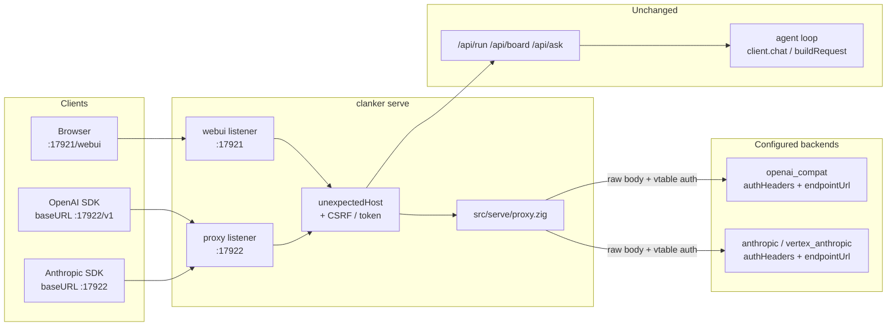
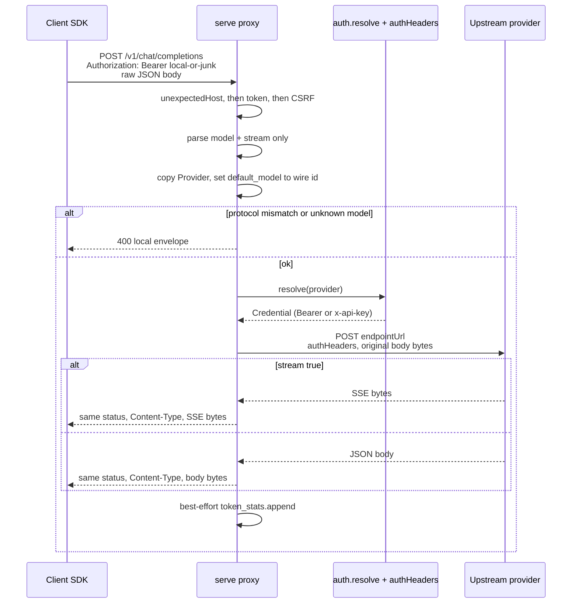

# PRD: LLM compatibility proxy on serve

| Field | Value |
|---|---|
| Number | 0026 |
| Title | LLM compatibility proxy on serve |
| Author | |
| Date | 2026-08-13 |
| Status | Draft |

## Status

Draft. Nothing in this PRD is built yet. No `/v1/*` route exists, `clanker serve` still opens exactly one socket (`src/cli.zig` `cmdServe`, `~L4373`), and `[serve]` still parses only `host`, `webui_port`, `serve_as` (`src/config.zig` `parseServe`, `~L941-968`).

Sources of truth once built:

- `src/serve/proxy.zig` (new): route table, model lookup, 1:1 forward, local error envelopes
- `src/cli.zig`: `cmdServe`, `resolveListen`, `handleConnection`, `buildServeArgvTail`, `Flag` / serve spec (`~L1331`)
- `src/config.zig`: `Serve` (`~L375-389`), `Provider`, `Model`, `ProviderKind`
- `src/llm/auth.zig` `resolve`, `src/llm/providers.zig` `forKind`, each kind's `authHeaders` / `endpointUrl`
- `src/stats/tokens.zig` `append` (usage recorded without rewriting the body)
- `docs/README.md` Binding and the trust model (`~L1030-1068`), `docs/configuration.md` `[serve]`

Surface: `clanker serve --proxy --proxy-port <port>`. Off by default. Existing `clanker run`, REPL, web UI `/api/*`, A2A, board, and chat routes stay as they are.

This is the inverse of `docs/cursor-api-notes.md`. That note says Cursor is not `openai_compat` and a standalone proxy is the pragmatic way to *consume* Cursor. This PRD makes clanker *be* an OpenAI/Anthropic front that forwards to a configured remote provider. It does not implement Cursor's gRPC Connect protocol.

## Problem

Clients that speak the OpenAI Chat Completions API or the Anthropic Messages API cannot point at clanker today. `clanker serve` exposes a private control plane (`/api/run`, `/api/board`, `/api/ask`, …) and the agent loop talks to providers through `types.Message` plus `providers.Provider.buildRequest`. That path is a *rebuild*: it serializes a closed internal schema and drops everything it does not know.

That rebuild is the right design for the agent loop (one internal type, every kind implements a codec). It is the wrong design for a compatibility proxy. A client that sends `tools`, vision content parts, `response_format`, `stop_sequences`, `stream_options`, extra sampling fields, or any vendor key the codec has never heard of would lose those keys if the request went through `client.chat` / `client.chatStream`. Worse, the OpenAI codec *adds* fields the client never sent: `stream_options.include_usage = true` whenever `stream` is true (`src/llm/providers/openai.zig` `~L140-148`), and the Anthropic codec rewrites system text into cache-controlled blocks (`src/llm/providers/anthropic.zig` `~L124-163`). Using that path as a proxy would inject clanker's agent conventions into a third-party client's request.

The practical ask is: an OpenAI SDK (or something like [cursor-openai-api](https://github.com/maci0/cursor-openai-api/tree/fix/cursor-api-compatibility) pointed the other way) sets `baseURL` at this process and gets 1:1 forwarding to whatever `[providers.*]` the operator already configured. Model listing must work. Streaming, tools, vision, and sampling fields must survive. Clanker must not add a system prompt, rewrite tools, strip unknown JSON keys, or invent `stream_options`. The agent loop, web UI, and `clanker run` must keep working unchanged.

Constraints that shape the design (not just the desired outcome):

- Provider credentials stay native (ADR 0004). The proxy's job *is* attaching those credentials, so it cannot be a WASM guest.
- `serve` already has a trust model (loopback default, Host/authority check, CSRF on non-GET with Origin) and a binding convention (one `--host`, named ports per surface). The proxy has to live inside that, not next to it as a second daemon with a second host policy.
- `GET /api/providers`, `GET /api/catalog`, and `GET /api/providers/models` already are the model catalog. Discovery on `/v1/models` must project that catalog, not invent a third store.
- Going through `types.Message` is the injection risk. The proxy must not call `client.chat` / `client.chatStream` / `buildRequest`.

## Goals

1. `clanker serve --proxy` (off by default) listens on a named port (`--proxy-port`, default `17922`) that speaks OpenAI-compatible and Anthropic-compatible HTTP, sharing `--host` and the existing Host/authority checks.
2. `POST /v1/chat/completions` and `POST /v1/messages` forward the request body byte-for-byte to the matching configured backend after attaching that provider's vtable auth. The proxy does not add, drop, or rewrite JSON keys, with one documented exception: rewriting the JSON `model` string when the client sent a composite `provider/id` or a configured alias (see Design, Model routing).
3. Incoming client `Authorization` / `x-api-key` is never sent upstream. Upstream headers are built from a named allowlist (never copied from the inbound set) plus `auth.resolve` / Vertex minting (see Design, Upstream headers).
4. `GET /v1/models` lists the configured models that actually speak the requested protocol, projected from the same catalog `GET /api/providers` already serves. No third catalog.
5. Streaming is a byte-faithful pass-through of upstream SSE (status, `Content-Type`, event bytes) on the `request` / `receiveHead` path, with `headers.accept_encoding = .omit` so Zig 0.16 does not advertise gzip. No `client.fetch`, no `StreamAccumulator` rebuild, no `[DONE]` invented when the upstream did not send one, no Anthropic events rewritten as OpenAI chunks.
6. Protocol mismatch is refused with `400`, never transcoded. An `anthropic` / `vertex_anthropic` model on `/v1/chat/completions`, or an `openai_compat` model on `/v1/messages`, is an error.
7. An optional local proxy token (`[serve].proxy_token_env`) can be required so a LAN bind is not an open relay of the operator's provider keys.
8. Agent loop, web UI `/api/*`, A2A, chat, board, and `clanker run` keep their routes and behaviour. Proxy routes are additive and, on the dedicated port, isolated from the control plane.
9. Proxy completions are recorded in `state/token_stats.jsonl` at the existing choke-point shape (`src/stats/tokens.zig` `Record`) without rewriting the body or the response.

## Non-goals

- A new `clanker proxy` daemon or subcommand. One process, one `--host`, a named port. A second binary would fork the Host/CSRF/hot-reload policy that `cmdServe` already owns.
- Translating through `types.Message` + `buildRequest`, or calling `client.chat` / `chatStream` on the proxy path. Those exist to serve the agent loop. Using them *is* the injection bug this PRD exists to avoid.
- Transcoding OpenAI bodies into Anthropic (or the reverse). Transcoding is injection: it rewrites tools, system, content parts, and unknown keys. A mismatch is `400`.
- Implementing Cursor's gRPC Connect / protobuf `AgentService/Run` inside clanker. `docs/cursor-api-notes.md` still holds: Cursor is not `openai_compat`. Compatibility here means an OpenAI SDK (including a process that currently points at cursor-openai-api) can point `baseURL` at this proxy.
- Copying agave's inference, KV cache, conversations, web chat UI (`POST /v1/chat`), tokenize/detokenize, embeddings stub, or `system_fingerprint: agave-v…`. Agave *is* the model. Clanker *forwards*.
- OpenAI `/v1/completions`, `/v1/responses`, `/v1/embeddings`, `/v1/audio/*`, `/v1/images/*`, Anthropic `/v1/complete`, batch APIs, or Files APIs. cursor-openai-api's client bar is `POST /v1/chat/completions` (stream + tools) and `GET /v1/models`.
- Injecting clanker's system prompt, tool catalog, or `agent.tool_catalog` hot-tool subset into proxied requests. The proxy is not the agent.
- CORS `Access-Control-Allow-Origin`. Same as serve today: no CORS. A browser on another origin uses a reverse proxy if it must.
- Rate limiting, request queues, or per-client quotas. A 64-connection cap already exists process-wide (`max_connection_threads` in `src/cli.zig`).
- Extracting all of `cmdServe` / `handleConnection` out of `cli.zig`. The proxy is a new file under `src/serve/`; the accept loop stays where it is until a later split.
- Changing how the agent loop, web UI, or `ck_llm` talk to providers.

## Design

**Why this stays native.** AGENTS.md says anything that can be a WASM tool must be one, and native `src/` needs a reason. The reason is the same one ADR 0004 already recorded for the provider vtable: the proxy attaches provider credentials (`auth.resolve`, Vertex `mint`, `api_key_env`) and speaks raw HTTP on the serve socket. Handing either to a guest inverts the sandbox (`env_allow` exists so a tool that declares nothing does *not* see `*_API_KEY`). `ck_llm` is the outbound guest path (a tool asks the host to call a model). This is the inbound HTTP path (a client asks clanker to call a model with the operator's key). They are opposite directions of the same trust boundary, and both stay in the harness.

**Surface and flags.** Attach to `clanker serve`, do not add `clanker proxy`. Flags:

| Flag | Config | Env | Default | Meaning |
|---|---|---|---|---|
| `--proxy` | `[serve].proxy` | (none) | `false` | Enable the proxy surface |
| `--no-proxy` | (forces off) | (none) | (flag absent) | Disable the surface even if the file or env enabled it |
| `--proxy-port <port>` | `[serve].proxy_port` | `CLANKER_PROXY_PORT` | `17922` | Named port for the proxy. A usable value is also intent to listen |
| (none) | `[serve].proxy_token_env` | the named var (e.g. `CLANKER_PROXY_TOKEN`) | unset | Optional local token |
| (none) | `[serve].proxy_aliases` | (none) | empty | Optional `client_name = "provider/id"` map |

`--proxy-port` without `--proxy` still enables the surface (setting the port is an intent to listen). `CLANKER_PROXY_PORT` is the same intent: a usable 16-bit port (not `0`) enables the surface and sets the port. A malformed value or `0` warns and is ignored, matching `CLANKER_WEBUI_PORT` (`src/cli.zig` `~L4343-4351`). A config that only sets `proxy_port` does **not** enable it: file-level `proxy` stays the switch, matching how `webui_port` names a port that `clanker serve` already opens.

`Options.proxy` is `?bool` (`null` = flag absent), the same "absent vs set" split `webui_port` already uses (`src/config.zig` `~L370-374`, `src/cli.zig` `~L170-172`). `--proxy` stores `true`, `--no-proxy` stores `false`. A one-off `clanker serve --no-proxy` on a box whose `config.local.toml` has `proxy = true` drops the surface. If both `--proxy` and `--no-proxy` appear, the last one on the command line wins. `--no-proxy` wins over `--proxy-port` / `CLANKER_PROXY_PORT` when `Options.proxy == false`.

Resolution order matches `resolveListen` today (`src/cli.zig` `~L4323-4365`):

```
[serve]  <  CLANKER_HOST / CLANKER_WEBUI_PORT / CLANKER_PROXY_PORT  <  flags
```

`--host` remains the one interface. `Serve` already documents this exact future (`src/config.zig` `~L376-383`): a second surface adds a *port* next to `webui_port`, not a second host.

`parseServe` grows the new keys in `warnUnknownKeys` and returns a `ServeFields` presence mask, the same pattern as `AgentFields` (`src/config.zig` `~L267-292`) and `ModulesFields` (`~L453-474`). `host` / `webui_port` / `proxy_port` / `proxy_token_env` stay optional, so "unset" is distinguishable from a written value and merge can keep copying them only when `!= null`. `proxy` is a real `bool = false`, so absent and `false` look identical after parse. Merge must **not** copy `proxy` whenever `serve_present` is true: a `config.local.toml` that only sets `host` would then turn off a base `proxy = true`. Track `ServeFields.proxy` (and `proxy_aliases`, which is not optional) and apply them only when the local file named the key. `proxy = false` in the local file then disables; omitting the key does not. That is the opposite of "absent and false are the same in toml" for merge purposes.

`proxy_aliases` follows `serve_as` once presence says the table was named: the local table **replaces** the base table rather than unioning keys. A local file that wants to keep a base alias must repeat it. `config.toml` comments the new keys next to the existing `[serve]` block; they stay commented so a stock file does not flip the surface on.

**Two sockets, or one when the ports collide.** Today serve "opens exactly one socket" (`docs/README.md` `~L1033`, `docs/configuration.md` `~L251`). This PRD is the second surface those sentences anticipated. `Connection.surface` is a three-value tag, not a bool:

```zig
pub const Surface = enum { webui, proxy, both };
```

- `proxy_port != webui_port`: a second `IpAddress.listen` on the same host. A dedicated accept thread feeds the same `serveConnection` pool, tagged `surface = .proxy`. That listener serves only the proxy route table plus `/health/live` and `/health/ready`. It does **not** serve `/api/run`, `/api/ask`, board, or the web UI. The named port is isolation, not just a number. The web UI listener stays `surface = .webui`.
- `proxy_port == webui_port`: one socket, `surface = .both`, both route tables. `/v1/*` is dispatched next to `/api/*`. Supported so a tight loopback install can keep a single port. Documented, not the default.

`max_connection_threads = 64` stays process-wide. A flood on the proxy port must not be a second, unbounded thread pool beside the web UI. Of those 64, `webui_reserved_slots = 8` are held back from `surface = .proxy` accepts: `serveConnection` returns the existing `503` when a `.proxy` connection would leave fewer than 8 slots for `.webui` / `.both`. Equal-port multiplexing (`surface = .both`) uses the full 64; a `/v1` flood on that collapsed port can still 503 the UI, which is the operator's choice.

`buildServeArgvTail` (`src/cli.zig` `~L3412`) must replay `--proxy` / `--no-proxy` and `--proxy-port` on hot reload, the same way it already pins `--host`, `--webui-port`, and `--serve-as`. A reload that dropped `--proxy` would silently close the surface. A reload that dropped `--no-proxy` would silently reopen it.

Startup log names both URLs when the proxy is on:

```
serve listening on 127.0.0.1:17921
serve proxy listening on 127.0.0.1:17922
http://127.0.0.1:17921/webui
```

If the bind host is not loopback and `proxy_token_env` is unset, log a warning: the proxy is an unauthenticated relay of every configured provider key.

**Trust model, reused not forked.** `handleConnection` today runs `unexpectedHost` then `crossOriginRequest` on every non-GET/HEAD *before* any route dispatch (`src/cli.zig` `~L4603-4616`). Token-skips-CSRF cannot live only inside `proxy.handle`: CSRF would already have returned 403. The accept-path order becomes:

1. **Host** (`unexpectedHost` with *that listener's port* and the same `serve_as_hosts`). Fail: existing `421` serve JSON `{"ok":false,"error":"invalid host"}`. No agave envelope here (the check runs before we know we will mint one).
2. **Proxy token**, only when `isProxyPath(path)` and `proxy_token_env` is configured. Implemented as `proxy.authorize(headers_raw, expected)` called from `handleConnection`, not from `handle`. Missing or wrong: `401` with the route's agave envelope (`code: invalid_api_key`). Applies to `GET /v1/models` as well as the POST routes. Valid: mark the request authorized and skip step 3.
3. **CSRF** (`crossOriginRequest`) on non-GET/HEAD, only when step 2 did not authorize. Fail: existing `403` serve JSON `{"ok":false,"error":"cross-origin request refused"}`. An OpenAI/Anthropic SDK (curl, Node, Python) sends no `Origin` and is let through, same as `/api/run` today. A browser that sends a foreign `Origin` *and* a valid token passes because the secret is the CSRF defense, matching how agave treats `--api-key`.
4. **Dispatch** (`proxy.handle` on `/v1/*` when `surface` is `.proxy` or `.both`).

When no token is configured, any inbound Bearer / `x-api-key` is discarded (not forwarded, not checked). That is what lets `new OpenAI({ apiKey: "anything", baseURL: "http://127.0.0.1:17922/v1" })` work on loopback, the same pattern cursor-openai-api documents.

Accept-path errors that fire before dispatch (413 body too large at `~L4569-4571`, 421 Host, 403 CSRF, 503 connection cap at `serveConnection` `~L4480-4484`) keep today's serve JSON. `proxy.handle` is the only place that mints agave envelopes. Do not promise the other shape for the accept path unless a later change actually branches those `respond` calls on `surface`.



**Route table (proxy surface).** Local errors use agave's envelopes (see Error envelopes). Upstream responses are passed through.

| Method | Path | Action |
|---|---|---|
| `GET` | `/v1/models` | Project the configured catalog (see Model discovery). No upstream call. |
| `POST` | `/v1/chat/completions` | Route by `model`, require `openai_compat`, 1:1 POST to that provider's chat URL. |
| `POST` | `/v1/messages` | Route by `model`, require `anthropic` or `vertex_anthropic`, 1:1 POST to that provider's messages URL. |
| `GET` | `/health/live`, `/health/ready` | Same handlers as the web UI listener, so a probe does not need the control-plane port. GET only. A POST still falls through to the existing generic 404 (`src/cli.zig` `~L4672-4675`); health is not a "known proxy path" for `405`. |
| other `/v1/*` | (any) | `404` with the OpenAI envelope (`code: unknown_endpoint`), or the Anthropic envelope if `anthropic-version` is present. |
| other | (any) | `404`. On the dedicated port this includes `/api/*` and `/webui`. |
| wrong method on a known `/v1/*` path | (known `/v1` path) | `405` + `Allow`, same as agave. Does not apply to `/health/*`. |

No `/v1/completions`, `/v1/responses`, `/v1/embeddings`, `/v1/chat`, `/v1/conversations`, `/v1/tokenize`, `/v1/kv_cache`. Those are agave-the-model, not clanker-the-forwarder.

**1:1 forward (the whole point).** For the two POST routes the proxy:

1. Reads the raw body bytes already buffered by `handleConnection` (same `rawhttp.max_body_bytes` cap, 24 MiB). A 413 at this layer is the existing serve JSON (see Trust model).
2. Parses JSON *only* enough to read `model` (required string) and `stream` (optional). If `stream` is absent, treat it as `false`. If `stream` is present and is not a JSON bool (`"true"`, `1`, an object, …): `400 malformed_request`, no upstream call. The parse is a read. The bytes that go upstream are the bytes that arrived, except the one `model` rewrite below.
3. Resolves the provider (Model routing). On mismatch or unknown model, returns a local `400` and does not contact upstream.
4. Builds upstream headers from scratch (see **Upstream headers**). Never copies the inbound header set.
5. Builds the upstream URL from the vtable, not by appending the inbound path. The `Provider` passed in is the *copy* from Model routing, so `endpointUrl` sees the requested wire id:
   - `openai_compat`: `endpointUrl(..., streaming=false)` which is `joinBaseAndPath` + `/chat/completions` or `provider.path` (`src/llm/providers/openai.zig` `~L33-37`). Blindly appending `/v1/chat/completions` would double `/v1` on a `base_url` that already ends in `/v1`.
   - `anthropic`: `endpointUrl` → `/v1/messages` or `provider.path`.
   - `vertex_anthropic`: `endpointUrl(..., streaming)` so `:rawPredict` vs `:streamRawPredict` is chosen by the inbound `stream` flag, not by rewriting the body (`src/llm/providers/vertex.zig` `~L55-69`).
6. POSTs with `std.http.Client.request` + `receiveHead` for **both** stream and non-stream. Do not call `client.fetch` (it buffers into `resp_cap` = 8 MiB, `src/llm/client.zig` `~L124-125`, `~L441-462`, and cannot be an unbounded SSE pipe). Do not call `client.chat` / `chatStream`.
7. Writes the inbound HTTP response as specified under **Inbound response framing**. For `stream: true` this is a raw SSE pipe: read a chunk, write a chunk, until the upstream closes. No `parseStreamEvent`, no `StreamAccumulator` (`src/llm/client.zig` `~L487+`). If the upstream sent `[DONE]`, the client sees `[DONE]`. If it sent Anthropic `message_start` / `content_block_delta` / `message_stop`, the client sees those. The proxy does not invent a terminal event. `respond()` (`src/cli.zig` `~L10244-10258`) is not used for a successful forward: it always sets `Content-Type: application/json`, `Content-Length`, and `Connection: close`.
8. Does **not** run `client.zig`'s `max_attempts = 3` retry loop. Completions are not idempotent. A `429`/`5xx` is forwarded. The caller retries if they want.

**Upstream headers.** Built from an allowlist, never by subtracting names from the inbound set. A denylist would leak `Host`, `Content-Length`, `Transfer-Encoding`, `Connection`, `Accept-Encoding`, `Cookie` variants, `Proxy-Authorization`, and `x-stainless-*` onto the provider request.

Allowlist, in order:

| Header | Source |
|---|---|
| `Content-Type` | Client value if present, else `application/json` |
| `Accept` | Client value if present, else omitted |
| `User-Agent` | Client value if present, else `clanker/` + `build_options.version` (same string `client.zig` `~L19-22` uses) |
| `Authorization` / `x-api-key` | Only from `auth.resolve` + the vtable, never from the client |
| `anthropic-version` | Client value if present, else the vtable default `2023-06-01` (`anthropic.zig` `~L79-80`) |
| `anthropic-beta` | Merge (see below) |

Never sent upstream: `Authorization` (client's), `x-api-key` (client's), `Cookie`, `Cookie2`, `Proxy-Authorization`, `Host`, `Content-Length`, `Transfer-Encoding`, `Connection`, `Keep-Alive`, `Upgrade`, `TE`, `Trailer`, `Proxy-Connection`, and every other inbound header not in the allowlist.

Leaving `Accept-Encoding` out of `extra_headers` is **not** enough. Zig 0.16 `std.http.Client.Request.Headers.accept_encoding` defaults to `.default` (`lib/std/http/Client.zig` L850), and `.default` emits `accept-encoding: gzip, deflate` (L831-837, L1041-1053). `chatStream` already hits this (`src/llm/client.zig` `~L549-552`, `~L589-592`) and has to decompress. The proxy must set `headers.accept_encoding = .omit` on the `Request.Headers` value passed to `client.request` (Zig 0.16 `Request.Headers.Value`). Keep it out of `extra_headers` too. If the proxy advertised gzip and still copied `Content-Encoding: gzip`, SDKs would double-decode. If it advertised gzip and forwarded compressed bytes as identity, SDKs would see binary. Forcing identity is the one non-1:1 *header* choice that makes the *body* 1:1. The PR 3 mock assertion is: captured upstream request has no `Accept-Encoding` (the field is `.omit`, not merely missing from `extra_headers`), and the inbound response has no `Content-Encoding: gzip` even if the mock would gzip when asked.

`anthropic-beta` is merged, not replaced. Anthropic accepts a single comma-separated header. `authHeaders` on the OAuth path already spends a slot on `oauth-2025-04-20` (`anthropic.zig` `~L72-75`); dropping it makes the token fail, and replacing a client `prompt-caching-…` / `computer-use-…` beta is injection-by-omission. Union the client betas with `oauth-2025-04-20` when the resolved strategy is `oauth_static` or `oauth_refresh`. De-dupe. On the api_key path, forward the client beta list as-is (or omit if the client sent none).

`authHeaders` is capacity-bound: `max_extra_headers = 2` (`src/llm/providers/api.zig` `~L36-40`). Anthropic's api_key path already fills both slots (`x-api-key` + `anthropic-version`). The proxy must **not** widen `ExtraHeaders` (the agent path stays at 2). It allocates its own extra-header buffer (8 slots) in `proxy.zig`. It may call `impl.authHeaders` into a scratch `ExtraHeaders` and copy the result, then overlay `anthropic-version` / `anthropic-beta` per the merge rules.

**Inbound response framing.**

- Copy upstream status and `Content-Type` (default `application/json` if the provider omitted it).
- Always set `X-Content-Type-Options: nosniff` and `X-Request-ID` (serve already does this on `respond`).
- Do not copy `Content-Encoding` or `Transfer-Encoding`. We frame the inbound response ourselves and we did not ask for gzip.
- `stream: true`: no `Content-Length`, `Connection: close`, write body chunks as they arrive. Cap the *accumulated* stream at `rawhttp.max_body_bytes` (24 MiB); past that, stop reading, close both sides, `token_stats` `ok: false`. A missing `[DONE]` is preserved (we never append one).
- `stream: false`: read the upstream body into a buffer capped at 24 MiB (same inbound cap, not `resp_cap`'s 8 MiB), then send `Content-Length` and `Connection: close`. Over the cap: local `502` agave envelope, no partial body.
- On inbound client close or a write error mid-pipe: cancel the upstream request (`client.Abort.trigger`, `shutdown(2)`) and release the connection slot. Do not wait for the provider to finish.

**Upstream deadlines.** `std.http.Client` has no working read timeout (`ConnectTcpOptions.timeout` is declared and unused; `client.zig` `~L32-43`). A silent upstream plus a few streaming POSTs occupies every slot and 503s `/api/run` / `/health/ready`. The proxy owns a deadline thread per forward. One number for "no bytes either direction" is wrong: it conflates connect, time-to-first-byte, and inter-chunk idle. The agent loop has no idle cap on `chatStream`. `agent.ask_timeout_seconds` is 120s and is only the browser-confirm wait (`src/config.zig` `~L233`). `provider_check_timeout_seconds = 10` is a ping, not a completion. A 60s cap on first byte would 504 a correct `stream: true` request to a thinking model (Goal 5).

Split the three clocks:

| Clock | Default | Config | What it covers |
|---|---|---|---|
| Connect | 10s | (constant, same as `provider_check_timeout_seconds`) | TCP/TLS handshake only |
| First byte | 300s | `[serve].proxy_first_byte_timeout_s` (`?u32`, `0` = no ceiling) | After the request is flushed, until the first upstream body byte (reasoning / long-context prefills) |
| Inter-chunk idle | 60s | `[serve].proxy_idle_timeout_s` (`?u32`, `0` = no ceiling) | After the first byte, gap between subsequent reads. A stalled mid-stream, not a thinking pause |

On fire: `Abort.trigger`. Local `504` agave envelope if no status line has been written yet; if headers already went to the client, just close.

**Arming `Abort`.** `trigger` is `pub` (`src/llm/client.zig` `~L86-101`). `arm` and `disarm` are file-private (`fn`, `~L69-81`). `trigger` on an unarmed handle is a no-op (`self.client orelse return`). Only `chat` / `chatStream` call `arm` today (`~L216-217`, `~L516-517`). The proxy must not copy the `connection_pool.used` shutdown loop. PR 3 makes `Abort.arm` and `Abort.disarm` public and lists `src/llm/client.zig`. The proxy uses the same arm / disarm / `defer` order as `chat`, so a timeout thread cannot `trigger` after `client.deinit`:

```zig
var http_client: std.http.Client = .{ .allocator = gpa, .io = io };
defer http_client.deinit();
// LIFO: disarm runs *before* deinit. disarm takes Abort.mutex, so it
// blocks until an in-flight trigger finishes with this client.
var abort: client.Abort = .{};
abort.arm(io, &http_client);
defer abort.disarm(io);
```

The deadline thread and the inbound-close path both call `abort.trigger(io)` only. A mock that accepts and never writes must fail by the first-byte budget (default 300s in production; tests pass a short override), not hang `zig build test`. A mock that writes its first byte at T+90s must succeed under the default first-byte budget.



What this deliberately does *not* do, with the code that would have done it:

| Temptation | Where it lives today | Why the proxy skips it |
|---|---|---|
| Rebuild the body from `types.Message` | `openai.buildRequest`, `anthropic.buildBody` | Drops unknown keys; cannot carry arbitrary content parts or vendor fields |
| Add `stream_options.include_usage` | `openai.zig` `~L140-148` | Client did not send it |
| Force `max_tokens` from `config.Model` | `common.clampedMaxTokens` | Client's sampling fields pass through or are absent |
| Lift system messages into Anthropic `system` + `cache_control` | `anthropic.zig` `~L124-163` | Rewrites the prompt |
| Accumulate SSE into `ChatResponse` | `client.chatStream` + `StreamAccumulator` | Rebuilds events; would re-encode OpenAI as OpenAI and drop frames |
| Buffer the whole response with `client.fetch` | `doFetch` / `resp_cap` 8 MiB | Not a pipe; silently truncates; cannot stream |
| Retry three times | `client.zig` `max_attempts = 3` | Doubles billable completions |

**Model routing.** The inbound `model` string maps onto `[models."<provider>/<id>"]` after `distributeModels` has filed each entry into `Provider.models` (`src/config.zig` `~L9-13`, `~L829`). Lookup, in order:

1. **Unique wire id, right protocol.** Among configured models whose provider `kind` speaks this route (`openai_compat` for `/v1/chat/completions`; `anthropic` or `vertex_anthropic` for `/v1/messages`), exactly one has `id == model`. Select that provider.
2. **Composite `provider/id`.** Same rule `Config.resolveProvider` already uses for `--model zai/glm-5.2` (`src/config.zig` `~L556-574`): split on the first `/` only when the head names a configured provider. Confirm the tail is in that provider's `models` (or accept it as a live id on a provider with an empty `models` map, the ollama case `handleProviders` already special-cases at `src/cli.zig` `~L7245-7253`). If the provider's kind does not speak this route: `400` protocol mismatch, do not transcode.
3. **`[serve].proxy_aliases`.** A TOML table `client_facing_name = "provider/id"`. Resolves to (2). Lets a Cursor-style `claude-4-sonnet` string hit a configured Anthropic model without inventing a third catalog.
4. Else `400` (`code: model_not_found`), naming the `model` and the route.

**After every successful lookup, copy the `Provider` and set `default_model` to the resolved wire id on that copy.** This is the `resolveProvider` pattern (`src/config.zig` `~L571-573`). `cmdServe` documents that config is immutable for the server lifetime (`src/cli.zig` `~L4394-4398`); mutating `cfg.providers` in place would race every other connection. `vertex_anthropic.endpointUrl` embeds `p.activeModelName()` in the path (`src/llm/providers/vertex.zig` `~L55-69`), and `activeModelName` is just `default_model` (`src/config.zig` `~L143-145`). A unique-wire-id hit that "used that provider" without this copy would call the configured default model regardless of the client's `model`. The same copy is what `totalCost` and `auth.resolve` see. Unit-test: a `vertex_anthropic` provider whose default is `claude-opus-4-6` and whose request asks for another configured id must produce a captured upstream URL containing the requested id.

**The one allowed body mutation.** If the inbound `model` string is not the wire id the backend expects (composite or alias), rewrite only that one JSON string value to the copy's `activeModelName()` (the tail). Do not re-serialize the object (that would reorder keys and drop unknown fields). Walk the top-level `model` token and splice the replacement. If that token is missing or not a string: `400`. A request whose `model` was already the wire id is bit-identical on the wire.

Two providers sharing a wire id (`gpt-4o` on both `openai` and `openrouter`) are not unique under (1). Clients must send `openai/gpt-4o` or an alias. Discovery advertises the composite in that case so `GET /v1/models` never returns an ambiguous id.

**Model discovery.** `GET /v1/models` does not call upstream and does not invent a store. It projects `cfg.providers` / `Provider.models`, the same data `handleProviders` (`src/cli.zig` `~L7187`) already JSON-encodes for the web UI.

Both official clients use the path `GET /v1/models` and expect different envelopes. Discriminate on the inbound `anthropic-version` header (the Anthropic SDK always sends it; the OpenAI SDK never does):

- **No `anthropic-version`:** OpenAI list, only `openai_compat` models.

```json
{"object":"list","data":[
  {"id":"kimi-k3","object":"model","created":0,"owned_by":"kimi-k3"}
]}
```

- **`anthropic-version` present:** Anthropic list, only `anthropic` and `vertex_anthropic` models.

```json
{"data":[
  {"id":"claude-sonnet-4-20250514","type":"model","display_name":"Claude Sonnet 4","created_at":"1970-01-01T00:00:00Z"}
],"has_more":false}
```

`id` is the advertised string from Model routing (wire id if unique on that protocol, else `provider/id`). `display_name` / `owned_by` come from `Model.display` or the provider name. `created` / `created_at` are zeros: we do not have a provision time and will not mint a fake one from the wall clock on every request (that would make ETags and client caches lie).

`GET /api/catalog` (models.dev search) and `GET /api/providers/models` (live upstream `/models`) stay on the web UI port. The proxy does not call them. A provider with an empty `models` map (live ollama) appears on `/v1/models` only if we choose to hit its `/models` the way `writeLiveModels` does. **Decision:** do not. Live listing belongs on `/api/providers/models`. `/v1/models` is the configured set, deterministic, offline, and the same source `--model` already accepts. An ollama user who wants those ids on the proxy adds `[models."ollama/<id>"]` rows, or a `proxy_aliases` entry.

**Vertex.** `vertex_anthropic` speaks Anthropic messages but addresses the model in the URL and wants `anthropic_version` in the body instead of `model` (`src/llm/providers/vertex.zig` `~L6-11`, `buildRequest` swaps the field). A 1:1 forward of a standard Anthropic-client body will likely 400 at Vertex. This PRD does not transcode around that. Vertex models are advertised on the Anthropic `GET /v1/models` (they are that kind). The forward uses `endpointUrl` on the copied `Provider` (Model routing) so the URL names the requested id. The body is untouched. If Vertex rejects it, that is the failure mode in the table, not a silent rewrite. Hiding Vertex from discovery is an open question.

**Error envelopes.** Two layers, two shapes. Do not mix them.

**(a) `proxy.handle` and `proxy.authorize` mint agave envelopes** so an SDK's error parser works. Upstream error *bodies* still pass through with their status; these codes are for failures that never leave the process, or for the 401 token check.

OpenAI (every local error except on `/v1/messages`, and on `GET /v1/models` without `anthropic-version`):

```json
{"error":{"message":"Unknown model 'foo' for POST /v1/chat/completions","type":"invalid_request_error","param":"model","code":"model_not_found"}}
```

Anthropic (`/v1/messages`, and `GET /v1/models` with `anthropic-version`):

```json
{"type":"error","error":{"type":"invalid_request_error","message":"Unknown model 'foo' for POST /v1/messages"}}
```

Codes minted here, stable:

| code | when |
|---|---|
| `missing_required_parameter` | no `model`, or `model` is not a string |
| `model_not_found` | lookup failed |
| `protocol_mismatch` | kind does not speak this route |
| `invalid_api_key` | proxy token configured and missing/wrong (`GET /v1/models` included) |
| `unknown_endpoint` | `/v1/*` we do not serve |
| `method_not_allowed` | known `/v1/*` path, wrong verb (`405` + `Allow`) |
| `malformed_request` | body is not JSON, or `stream` is present and not a JSON bool |
| (none, status `502`) | upstream connect/TLS failure |
| (none, status `504`) | connect, first-byte, or inter-chunk idle timeout, no status line written yet |

**(b) The accept path keeps today's serve JSON.** `unexpectedHost` is `421` `{"ok":false,"error":"invalid host"}`. Body-too-large is `413` `{"ok":false,"error":"request body too large"}`. CSRF is `403` `{"ok":false,"error":"cross-origin request refused"}`. The 64-connection cap is `503` `{"ok":false,"error":"too many concurrent connections"}`. These fire before `proxy.handle`. This PRD does not rewrite them into agave envelopes.

**cursor-openai-api as a client.** That project's documented SDK snippet is:

```javascript
const client = new OpenAI({
  apiKey: "cursor",
  baseURL: "http://127.0.0.1:17922/v1",
})
await client.chat.completions.create({
  model: "kimi-k3",
  messages: [{ role: "user", content: "Hello" }],
  stream: true,
  tools: [/* ... */],
})
```

That is the compatibility bar: `POST /v1/chat/completions` (stream + tools + whatever else the SDK puts in the JSON) and `GET /v1/models`, Bearer accepted. The model's tools, vision parts, `response_format`, and sampling fields survive because they are in the body we do not rewrite. We do not implement Cursor's Connect/protobuf backend.

**Reuse from agave vs stay clanker-native.**

Reuse (protocol surface only):

- Endpoint names: `POST /v1/chat/completions`, `POST /v1/messages`, `GET /v1/models`
- OpenAI and Anthropic error envelopes (above)
- SSE framing expectation: OpenAI `data: {…}` plus optional `data: [DONE]`; Anthropic `message_start` → `content_block_*` → `message_delta` → `message_stop`
- `405` + `Allow` on wrong method
- Token on `Authorization: Bearer` or `x-api-key`
- CSRF when no token is configured

Do not copy from agave (`src/server/server.zig` and friends):

- Inference, sampling, grammars, KV cache, prefix cache
- Conversations, `POST /v1/chat`, regenerate, web UI
- `/v1/tokenize`, `/v1/detokenize`, `/v1/embeddings` 501 stub
- `system_fingerprint: agave-v…`
- Rate-limit buckets, sleep-after, `/ready` degraded-for-KV
- Agave's listen/auth flags (`AGAVE_API_KEY`, port `49453`)

Stay clanker-native:

- `auth.resolve` / `authHeaders` / Vertex mint (ADR 0005)
- `config.Provider` / `Model` / `distributeModels`
- `unexpectedHost` / `crossOriginRequest` / `--serve-as`
- `token_stats.append` at the existing Record shape
- `cmdServe` accept pool, hot reload, `rawhttp` body cap

**Usage recording without rewriting.** `client.recordUsage` / `recordFailure` (`src/llm/client.zig` `~L346-389`) are private and tied to `types.Usage` after a parse. The proxy calls `token_stats.append` directly with the same `Record`. It does **not** call `parseResponse` (that rebuilds a `ChatResponse`). It peeks usage fields only:

- On a non-stream success, parse `usage` from a copy of the response that already went to the client.
  - OpenAI: `prompt_tokens`, `completion_tokens`, `total_tokens`, plus `prompt_cache_hit_tokens` / `cached_tokens` the way `openai.zig` already folds them.
  - Anthropic: `input_tokens`, `output_tokens`, `cache_read_input_tokens`, `cache_creation_input_tokens`, mapped exactly as `anthropic.Usage.prompt()` does (`src/llm/providers/anthropic.zig` `~L336-350`): `prompt_tokens = input + cache_read + cache_creation`, `cache_hit = cache_read`, `cache_miss = input + cache_creation`.
- On a stream success, scan the last `data:` payload for the same objects (OpenAI final chunk, Anthropic `message_delta` / `message_start`). If none, record `ok: true` with zeros (duration still useful). Do not wait to rewrite a chunk.
- `cost` is `client.totalCost` (`src/llm/client.zig` `~L297-303`) on the *copied* `Provider` (so `activeModel()` is the requested id's pricing, not the configured default). Zero when pricing is absent or the peek failed.
- On transport or local failure, `ok: false`, `http_status`, short `err`, tokens and cost zero. Never the request body.
- `provider` and `model` are the resolved config names, not the inbound alias.
- Skip when `modules.token_stats` is off, same guard as `recordUsage`.

`llm_requests_total` / `llm_errors_total` (`client.zig` `~L131-133`) stay the agent-loop counters. The proxy increments the existing HTTP counters in `handleConnection` (`http_requests_total`, latency buckets) because it is an HTTP request. A dedicated `proxy_forwards_total` is optional and listed under Observability.

**Config sketch.**

```toml
[serve]
host = "127.0.0.1"
webui_port = 17921
proxy = false
proxy_port = 17922
# proxy_first_byte_timeout_s = 300
# proxy_idle_timeout_s = 60
# proxy_token_env = "CLANKER_PROXY_TOKEN"
# [serve.proxy_aliases]
# "claude-4-sonnet" = "anthropic/claude-sonnet-4-20250514"

[providers.kimi-k3]
kind = "openai_compat"
base_url = "https://api.moonshot.ai/v1"
api_key_env = "MOONSHOT_API_KEY"

[models."kimi-k3/kimi-k3"]
provider = "kimi-k3"
```

**Module layout.** New `src/serve/proxy.zig` (routes, lookup, forward, envelopes, discovery, `authorize`, the 8-slot header buffer). Tests live in that file. `src/main.zig`'s `comptime` block must reference it or `zig build test` never runs them. `cli.zig` grows flags (including `--no-proxy`), `resolveListen` fields (`proxy_enabled`, `proxy_port`), a second listen/accept when enabled, `Connection.surface: enum { webui, proxy, both }`, the reserved-slot check in `serveConnection`, and the Host → `proxy.authorize` → CSRF → dispatch order in `handleConnection`. No `switch (provider.kind)` is added anywhere; kind checks go through `providers.forKind` and compare `impl.kind`.

**What a caller types.**

```sh
clanker serve --proxy
# OpenAI SDK:  baseURL http://127.0.0.1:17922/v1
# Anthropic SDK: baseURL http://127.0.0.1:17922

clanker serve --host 0.0.0.0 --serve-as clanker.lan --proxy --proxy-port 17922
# pair with [serve].proxy_token_env so the LAN bind is not an open relay
```

## Key Decisions

1. **`serve --proxy` + `--proxy-port`, not `clanker proxy`.** The binding docs and `Serve` comments already reserved a named port next to `webui_port` and a shared `--host`. A second command would duplicate Host/CSRF/hot-reload and leave `clanker serve` users running two processes to get one machine's UI plus one machine's SDK endpoint.

2. **Dedicated port `17922` by default, multiplex only when the ports are equal.** The proxy is a credential relay. Putting `/v1` on `:17921` next to `/api/run` means an SDK pointed at the web UI port can also probe the control plane. A second listener that does not serve `/api/*` is the isolation the named-port convention exists for. Equal ports remain an explicit, supported collapse for loopback.

3. **Raw forward, never `client.chat` / `buildRequest`.** The agent codec rebuilds a closed schema and injects `stream_options`, `cache_control`, and clamped `max_tokens`. That is correct for clanker-as-agent and fatal for clanker-as-proxy. The vtable is still used, but only for `authHeaders` and `endpointUrl`.

4. **Refuse protocol mismatch, do not transcode.** Transcoding OpenAI↔Anthropic *is* injection (tools, system, content parts, unknown keys). A 400 the caller can fix by pointing at the other route is better than a silent rewrite they cannot see.

5. **Discovery is a projection of `[models.*]`, discriminated by `anthropic-version`.** One path (`GET /v1/models`), two official envelopes. The Anthropic SDK always sends that header. Using it avoids a second port and avoids advertising an Anthropic id on an OpenAI list (which would just produce mismatch 400s later).

6. **Optional local token, required-in-spirit on a non-loopback bind.** Serve itself is unauthenticated and relies on loopback + Host + CSRF. The proxy spends *provider* keys, so a LAN bind without a token is an open relay. The token is an env-named secret (`proxy_token_env`), never a value in toml, matching how providers already refuse to store keys. The check runs in `handleConnection` *before* CSRF. Token enforcement ships in the same PR as the forwarder so a merge never leaves `--host 0.0.0.0 --proxy` a silent relay.

7. **One allowed body mutation: the `model` string, and only when routing requires it.** A client that sends the wire id sees bit-identical forwarding. A client that sends `provider/id` or an alias cannot succeed 1:1 because the backend does not know that name. Splicing one string is not a re-serialize.

8. **Native module under `src/serve/`, not a WASM tool.** Credentials and the HTTP listener are the harness. See Design, Why this stays native.

9. **Upstream headers are an allowlist built from scratch.** Copying inbound headers minus a denylist leaks hop-by-hop fields and client SDK junk. `authHeaders` stays at `max_extra_headers = 2` on the agent path; the proxy has its own 8-slot buffer and merges `anthropic-version` / `anthropic-beta` in one place. Compression is disabled with `headers.accept_encoding = .omit`, not by leaving the name out of `extra_headers` (Zig 0.16 `.default` still emits `gzip, deflate`).

10. **`--no-proxy` is a real off-switch.** `Options.proxy: ?bool` matches `resolveListen`. File `proxy = true` is not sticky against a flag.

11. **Copy the `Provider` after lookup.** `cfg` is immutable for the serve lifetime. Vertex's URL (and `totalCost`) read `default_model` on that copy.

12. **Three clocks, not one idle-read.** Connect 10s, first-byte 300s (thinking models), inter-chunk idle 60s. A single 60s "no bytes" cap would 504 a correct streaming completion.

13. **`ServeFields.proxy` for two-file merge.** `proxy: bool = false` cannot use the optional-field trick `host` uses. Merge copies it only when the local file named the key, same as `ModulesFields`.

## Alternatives Considered

### 1. New `clanker proxy` subcommand vs `serve --proxy` / `--proxy-port`

**`clanker proxy` (rejected).** A dedicated command is easy to explain and would not touch `cmdServe`. It would also copy `resolveListen`, `unexpectedHost`, `crossOriginRequest`, the accept-thread pool, hot reload argv, and the `[serve]` layering, or it would invent a second, slightly different trust model. Two binaries to bind two ports on one host is the opposite of "one `--host`, named ports per surface" (`docs/README.md` `~L1068`, serve spec `src/cli.zig` `~L1331`). Operators who already run `clanker serve` for the web UI would start a second long-lived process just to expose `/v1`.

**`serve --proxy` + `--proxy-port` (chosen).** Matches the comment already sitting on `Serve.host` (`src/config.zig` `~L376-383`). Off by default, so existing service files do not grow a `/v1` they did not ask for. Hot reload already rebuilds a `serve …` argv tail.

**`--enable-proxy` as the spelling (rejected).** Longer, no clearer, and every other serve flag is the noun (`--host`, `--webui-port`, `--serve-as`). `--proxy` is the noun.

**Sidecar (cursor-openai-api / LiteLLM / nginx) and do not put a relay in `cmdServe` (rejected).** A sidecar already speaks OpenAI. It cannot call `auth.resolve`, mint a Vertex token, project `[models.*]`, share `unexpectedHost` / `--serve-as`, or ride `buildServeArgvTail` on hot reload. Operators would keep two long-lived processes and two credential stores (clanker's `*_API_KEY` / service account, plus whatever the sidecar reads). That is the same cost Alternative 1 rejects for a second command, plus a second place keys can leak. The native-module section answers WASM, not this; the reason to be in-process is those four harness pieces, not "we like writing HTTP servers."

### 2. Translate through `types.Message` + `buildRequest` vs raw forward

**Translate (rejected).** It reuses the tested codec and would "support" tools/vision only to the extent `types.Message` already does. It also: drops unknown keys; cannot pass `stop_sequences`, `response_format` schemas, extra content-part types, or vendor fields; injects `stream_options` (`openai.zig` `~L140-148`); rewrites Anthropic `system` into cache-controlled blocks (`anthropic.zig` `~L124-163`); clamps `max_tokens` from config; and on the stream path rebuilds events via `StreamAccumulator`. That is the agent loop. It is not a proxy.

**Raw forward (chosen).** Auth and URL from the vtable; body and SSE from the client/upstream. Features the backend supports work without clanker knowing their names. The cost is that clanker cannot "fix" a bad client body, and Vertex's body-field swap is not papered over.

### 3. Same port as the web UI (`/v1` next to `/api`) vs dedicated `--proxy-port`

**Same port only (rejected as the default).** One socket, simplest accept loop, no change to "exactly one socket". Also: an SDK `baseURL` of `:17921/v1` sits on the same origin as `/api/run`. Anyone who can reach the proxy can reach the control plane. Enabling the proxy would expand the attack surface of the port operators already firewalled for a browser UI.

**Dedicated port (chosen), with equal-port multiplexing as an opt-in collapse.** Isolation by default. One socket when the operator sets both ports equal. This is the first time serve binds two sockets; the docs that say "exactly one" get updated in the same change that adds the second listen.

### 4. Transcode OpenAI↔Anthropic vs refuse protocol mismatch

**Transcode (rejected).** It is the feature people will ask for the first time they point an OpenAI SDK at an Anthropic key. It is also a second `buildRequest`, with a larger surface than the agent codec (every content-part type, every tool shape, `system` vs messages, `stop` vs `stop_sequences`). It cannot be 1:1. Unknown keys have nowhere to go. Failures become clanker's problem ("why did my `thinking` block vanish?").

**Refuse with 400 (chosen).** Discovery only lists models on the protocol they speak. The error names the route and the kind. A caller who wants Anthropic uses `/v1/messages`.

### 5. Copy agave `server.zig` vs a thin forwarder next to `handleConnection`

**Copy `server.zig` (rejected).** Agave is an inference server. Its `/v1/*` handlers parse every sampling field, run a model, manage KV cache, mint `system_fingerprint: agave-v…`, and stub embeddings. Copying it would import a product we are not. The listen/CSRF/token code is the part that looks reusable, and clanker already has the equivalent in `handleConnection`.

**Thin forwarder in `src/serve/proxy.zig` (chosen).** Reuse agave's *protocol surface* (paths, envelopes, SSE event names) as a written contract, not as source. Wire it into the existing accept path with a `surface` tag. Small enough to unit-test the lookup and the "body in == body out" invariant against `src/llm/mock_server.zig` without standing up inference.

## API / Interface Changes

CLI (`src/cli.zig` `Flag`, serve `Spec`):

```
serve [--host <addr>] [--serve-as <name>]... [--webui-port <port>]
      [--proxy] [--no-proxy] [--proxy-port <port>]
```

`Options` gains `proxy: ?bool = null` and `proxy_port: ?u16 = null` (null = flag absent, so config/env still apply). `ListenPolicy` gains `proxy_enabled: bool` and `proxy_port: u16`.

The serve `Spec` `detail` string and the `--webui-port` parser comment (`src/cli.zig` `~L436-440`, `~L1331`) currently say a future split-out API port "would be `--api-port`". This surface is `--proxy-port` (the existing `/api/*` stays on `webui_port`). Those two sentences are rewritten in PR 1, the living-document slice AGENTS.md asks for when a turn surfaces a stale name.

`config.Serve`:

```zig
pub const ServeFields = struct {
    host: bool = false,
    webui_port: bool = false,
    serve_as: bool = false,
    proxy: bool = false,
    proxy_port: bool = false,
    proxy_token_env: bool = false,
    proxy_aliases: bool = false,
    proxy_first_byte_timeout_s: bool = false,
    proxy_idle_timeout_s: bool = false,
};

pub const Serve = struct {
    host: ?[]const u8 = null,
    webui_port: ?u16 = null,
    serve_as: []const []const u8 = &.{},
    proxy: bool = false,
    proxy_port: ?u16 = null,
    proxy_token_env: ?[]const u8 = null,
    proxy_aliases: std.StringArrayHashMapUnmanaged([]const u8) = .empty,
    /// Seconds to wait for the first upstream body byte. Null means the
    /// 300s default. 0 means no ceiling.
    proxy_first_byte_timeout_s: ?u32 = null,
    /// Seconds of silence after the first byte. Null means the 60s default.
    /// 0 means no ceiling.
    proxy_idle_timeout_s: ?u32 = null,
};
```

`parseServe` returns `{ .serve, .fields }` like `parseAgent`. `Config` grows `serve_fields: ServeFields`. Merge (`src/config.zig` `~L1381-1385`) becomes `if (src.serve_present) applyServeFields(...)`: optional fields still copy when `!= null`, but `proxy` copies only when `src.serve_fields.proxy`. A local `[serve]` that only sets `host` leaves a base `proxy = true` on. `proxy = false` in the local file disables. The *flag* is still `Options.proxy: ?bool` so `--no-proxy` can force off at resolve time.

`proxy_port` / timeout fields stay optional so env/flags and two-file merge can override a written value without a presence bit, but tracking them in `ServeFields` anyway keeps one apply function.

Public functions the accept path calls (sketch, names indicative):

```zig
// src/serve/proxy.zig
pub const Surface = enum { webui, proxy, both };

pub fn isProxyPath(path: []const u8) bool {
    return std.mem.startsWith(u8, path, "/v1/");
}

/// Called from handleConnection after unexpectedHost and before CSRF.
/// `expected` is the value of the env named by proxy_token_env.
pub fn authorize(headers_raw: []const u8, expected: []const u8) enum { missing, mismatch, ok };

pub fn handle(
    io: std.Io,
    gpa: std.mem.Allocator,
    cfg: *const config.Config,
    environ_map: *std.process.Environ.Map,
    method: []const u8,
    path: []const u8,
    headers_raw: []const u8,
    body: []const u8,
    stream: std.Io.net.Stream,
) void;
```

No change to `providers.Provider` vtable. No new `ProviderKind`. No new `ck_*` host function.

## Data Model Changes

No new state files. No migration.

`state/token_stats.jsonl` lines keep the existing `Record` schema. Proxy calls are indistinguishable from agent calls in the aggregator except by `request_id` (`http-N`, already set in `handleConnection`). A future `source: "proxy"` field is deliberately not added here (it would break older readers for a distinction `clanker stats` does not yet show).

`[serve].proxy_aliases` is config, not a durable store.

## Security & Privacy Considerations

**Threat: open relay.** The proxy spends the operator's provider keys on whoever can POST to `:17922`. Severity: high on a non-loopback bind, low on `127.0.0.1`. Mitigation: off by default; default bind remains loopback; optional `proxy_token_env`; startup warning when host is not loopback and no token is set; dedicated port does not serve `/api/run`.

**Threat: client `Authorization` forwarded upstream.** A junk SDK key (`"cursor"`, `"sk-dummy"`) would replace a real key and fail, or a stolen key in the client would leak to the provider's logs. Severity: high if it happened. Mitigation: upstream headers are an allowlist built from scratch (Design, Upstream headers). Client `Authorization`, `x-api-key`, `Cookie` / `Cookie2`, `Proxy-Authorization` are never copied. Only `auth.resolve` output is attached.

**Threat: DNS rebinding / CSRF.** Same as serve today, plus the token check *before* CSRF on `/v1/*` (Trust model order). `unexpectedHost` on every request. Severity: high without these, already solved for `/api/*`.

**Threat: hung upstream / client-gone DoS.** `std.http.Client` has no read timeout (`client.zig` `~L32-43`). A few streaming POSTs to a silent provider fill all 64 slots and 503 the web UI and `/health/ready`. Severity: high on a shared process. Mitigation: connect 10s, first-byte 300s (thinking models), inter-chunk idle 60s, `Abort.trigger` on inbound close, `webui_reserved_slots = 8` so a dedicated proxy listener cannot take the last eight slots. `arm` / `disarm` are made public so the proxy can reuse `Abort` instead of forking the pool walk.

**Threat: `/v1` on the web UI port exposes the control plane to SDK users.** Severity: medium. Mitigation: default to a distinct `--proxy-port` whose listener does not mount `/api/*`.

**Threat: body logged.** `CLANKER_DEBUG_BODY` today logs provider name and byte count, never content (`client.zig` `~L535-538`). The proxy follows that. Token-stats `err` is a short name, never a body.

**Threat: proxy token in argv.** `proxy_token_env` names an environment variable. There is no `--proxy-token <secret>` flag, so the secret does not appear in `ps`. Same reason agave prefers `AGAVE_API_KEY` over `--api-key`.

**Data handling.** Request bodies (prompts, images, tools) transit memory and the upstream connection. They are not written to `state/`. Usage numbers are.

**WASM boundary.** Unchanged. Guests still cannot see `*_API_KEY`. This feature does not add a `ck_*` that would let them.

## Observability

**Logs** (existing `log.log`, request id already set to `http-N` or an inbound correlation header):

- `info`: proxy listen line; one line per forward `proxy method=POST path=/v1/chat/completions model=kimi-k3 provider=kimi-k3 stream=true status=200 duration_ms=N`
- `warn`: non-loopback bind without a token; alias that points at an unknown provider (skipped, like a bad `fallback_providers` name in PRD 0025)
- `error_`: upstream connect failure, local 5xx
- `debug` under `CLANKER_DEBUG_BODY`: provider + byte count, no body

**Metrics.** Existing `http_requests_total` / latency buckets / `http_errors_total` already wrap `handleConnection`. Optional additions, low cardinality (no model label):

- `proxy_forwards_total`
- `proxy_forward_errors_total`
- `proxy_protocol_mismatch_total`

Exposed on the existing `GET /api/metrics` of the web UI port, not on the proxy port (the proxy port is for SDKs, not Prometheus). A later change can add `GET /metrics` on the proxy port if someone wants to scrape it in isolation.

**Token stats.** `state/token_stats.jsonl` via `token_stats.append`. Failures recorded (`ok: false`). `clanker stats` and `GET /api/stats` then include proxy traffic automatically.

**Alerting.** None in-process. The existing "is the provider down?" question is answered by `ok:false` lines plus `http_status`, which is why `recordFailure` exists (`src/llm/client.zig` `~L371-374`). The proxy writes the same shape.

**Latency target.** Proxy overhead (parse `model`/`stream`, resolve auth, splice alias) should stay well under 5 ms on loopback before the upstream connect. End-to-end TTFB is the provider's. Streaming first byte is a function of `std.http.Client` read size on the `request` / `receiveHead` path (not `fetch`, not an accumulator). Connect gives up at 10s. First body byte may take up to 300s (thinking / long prefill). After that, 60s of silence is a stall.

## Failure modes

| Condition | Behavior |
|---|---|
| `--proxy` not given and `[serve].proxy` is false | Unchanged serve. No second socket. `/v1/*` is 404 on `:17921` (and nothing listens on `:17922`). |
| `[serve].proxy = true` and the operator passes `--no-proxy` | Surface off. Flag wins. |
| `CLANKER_PROXY_PORT=17922` and no `--no-proxy` | Surface on, port 17922. A value of `0` or a non-integer warns and is ignored. |
| `--proxy` on, default ports | Web UI on `:17921` (`surface = .webui`), proxy on `:17922` (`surface = .proxy`), same `--host`. |
| `--proxy-port` equals `--webui-port` | One socket, `surface = .both`. `/v1` is additive. |
| Client sends a unique wire id | Body forwarded bit-identically. Auth replaced. |
| Client sends `provider/id` or an alias | Only the JSON `model` string is rewritten to the wire id. |
| Two providers share a wire id and the client sent that bare id | `400 model_not_found` (not unique). Discovery advertised the composites. |
| `anthropic` model on `POST /v1/chat/completions` | `400 protocol_mismatch`. No upstream call. |
| `openai_compat` model on `POST /v1/messages` | `400 protocol_mismatch`. No upstream call. |
| Unknown `model` | `400 model_not_found`. |
| Body not JSON, or `model` missing/not a string | `400 malformed_request` / `missing_required_parameter` (agave envelope from `proxy.handle`). |
| `stream` present and not a JSON bool | `400 malformed_request`. No upstream call. Vertex verb and inbound framing are not guessed. |
| `stream: true` | Raw SSE pipe on `request` / `receiveHead`. No invented `[DONE]`, no event rewrite, no `Content-Encoding: gzip` on the inbound response. |
| Upstream `429` / `5xx` / `4xx` | Status and body forwarded. No retry. |
| Upstream connect/TLS failure | Local `502` with envelope (`message` names the provider, not the key). `token_stats` `ok: false`. |
| Hung upstream (accepts, never writes) | First-byte budget (default 300s). `Abort.trigger`. `504` if no status line yet. Slot released. |
| Silent-but-open upstream past first-byte budget | `504`. Same as hung. A T+90s first byte under the default succeeds. |
| Stall mid-stream (no bytes for 60s after first byte) | `Abort.trigger`. Close both sides. `token_stats` `ok: false`. |
| `[serve].proxy_first_byte_timeout_s = 0` | No first-byte ceiling. Inter-chunk idle still applies unless also 0. |
| Inbound client closes mid-SSE | `Abort.trigger` on the upstream request. Slot released. Provider is not drained to completion. |
| Dedicated proxy listener at 56+ in-flight | New `.proxy` accept is `503` (8 slots reserved for `.webui` / `.both`). |
| Vertex model on `/v1/messages` | Copied `Provider` with `default_model` = requested id. Forwarded to that id's `:rawPredict` / `:streamRawPredict` with the client body as-is. Vertex may 400 on `model` vs `anthropic_version`. That 400 is forwarded. |
| Proxy token configured, missing/wrong | `401 invalid_api_key` (agave envelope from `proxy.authorize` in `handleConnection`). Includes `GET /v1/models`. No upstream call. CSRF not reached. |
| Proxy token configured, correct | CSRF skipped. Token not forwarded. |
| No token, loopback, SDK `apiKey: "x"` | Accepted. Inbound Bearer discarded. |
| No token, `--host 0.0.0.0` | Accepted (serve is unauthenticated). Startup warning. Anyone on the LAN spends the operator's keys. |
| Browser POST from a foreign `Origin`, no token | `403` CSRF, same as `/api/run`. |
| `unexpectedHost` | `421` serve JSON `{"ok":false,"error":"invalid host"}`. Not an agave envelope. |
| Body larger than `rawhttp.max_body_bytes` (24 MiB) | `413` serve JSON, existing `handleConnection` path. |
| 64 connections already in flight (`.webui` / `.both`) | `503` serve JSON, existing pool. |
| `GET /v1/models` | Configured models for that protocol only. No upstream. Empty `data` if none. Token required when `proxy_token_env` is set. |
| `POST /health/live` or `POST /health/ready` | Existing generic 404, same as the web UI listener. Not `405`. |
| `POST /v1/embeddings` (or any other `/v1/*`) | `404 unknown_endpoint`. |
| `modules.token_stats = false` | No jsonl line. Forward still happens. |
| Alias points at an unknown `provider/id` | Skipped with a warning at first use (or at listen time). Lookup falls through to `model_not_found`. |
| Hot reload after `--proxy` | Child is re-exec'd with `--proxy --proxy-port <resolved>`, so the surface cannot silently disappear. |

## Acceptance criteria

Traceable to Goals. All unchecked: nothing is built.

- [ ] `clanker serve` without `--proxy` and with `[serve].proxy` left false opens one socket and does not serve `/v1/*` (Goal 1, Goal 8).
- [ ] `clanker serve --proxy` listens on `:17922` by default, on the same `--host`, and logs a distinct proxy listen line (Goal 1).
- [ ] `--proxy-port` and `[serve].proxy_port` / `CLANKER_PROXY_PORT` resolve in the same three-layer order as `--webui-port`. A usable `CLANKER_PROXY_PORT` enables the surface. `0` or a non-integer warns and is ignored (Goal 1).
- [ ] `--no-proxy` disables the surface when `[serve].proxy = true` or `CLANKER_PROXY_PORT` is set (Goal 1).
- [ ] The dedicated proxy listener (`surface = .proxy`) answers `/v1/*` and health and 404s `/api/run` (Goal 8).
- [ ] Equal `--proxy-port` and `--webui-port` multiplex onto one socket (`surface = .both`); `/v1` and `/api` both work (Goal 1, Goal 8).
- [ ] `POST /v1/chat/completions` against a mock `openai_compat` backend sends a body bit-identical to the inbound body when `model` is the wire id, including unknown keys, `tools`, vision parts, `response_format`, and sampling fields. No `stream_options` is added (Goal 2).
- [ ] `POST /v1/messages` against a mock `anthropic` backend forwards `system`, `stop_sequences`, and unknown keys bit-identically when `model` is the wire id (Goal 2).
- [ ] The captured upstream request has only the allowlisted headers. Inbound `Authorization`, `x-api-key`, `Cookie`, and `Host` are absent. There is no `Accept-Encoding` at all (`headers.accept_encoding = .omit`, not merely missing from `extra_headers`). The vtable auth header is present. A client `anthropic-beta` is merged with `oauth-2025-04-20` on the OAuth path, not replaced (Goal 3).
- [ ] `GET /v1/models` without `anthropic-version` lists only `openai_compat` models from config, OpenAI envelope. With `anthropic-version`, only Anthropic-family models, Anthropic envelope. Neither calls models.dev or upstream `/models` (Goal 4).
- [ ] `stream: true` returns the mock upstream's SSE bytes unchanged, including a missing `[DONE]`. The inbound response has no `Content-Encoding: gzip` even if the mock would gzip when asked (Goal 5).
- [ ] A `stream` field that is not a JSON bool is `400 malformed_request` with zero upstream calls (Goal 5).
- [ ] An `anthropic` model on `/v1/chat/completions` and an `openai_compat` model on `/v1/messages` return `400` with `code: protocol_mismatch` and make zero upstream calls (Goal 6).
- [ ] A `vertex_anthropic` provider whose default is `claude-opus-4-6` and whose request asks for another configured id produces an upstream URL containing the requested id. `cfg.providers` is not mutated (Goal 2).
- [ ] With `proxy_token_env` set, `GET /v1/models` and both POST routes without the token are `401`; with the token, they proceed and the token is not sent upstream. A foreign-`Origin` POST with a valid token is not CSRF-blocked (Goal 7).
- [ ] `POST /api/run`, board, chat, A2A, and `clanker run` behave as they do today on a process that also has `--proxy` (Goal 8).
- [ ] A successful forward and a failed forward each append one `token_stats.jsonl` line in the existing `Record` shape when `modules.token_stats` is on, including `cost` from `totalCost` and Anthropic cache fields when the peek succeeds; the response body the client saw is still the upstream's (Goal 9).
- [ ] A mock that accepts and never writes fails the forward by the first-byte budget (`504` or closed pipe) and releases the slot; it does not hang the test process. Tests pass a short override so this is not a 300s wait (Goal 5, Security).
- [ ] A mock that writes its first SSE byte at T+90s succeeds under the default first-byte budget (Goal 5).
- [ ] A `config.local.toml` that only sets `[serve].host` does not clear a base `proxy = true`. A local `proxy = false` does (Goal 1).
- [ ] An OpenAI SDK-shaped request (the cursor-openai-api snippet: `baseURL` ending in `/v1`, Bearer, `chat.completions.create` with `stream` and `tools`) is accepted on the proxy port (Goals 2, 4, 5).
- [ ] `zig build test` covers lookup, protocol mismatch, the bit-identical body invariant, the header allowlist, gzip-not-double-applied, missing `[DONE]`, Vertex URL model, `stream` type check, and discovery envelopes. `zig build e2e` drives `harness.spawnServe` plus `tests/e2e/serve_proxy_test.zig` against `mock_llm.zig`. `zig fmt --check` is clean.

## Open questions / future work

- **Vertex body swap.** Do we hide `vertex_anthropic` models from Anthropic `GET /v1/models` until a client exists that already sends `anthropic_version` in the body? Advertising them is honest about config and sets callers up to see Vertex's own 400. Hiding them is kinder and slightly lies about what is configured. Default in this PRD: advertise, do not transcode. Revisit if the first Vertex user is surprised.

- **Live `/models` for empty `Provider.models`.** `handleProviders` already fetches live ids for ollama-style providers. Doing the same on `GET /v1/models` would make discovery match the picker, at the cost of a networked, non-deterministic list and a third caller of that fetch. Left out on purpose. A follow-up can share `writeLiveModels` if operators actually miss it.

- **`source: "proxy"` on token_stats.** Useful the first time someone asks "how much did the SDK burn vs the agent?" Requires a schema bump and a `clanker stats` column. Not needed to ship the forwarder.

- **Same-port as the documented recommendation.** Some operators will want one port behind one reverse-proxy stanza. Equal-port multiplexing covers them. Whether the *default* should flip to same-port later depends on whether the control-plane-probe risk stays theoretical.

- **OPTIONS / CORS.** Not in this PRD. If a browser app needs to call `:17922` from another origin, the answer is a reverse proxy or an explicit later flag, not a silent `Access-Control-Allow-Origin: *` on a credential relay.

- **Retry / fallback chain (PRD 0025).** The proxy does not participate in the agent fallback chain. A follow-up could, but only for connect-level failures with no bytes delivered, and never by rewriting the body onto a different *kind*.

## References

- `docs/prds/TEMPLATE.md`, `docs/prds/0025-fallback-provider-chain.md` (house style)
- `docs/adrs/0004-providers-are-a-native-vtable-not-wasm.md`
- `docs/adrs/0005-auth-is-a-strategy-axis-separate-from-wire-kind.md`
- `docs/cursor-api-notes.md` (Cursor is not `openai_compat`; this PRD is the inverse direction)
- `docs/README.md` Binding and the trust model (`~L1030-1068`)
- `docs/configuration.md` `[serve]` (`~L245-258`)
- `AGENTS.md` (WASM by default; native needs a reason)
- `src/llm/providers/api.zig`, `src/llm/providers.zig`, `src/llm/client.zig`
- `src/llm/providers/openai.zig` `buildRequest` / `stream_options` (`~L140-148`)
- `src/llm/providers/anthropic.zig` `buildBody` / `authHeaders` / `endpointUrl`
- `src/llm/providers/vertex.zig` `endpointUrl` (`:rawPredict` / `:streamRawPredict`)
- `src/llm/auth.zig` `resolve`
- `src/cli.zig` `cmdServe`, `handleConnection`, `unexpectedHost`, `crossOriginRequest`, `handleProviders`, `handleProviderModels`, `handleCatalog`
- `src/config.zig` `Serve`, `Provider`, `Model`, `ProviderKind`, `resolveProvider`
- `src/stats/tokens.zig`
- `src/llm/mock_server.zig`, `tests/e2e/mock_llm.zig`
- [agave `docs/API.md`](https://github.com/maci0/agave/blob/main/docs/API.md) (protocol surface only)
- [cursor-openai-api `fix/cursor-api-compatibility`](https://github.com/maci0/cursor-openai-api/tree/fix/cursor-api-compatibility) (client bar: `/v1/chat/completions`, `/v1/models`, Bearer)

## PR Plan

Four incremental PRs, each independently reviewable. The surface stays off by default until PR 3 mounts `/v1` *and* the token check, so a merge never ships an unauthenticated LAN relay. PR 3 is not deployable as a credential forwarder without the token code that lives in the same change.

### PR 1: serve: proxy listen policy and flags

- **Title:** `serve: add --proxy / --no-proxy / --proxy-port listen policy`
- **Files:** `src/cli.zig` (`Flag`, `Options`, serve `Spec` / help text, `--webui-port` comment that currently says `--api-port`, `resolveListen`, `buildServeArgvTail`, `cmdServe` second listen + `Connection.surface: enum { webui, proxy, both }`, `serveConnection` reserved-slot check, existing `resolveListen` tests), `src/config.zig` (`Serve`, `ServeFields`, `parseServe` returning fields, `applyServeFields`, `Config.serve_fields`, `warnUnknownKeys`), `config.toml` (commented example)
- **Depends on:** nothing
- **Changes:** Parse and resolve `proxy` / `proxy_port` / `CLANKER_PROXY_PORT` / `--no-proxy` with the same three-layer rule as the web UI port. A usable `CLANKER_PROXY_PORT` is intent to listen; `0` or garbage warns and is ignored. `parseServe` records `ServeFields`; merge copies `proxy` only when the local file named it (a local `[serve]` that only sets `host` must not clear a base `proxy = true`). When enabled and the port differs, bind a second socket whose accept thread shares `max_connection_threads`, with 8 slots reserved for `.webui` / `.both`. The new listener 404s everything except health (no `/v1` yet). Log the non-loopback "unauthenticated relay" warning whenever the proxy is on and the bind host is not loopback (token does not exist yet; PR 3 narrows the warning). Hot reload replays `--proxy` / `--no-proxy` / `--proxy-port`. Rewrite "would be `--api-port`" to `--proxy-port` in the serve `detail` string and the `--webui-port` parser comment. Tests for layering, `--no-proxy` vs file, two-file `proxy` presence, `CLANKER_PROXY_PORT`, equal-port collapse (`surface = .both`), reserved slots, and "off by default still one socket."

### PR 2: proxy: model routing, discovery, local envelopes

- **Title:** `serve: project /v1/models from the configured catalog`
- **Files:** `src/serve/proxy.zig` (new), `src/main.zig` (`comptime` test import), `src/cli.zig` (dispatch `/v1/*` on `.proxy` and `.both`), `src/config.zig` (`proxy_aliases` parse, `warnUnknownKeys`, merge: local table replaces base when present, same as `serve_as`)
- **Depends on:** PR 1
- **Changes:** Lookup algorithm including the `Provider` copy / `default_model` write, `proxy_aliases`, OpenAI vs Anthropic `GET /v1/models` (header discriminate), local error envelopes for `proxy.handle` only, `405` on wrong method for `/v1/*`, `404 unknown_endpoint` for other `/v1/*`. No upstream HTTP yet. Unit tests: unique wire id, composite, alias, collision, protocol filter, both envelopes, empty catalog, copy-not-mutate `cfg`.

### PR 3: proxy: 1:1 forward, SSE pipe, token, deadlines

- **Title:** `serve: 1:1 OpenAI and Anthropic proxy forward`
- **Files:** `src/serve/proxy.zig` (forward, header allowlist, `accept_encoding = .omit`, 8-slot buffer, `authorize`, three-clock deadlines), `src/llm/client.zig` (`Abort.arm` / `Abort.disarm` made `pub`; no other client changes), `src/config.zig` (`proxy_token_env`, `proxy_first_byte_timeout_s`, `proxy_idle_timeout_s`), `src/cli.zig` (`handleConnection` order: Host, `proxy.authorize` on `/v1/*`, CSRF, dispatch; narrow the LAN warning when a token is configured), tests using `src/llm/mock_server.zig`
- **Depends on:** PR 2
- **Changes:** `POST /v1/chat/completions` and `POST /v1/messages` on `request` / `receiveHead` (never `fetch` / `chat` / `chatStream`). Allowlisted upstream headers with `headers.accept_encoding = .omit`, byte-faithful body (plus the one `model` splice), raw SSE pipe, inbound framing as specified, no retry, protocol-mismatch 400 with zero upstream calls. `proxy_token_env` enforced in `handleConnection` before CSRF; `GET /v1/models` included. Arm `Abort` with the same `arm` / `defer disarm` / `defer deinit` order as `chat`; connect 10s, first-byte 300s, inter-chunk idle 60s; cancel on inbound close. Do not reimplement the pool walk. Mock-server tests: captured body == inbound body, no `stream_options`, inbound Bearer absent, no `Accept-Encoding` on the wire, provider header present, stream bytes round-trip, missing `[DONE]` preserved, gzip not double-applied, Vertex URL contains the requested id, `stream` non-bool is 400, accept-and-never-write times out under a short first-byte override, first byte at T+90s succeeds under the default, token missing/wrong/right, foreign Origin + valid token is not CSRF-blocked.

### PR 4: proxy: token_stats, e2e, operator docs

- **Title:** `serve: record proxy usage and document the surface`
- **Files:** `src/serve/proxy.zig` (`token_stats.append`, `totalCost`, Anthropic cache mapping), `tests/e2e/harness.zig` (`spawnServe`: spawn `clanker serve --proxy`, wait for `serve proxy listening on`, return a kill handle), `tests/e2e/serve_proxy_test.zig` (new), `tests/e2e/main.zig` (import), `docs/README.md` (binding section: second socket, `--proxy-port`), `docs/configuration.md` (`[serve]` keys), `docs/cursor-api-notes.md` (one paragraph pointing at this PRD as the inverse direction)
- **Depends on:** PR 3
- **Changes:** Best-effort usage/failure records in the existing `Record` shape, with `cost` and cache fields filled when the peek succeeds. Black-box e2e on loopback with no token: `spawnServe` against `tests/e2e/mock_llm.zig`, OpenAI-shaped POST (stream + tools) and `GET /v1/models`, then kill the child. Update the sentences that currently say serve opens exactly one socket. Living-document slice: the binding section and `[serve]`, not a rewrite.

After PR 4 the acceptance-criteria boxes can start flipping. Nothing before PR 3 is user-visible on `/v1`. PR 3 is the first change that can spend a provider key, and it includes the token.
