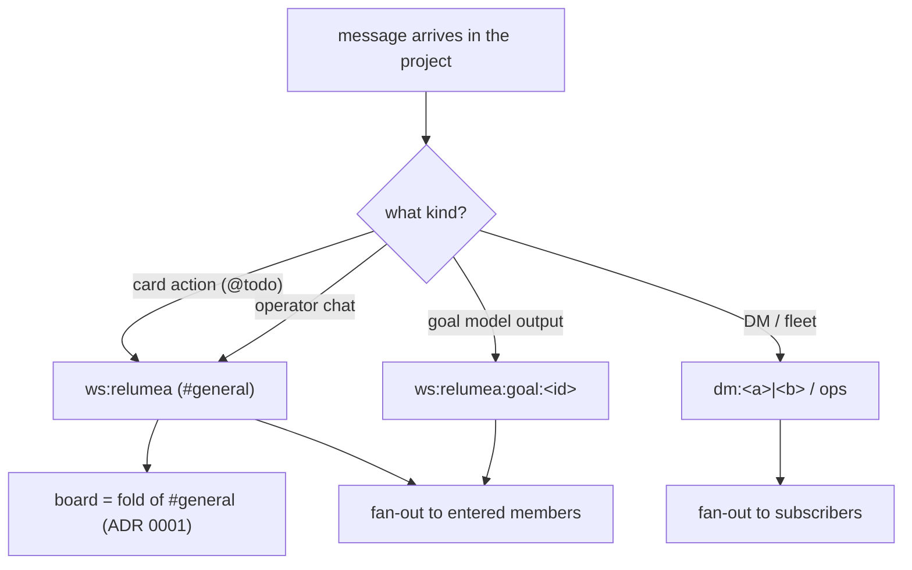
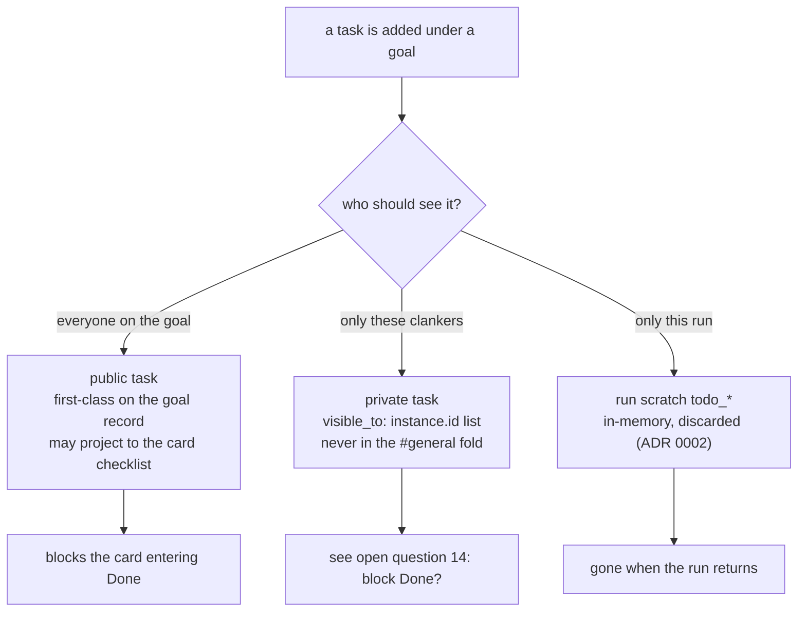
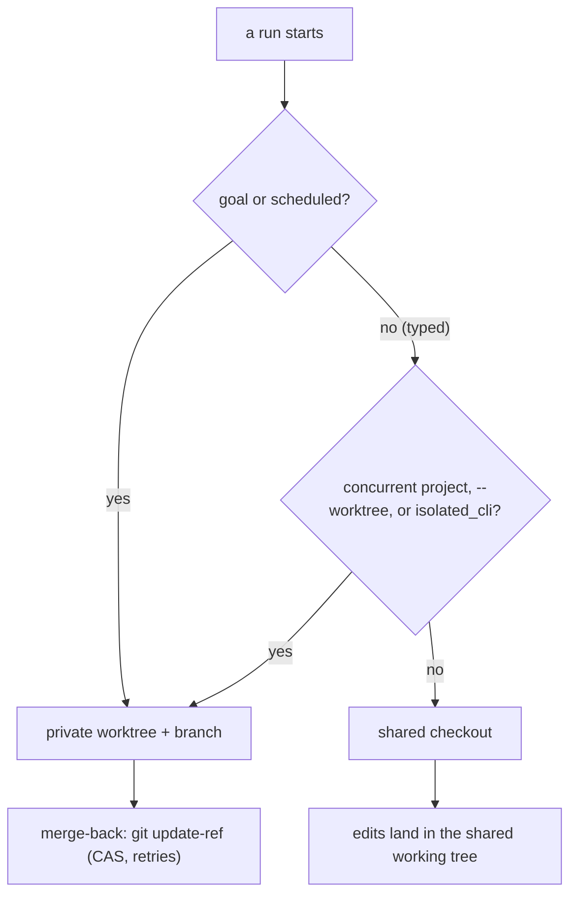
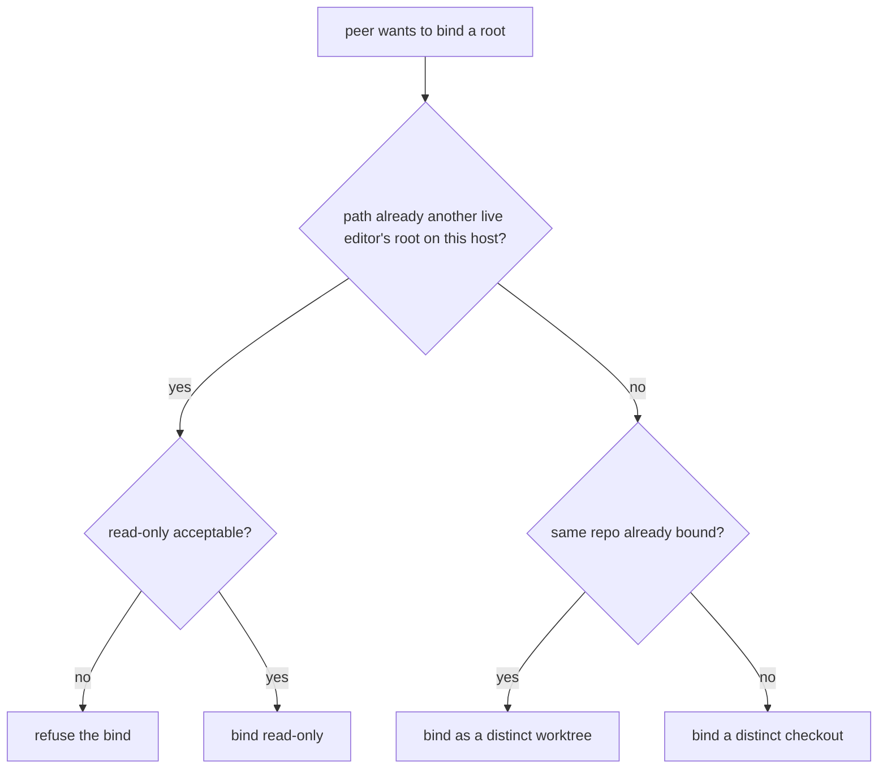
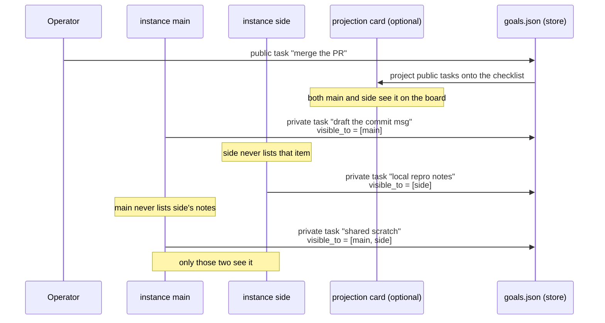

# RFC 0001 — Workspace, room, board, and folder hierarchy

## Status

Decided — 2026-08-16. Implemented as Option B (multi-root project, no
goal-is-a-card); recorded in ADR 0020. The earlier arena
(`arena-1786861439-dad384e4`) that rejected goal-is-a-card is what settled the
goal/task split.

## Overview

An operator wants to treat "the project" as one thing with several parts:
a set of folders that live in different directories, and a `#general` room that
is the project's activity feed — operator chat plus card actions, with the
board as its fold. Heavy agent work — a goal's model output — goes to its own
room rather than flooding the feed. Today those parts sit next to each other
without a declared relationship, so the next implementation will invent a
hierarchy whether we write it down or not.

The forcing examples are suites, not leaves: `relumea` is one product whose
repos are `relumea-core` and `relumea-web` in different directories, and
`~/Desktop/7dtd` is a game plus its tools. The operator wants **one board and
one `#general` feed for the project**, not one per folder, wants **a room per
goal for the actual model output** so the feed stays readable, and wants a
second clanker — a different process on the same host, or a networked
instance — to **join the project** and see the same board, feed, and folders.

**Decision to make.** How should folders, the workspace (a project), its
rooms (`#general` feed, per-goal output), goals, the tasks under a goal,
membership, and remote clanker instances relate?

**Why now.** Three follow-on changes are blocked on the same answer: bind the
default board to a workspace, put goals on the board as cards, and define
share / enter / leave for mesh Phase 3. Doing any of those against today's
implied model (one global `board` room, a workspace that is a single folder, a
session tag that is not a path, a local `workspaces.json`) will bake a shape
that the next change has to migrate.

**Drivers.**

- Do not re-litigate ADR 0001 (the board is a chatroom fold) or ADR 0012
  (draft / persist / run stay separate). A goal is **not** a card. Objective,
  criterion, proof, stop rule, and status live in `state/goals.json`. The
  board card is a projection of that record onto `#general`, the same way a
  goal room is a projection of the session. Folding the goal into `@todo`
  makes one idea live in chat and in `goals.json` at once, so drafts cannot
  persist without publishing, and edits fork (arena p6).
- A goal has **many tasks**, first-class records under that goal, not
  checklist deltas on a card. Public tasks are visible to every member
  working the goal. Private tasks are visible only to the clankers they
  name (`instance.id`). A public task may *project* onto the card
  checklist; the card is not the store. Run-private `todo_*` items still
  die with the run (ADR 0002) and never attach to a goal.
- A workspace **is** a project: one stable id over one or more named folders
  (components). The single-folder model fails the suite case by construction.
- A project owns a small **room namespace**, not one log: a default `#general`
  room that carries operator chat and card actions (the board is its fold,
  ADR 0001), and optional focused rooms — one per goal — for the goal's model
  output. The feed stays readable; heavy agent work goes to its own room.
  Per-object rooms are already the pattern (`arena-<id>`).
- Membership is uniform. The instance that owns a workspace is always in it;
  every other clanker — another process on the same host, or a networked
  instance — joins the same way, with the same verbs. Loopback is an address,
  not a mode.
- A workspace id is never a path (`src/agent/workspace.zig`: no `/` or `\`).
  A local folder path is never a global name. Component paths live on the
  home instance; a remote member maps them via an explicit bind.
- The sandbox still enforces reach. Multi-root is a sandbox change (a root
  set, not one root), and that is a security review, not a rename. File bytes
  that cross the mesh land under `state/mesh/<home-id>/files/`, never over a
  local path of the same name (PRD 0011).
- Files merge by git, state merges by home. Sharing a workspace never grants
  concurrent write access to one working tree: two live editors use distinct
  checkouts or distinct worktrees, and there is no cross-instance file lock
  (see Concurrent git access).
- One obvious way to do a thing. Mesh join/leave must not be overloaded as
  project enter/leave.
- Suites (one product, several repos) and leaves (one repo) both have to be
  first-class. `~/Desktop/Projects` itself is a drawer, not a project.
- Only another `clanker serve` can share or enter a workspace. `clanker run`,
  the REPL, subagents, A2A, and ACP are not peers.
- Same-host multi-process mesh is the same mesh. Two `clanker serve`
  processes on one box join, share, enter, leave, and bind with the same
  frames as two machines. A shared `state/` is not a mesh: that is one
  instance with two processes fighting over the same files.

**Out of scope.** Mesh transport, admission, and TLS (PRD 0011). Goal
write / add / run split (ADR 0012). Whether the board stays a chatroom
(ADR 0001). Cron. Implementing share/enter/leave in this turn. Per-root share
(share a subset of a project's folders). Roles/permissions within a project
(read-only member vs editor). Task visibility is not a project role: it is
who can see one task on one goal. A general arbitrary room hierarchy (rooms beyond
`#general` / per-goal). A UI that browses the whole mesh as one tree (PRD 0011
non-goal). Per-session exclude from a share (PRD 0011 open question).

## Current state

These pieces already exist, and already disagree about ownership. Component /
root, goal room, and bind record are missing entirely; membership has no
per-project roster yet.

| Thing | Where it lives | What it is bound to today |
|---|---|---|
| Folder | an absolute directory on one machine | the `path` on a workspace row, or the serve cwd |
| Workspace | `state/workspaces.json` (`src/agent/workspace.zig`) | **exactly one** folder + sessions tagged with that id. Empty id is the cwd and is never stored |
| Component / root | *does not exist* | a workspace cannot name a second folder today |
| Session | `state/sessions/<id>.db` (SQLite; was `<id>.json`, PRD 0044) | a single `workspace` string (`src/agent/session.zig`) |
| Chatroom | `state/chatrooms.jsonl` | a fleet-scoped named log. Subscribe is per instance, not per workspace (PRD 0001). DMs are ordinary rooms `dm:<a>\|<b>` with no folder and no board; arenas already get per-object rooms `arena-<id>` |
| Kanban | fold of a room, default `"board"` (`tools/zig/board.zig`) | the room the caller named, otherwise one global board for the instance. The board is already a room fold; there is no per-project `#general` room and no goal rooms |
| Goal | `state/goals.json` | optional `worktree` (git branch/path). No workspace field (`tools/zig/add_goal.zig`) |
| Goal room | *does not exist* | a goal's model output lives in a session, with no room of its own |
| Public task | checklist item on a card (`tools/zig/cards.zig` `subtask_*`) | the card. Folded from `@todo` in the board's room, so everyone who can see the board sees it. A card cannot enter Done until every item is complete |
| Goal-private task | *does not exist* | no durable task scoped to a goal but hidden from some members |
| Goal attach | *does not exist* | card has a `goal` link and no file or URL list (RFC 0003) |
| Membership | `state/mesh/members.json` (PRD 0011) | **mesh** membership only. No per-project roster, no enter/leave |
| Bind record | *does not exist* | nothing maps a remote project's folders to local checkouts |
| Private todos | in-memory, per run (ADR 0002) | the run, never a room |
| Mesh member | `state/mesh/members.json` (PRD 0011) | an `instance.id`. JOIN may *advertise* `share.workspaces[]` but sharing is not implied |
| Mesh CLI | `clanker mesh` (`src/peers/command.zig`) | loopback HTTP to local serve: status, join, leave, pending, admit, deny. `--webui-port` picks which serve. Not workspace enter/leave |
| Remote replica | `state/mesh/<home-id>/sessions/` (Phase 3, not built) | home instance owns the canonical transcript |

The web UI rail (`#workspace-pick`) already treats a workspace as "a folder
on this machine and its chat history". The files browser sandboxes to that
folder. The board view does not. The goals view does not. Two serves that
both register `~/Desktop/7dtd` still have two workspaces: same path is a
coincidence, not identity. Two serves started from the same checkout
without a private `state_dir` are not meshed at all: they share
`state/sessions/`, `state/chatrooms.jsonl`, and `state/workspaces.json`.
Serve's HTTP listen sets `reuse_address`, so a second process can even
bind the same web UI port; that is a collision, not a cluster.

The status quo is viable for one operator, one machine, one checkout, one
folder. It fails as soon as a project spans two folders, or a second instance
needs the same board and feed, or a long goal loop starts flooding the one
global room with model output.

## Concurrent git access

Two instances — same host or meshed — never share a live working tree. File
content is git's job; clanker coordinates only its own state. That split is what
keeps the workspace model from inventing a distributed-write mechanism.

- **Files.** Each instance edits its own checkout, or its own worktree inside a
  shared checkout. There is no live cross-instance file merge. Sharing a
  workspace grants replicated state and a bind to a local checkout, never
  concurrent write access to one tree. Across machines git is the merge (pull /
  merge / PR through `git_remote_ops`); the mesh file share
  (`state/mesh/<home-id>/files/`) is a read-only copy, not an editable mount
  (PRD 0011).
- **State.** Board, sessions, and goals merge by clanker's own rules, which do
  not depend on file merge: the board is a room fold that dedupes by message id
  (ADR 0001); sessions are home-ordered appends with read-only replicas and
  home-unreachable refuses writes (PRD 0011); goals update by compare-and-swap
  on `from`.
- **Worktree isolation.** A run that must not touch the shared checkout works in
  a private git worktree + branch (`src/improve/worktree.zig` `createOn`).
  Merge-back is `git update-ref <ref> <new> <old>` — a compare-and-swap that
  retries on contention and, on a real conflict, leaves the commit parked on the
  side branch for a human or the next run. Isolation is the default for goal and
  scheduled runs; a typed interactive run defaults to the shared checkout
  because an isolated run cannot see uncommitted work (`src/cli.zig`
  `isolateByDefault`).

Multi-root applies this per root: each root is its own git repository (or a
non-git tree with no branch), so an isolated run over N roots needs one
worktree per git root and a coordinated merge-back. Non-git roots have no
branch to isolate onto and stay shared read-only unless given their own lock
(see question 12).

Four hazards follow, and each is resolved explicitly.

1. **Same-host peers must not both edit one working tree.** Loopback is an
   address, not a mode. If two processes both `bind` the *same absolute path*
   and both run against it, they race on the working tree — git worktrees do not
   help, because a worktree is a separate directory. The rule: bind a distinct
   checkout, or bind distinct worktrees inside one shared checkout. Binding the
   identical path as a second live editor is refused (or treated as read-only),
   never silently raced.
2. **Interactive concurrency is opt-in isolation.** A typed `clanker run`
   defaults to the shared checkout, so two concurrent interactive runs on one
   instance race on uncommitted work. The escape hatches are `--worktree`,
   `[agent] isolated_cli`, `git_worktree_on`, and the `worktree` /
   `goal_worktree` defaults (`src/cli.zig` `shouldIsolate`). A workspace that
   expects concurrent work should set isolation on rather than rely on the
   default.
3. **Branch names must be instance-unique.** `createOn` builds the branch as
   `prefix + caller-supplied id` (`src/improve/worktree.zig`). Two instances
   sharing one checkout with distinct worktrees must not generate the same id,
   so the id includes `instance.id` (or a timestamp). The webui caller already
   uses a nanosecond timestamp; goal and scheduled callers must make the same
   guarantee explicit.
4. **No cross-instance file lock.** `state/improve.lock` serializes improve-self
   runs only (`src/improve/worktree.zig`). Ordinary agent runs have no lock and
   do not get one over the mesh: a mesh-wide file lock would reintroduce a home
   dependency for file writes, which is exactly what worktrees + CAS merge-back
   avoid.

## Options considered

### Option A — single-folder typed hierarchy (one folder per workspace)

- **What it is:** keep the types distinct and pin their edges, but leave a
  workspace at exactly one folder. Cross-tree work is an "extra attach" list
  of other workspace ids on the same session. The room namespace idea below
  (a `#general` feed plus per-goal rooms) applies to A too; A just keeps one
  root.

  ```mermaid
  flowchart TD
      Inst["instance (instance.id)"]
      WS["workspace — one folder (stable id)"]
      Folder["folder — exactly one"]
      Sessions["sessions — tagged with that id"]
      Extra["extra attaches — other workspace ids (cross-tree)"]
      BoardRoom["board room — board (default) / board:&lt;id&gt;"]
      Goals["goals — tagged with that id"]
      Rooms["fleet rooms (lounge, ops, dm:…) — not workspaces"]

      Inst --> WS
      Inst --> Rooms
      WS --> Folder
      WS --> Sessions
      WS --> Extra
      WS --> BoardRoom
      WS --> Goals

      subgraph Mesh["mesh verbs"]
          J["join / leave — instance membership"]
          S["share / unshare — home offers one workspace id"]
          E["enter / leave — a member subscribes to the offer"]
          B["bind — local checkout mapped to the same id"]
      end

      Inst --- Mesh
  ```

  Remote sharing is the PRD 0011 home rule plus three operator verbs:
  **share** (home offers the id), **enter** (peer takes a shadow row: same id,
  `home=<instance>`, no path), **bind** (peer maps a local checkout).

- **Maturity:** most of the types already exist. Missing: goal `workspace`
  field, `board:<id>` convention, session extra-attach list, enter/leave/bind.
- **How it would fit:** `workspace.zig` stays the local registry.
  `Session.workspace` stays the primary id; a new optional extras list holds
  the rest. `goal_add` grows a workspace field. `board.zig` already accepts
  `room`; the host default becomes `board:<ws>`.
- **Pros:**
  - Matches the files rail and the sandbox (one root) as they exist today.
  - Does not invent a second replication mechanism.
  - A laptop can enter `7dtd` without pretending it has the local path.
- **Cons:**
  - **A project with two folders is not one workspace.** `relumea` cannot be
    "one board, one feed" without either opening the parent drawer or adding
    an extra-attach list — which is exactly the multi-root idea, under a
    different name, and the "run may touch" extras still need a sandbox root
    set to be enforced (see Option B). Extra-attach is either informational
    (then it is not reach) or enforced (then it carries B's sandbox cost with
    none of B's clarity).
  - `board:<id>` forks the current global `board` room.
- **Cost to adopt:** schema additions (goal field, session extras, shadow
  rows), one board-room defaulting rule, share/enter/leave/bind surface.
- **Cost to leave:** drop the extra field and the room default. The one-way
  door is migrating cards off the global `board` room.
- **Evidence:** `workspace.zig` is already "named folder plus tagged
  conversations"; `board.zig` already takes `room`; PRD 0011 Phase 3 already
  has home + explicit share.

### Option B — multi-root project workspace (recommended)

- **What it is:** a workspace is a **project**: one stable id over one or more
  named folders (components), a small **room namespace** (a `#general` feed
  plus optional per-goal output rooms), tagged goals and sessions, and a
  membership roster. The owning (home) instance is always a member; every other
  clanker — another process on the same host or a networked instance — becomes
  a member by entering the same shared offer.

  ```mermaid
  flowchart TD
      subgraph Inst["instances (mesh members)"]
          Main["instance main — home / owner"]
          Laptop["instance laptop — peer"]
      end

      subgraph WS["workspace relumea — one project"]
          W["workspace id<br/>(stable, never a path)"]
          W --> Roots["roots — named folders: core, web"]
          W --> Gen["ws:relumea · #general<br/>chat + card actions<br/>(board = fold of this room)"]
          W --> GoalRoom["ws:relumea:goal:&lt;id&gt;<br/>per-goal model output<br/>(optional, lossy feed)"]
          W --> Goals["goals — state/goals.json, tagged to this id"]
          W --> PubTasks["public tasks: first-class on the goal"]
          W --> PrivTasks["private tasks: visible_to named instance.id"]
          W --> Sessions["sessions — tagged relumea"]
          W --> Members["members — main (home), laptop"]
          Goals --> PubTasks
          Goals --> PrivTasks
      end

      subgraph Fleet["fleet rooms — not projects"]
          DM["dm:&lt;a&gt;|&lt;b&gt;<br/>direct messages"]
          Ops["ops / other fleet rooms"]
      end

      Main --- W
      Laptop -.->|enter/leave| Members
      Main --- Fleet
      Laptop --- Fleet
  ```

  **A room namespace, not one log.** ADR 0001 already made the board a chatroom
  fold, so the project's default room `ws:<id>` (shown as `#general`) is the
  board *and* the project feed: card actions are `@todo` messages the fold
  picks out, operator chat is everything else. A goal may get an optional
  `ws:<id>:goal:<goal-id>` room for its actual model output — turns, decisions,
  diffs — so a long goal loop does not flood the feed. The board stays one fold
  over `#general`; goal rooms are output feeds. A goal is a `goals.json`
  record tagged to the workspace; the board card (if any) is a projection of
  that record, not the record. The empty-id (cwd)
  workspace keeps today's `board` room as its `#general`, so existing logs do
  not move.

  **A goal has many tasks.** The goal is the parent; the tasks are the work
  under it. Two visibilities, one store:

  | Kind | Who sees it | Where it lives | Survives the run? |
  |---|---|---|---|
  | Public task | every member who can see the goal | first-class on the goal record; may project onto the card checklist | yes |
  | Private task | only the named `instance.id`s | same goal record, `visible_to: []instance.id`; **not** in the `#general` fold | yes |
  | Run scratch | the run that created it | in-memory `todo_*` (ADR 0002) | no |

  Public tasks can appear as a checklist on the projection card so the
  board still shows shared work. The card is not the store: creating a
  draft (`write-goal`) must not publish `@todo` fields, and a persist
  (`add-goal`) writes `goals.json` without requiring a card action.
  Private tasks never land in `#general`. ADR 0002 run scratch stays the
  third layer: a turn's "check the gate then patch" notes die with the run
  unless someone promotes them with an explicit public or private add.

  **Two different canonical rules.** The board's room *is* the board's source
  of truth (ADR 0001: there is no `board.json`). A goal's source of truth is
  `state/goals.json`. The card and the goal room are both projections: the
  card of the goal record, the room of the session transcript (PRD 0011
  home). Making the card the goal (or making the goal room canonical for
  output) re-creates the two-stores-for-one-idea problem ADR 0001 closed,
  and it also breaks ADR 0012: a draft cannot stay off the board.

  ```mermaid
  sequenceDiagram
      participant Goal as Goal loop (agent)
      participant GR as ws:relumea:goal:&lt;id&gt;
      participant Gen as ws:relumea (#general)
      participant Peers as Entered members

      Goal->>GR: post model output (turns, decisions, diffs)
      GR->>Peers: fan-out to subscribers
      Goal->>Gen: card action — @todo move / claim / log
      Gen->>Peers: fan-out board update to subscribers
      Note over Gen,Peers: the board is the fold of #general (ADR 0001)
  ```

  **Membership is uniform.** The home process owns its workspaces and is always
  in them — no local join needed. A second process on the same host is a loopback
  mesh peer and enters exactly like a networked instance: `share` on home,
  `enter` on the peer (subscribe to the project's rooms, take replica sessions
  under `state/mesh/<home-id>/sessions/`, optionally `bind` local folders),
  `leave` to unsubscribe. `bind` is always explicit, and two processes on one
  host must bind distinct checkouts or distinct worktrees — never the same
  working tree as two live editors (see Concurrent git access).

  **Folders reach a member two ways.** For editing, the member `bind`s a local
  checkout (git is the file merge, PRD 0011). For reading without a checkout,
  shared file bytes land under `state/mesh/<home-id>/files/` — never over a
  local path of the same name.

- **Maturity:** multi-root is VS Code's default for "this product is several
  folders", and it is the fix for the single-cwd gap Claude Code operators file
  ([anthropics/claude-code#47983](https://github.com/anthropics/claude-code/issues/47983),
  open as of 2026-08). The
  [repo-of-repos](https://www.raffertyuy.com/raztype/repo-of-repos-pattern/)
  and
  [multi-repo workspace](https://medium.com/@sunghyunroh/multi-repo-workspace-strategy-the-structure-where-ai-coding-agents-actually-shine-4ed6b87fb11d)
  writeups are the same conclusion from the other direction: people invent an
  *outer* object to hold N folders. We already have the outer object — the
  workspace id — it just holds one path today. Per-object rooms are already
  established (`arena-<id>`), so per-goal rooms are the same pattern.
- **How it would fit:** `Workspace.path: []const u8`
  (`src/agent/workspace.zig:30-35`) becomes `roots: []Root` with `{name, path}`.
  `workspaceSandboxPath` (`src/cli.zig:11255`) and `openWorkspaceRoot`
  (`src/cli.zig:11261`) return a root **set** instead of one directory; the
  files browser takes a root/component selector. The run sandbox root
  (`run_cfg.agent.sandbox_root`, `src/cli.zig:12908`) becomes a set, and
  `fs_prefixes` — already a list, and today validated as "relative to the
  sandbox root" (`src/toolhost/manifest.zig:493`) — needs a disambiguator for
  which root a prefix is relative to. The default board room moves from the
  global `board` to the project's `ws:<id>` (`#general`), empty-id keeps
  `board`; goal rooms are created on demand under `ws:<id>:goal:<id>` and are a
  feed over the session, not a store. Goal/session fields are the same additive
  change as A. Mesh Phase 3 guests `workspace_share` as specified;
  enter/leave/bind are the operator surface on that offer, not new frame kinds.
- **Pros:**
  - The suite case is the default, not an attach: `relumea` is one project with
    two roots, one board, one `#general` feed — which is what "the relumea
    board" means.
  - The feed stays readable: a goal's model output lives in its own room, while
    card actions and operator chat stay in `#general`. The board remains one
    consistent fold.
  - Membership is one set of verbs for local, loopback, and networked clankers;
    only the address differs.
  - Does not invent a second replication mechanism (board rides the room,
    sessions ride PRD 0011 home).
  - A leaf opened alone is just a project with one root — the same shape, no
    special case.
- **Cons:**
  - The sandbox's single-root assumption must become a root set. That is the
    first security-sensitive change in this RFC and must be spiked, not assumed.
  - A leaf opened alone and the same folder as a root of the suite become two
    names for one tree.
  - Sharing a project shares all its roots; per-root share is a follow-up.
  - Remote bind is N checkouts, not one.
- **Cost to adopt:** workspace schema (roots list), files API + sandbox root
  set, board-room defaulting rule + goal-room creation, membership roster,
  share/enter/leave/bind surface. This is the largest option and the one real
  cost.
- **Cost to leave:** sessions and shares that refer to a multi-root id must be
  split back into single-root workspaces (a data migration); the sandbox root
  set reverts to one root; goal rooms can be dropped and the fold moved back to
  the global `board`.
- **Evidence:** VS Code multi-root; Claude Code
  [#47983](https://github.com/anthropics/claude-code/issues/47983) is the
  single-folder complaint; repo-of-repos and multi-repo-workspace writeups
  both conclude "outer object holds N repos". Eric Ma,
  [cross-repo agents](https://ericmjl.github.io/blog/2025/11/17/how-to-reference-code-across-repositories-with-coding-agents/):
  operators already attach extra paths by telling the agent the other path —
  a roots list makes that a named field instead of a prompt convention.
  `fs_prefixes` is already a list (`src/sandbox/host.zig:178`); the single
  assumption is the root *directory*, not the prefix type. `arena-<id>` rooms
  (`tools/zig/lib.zig`) show per-object rooms are an existing convention.

### Option C — collapse the types

- **What it is:** chatroom = workspace = folder. One name, one log, one path,
  the board is that room's fold. Entering a workspace is joining a room.
- **Maturity:** how a lot of chat products feel; also how this repo looked
  before `workspace.zig` existed.
- **How it would fit:** delete `workspaces.json` or make it room metadata.
  `Session.workspace` becomes the room name. Mesh JOIN `share.rooms[]` is the
  only share list.
- **Pros:** fewest nouns; board, chat, and "where are we" cannot disagree.
- **Cons:** a folder is not a log. A laptop that has not bound a checkout still
  needs a room, and a room still needs a path on *some* machine; collapse hides
  that split. Fleet lounge and `ws:relumea` are different kinds of room.
  Forcing every room to have a folder either pollutes the drawer or makes
  "folder" optional — which is B with worse names. ADR 0001 said the board
  rides a room, not that a room *is* a workspace.
- **Evidence:** PRD 0001 rooms have no path; DMs (`dm:<a>|<b>`) are rooms with
  no folder. PRD 0011 JOIN carries *both* `share.workspaces[]` and
  `share.rooms[]` — the design already says they are not the same set.

### Option D — status quo

- **What it is:** keep today: workspace is one local folder plus a session tag,
  one global `board` room, goals untagged, no enter/leave.
- **Pros:** zero migration.
- **Cons:** a project spanning two folders has no name; a second instance cannot
  enter a project as a first-class act; goals remain instance-global; a goal
  loop's model output floods the one global `board` room; the next "board per
  workspace" change guesses a room name in the dark.
- **Evidence:** `Session.workspace` is a single string; `add_goal.zig` has
  `worktree` and no workspace; `board.zig` defaults to `"board"`.

### Option E — out of the box: cwd is the workspace, git is identity

- **What it is:** delete the registry; the workspace *is* the process cwd.
  Cross-machine identity is `(git remote, HEAD)`. A second instance "enters" by
  cloning the same remote. No `workspaces.json`, no share verb, no shadow rows.
- **Maturity:** the default for most CLI coding agents, and why they grow
  `CLAUDE.md`/`AGENTS.md` at the repo root and then invent outer repos.
- **Pros:** no new identity; git is already the file merge; `clanker run` in a
  checkout is already this.
- **Cons:** non-git trees (notes, `7dtd` game data, a mixed drawer) have no
  identity; two clones of one remote need a disambiguator, which is a registry
  again; the board is not in git; home-instance for sessions is still required.
  The first suite forces an outer object — the same conclusion as B.
- **Evidence:** Claude Code #47983; Eric Ma cross-repo (the workaround is "tell
  the agent the other path", i.e. B's roots list done by hand).

## Implications by horizon

### Short term (this release / 0–3 months)

- **If B:** add `workspace` on goals; default the board room to `ws:<id>`
  (`#general`) when a non-empty workspace is selected (empty-id keeps `board`
  so today's log does not move); add a membership roster row (owner + entered
  members); keep `goals.json` as the store, tasks first-class on the goal,
  card as a projection of public tasks only. **Spike the sandbox root set before anything else**:
  it is the only irreversible-enough change and the only security-sensitive one.
- **If A:** add `workspace` on goals; default `board:<id>`; extra-attach stays
  an open question.
- **If C:** rename in the UI only, or accept rooms-without-folders leaking.
- **If status quo:** ship nothing; the next board or goals change guesses.
- **If E:** delete or ignore `workspaces.json`; break the files rail for any
  registered non-cwd folder.

### Medium term (3–12 months)

- **If B:** mesh Phase 3 implements share/enter/leave/bind against a locked
  model. Two machines bind the same id to different checkouts; git merges files,
  home merges transcripts. The files browser shows the project's roots as a
  selector. Goal rooms are created on demand as feeds over their sessions; the
  board stays one fold over `#general`.
- **If A:** the first real suite pushes the extra-attach list into being a de
  facto multi-root, or the operator opens the parent drawer.
- **If C:** fleet rooms and project rooms fight for the same picker; someone
  re-adds "this room has no folder".
- **If status quo:** each surface grows a private notion of "current project";
  they drift.
- **If E:** every suite becomes a super-repo or a pile of absolute paths in
  prompts.

### Long term (12+ months)

- **If B:** the type list is stable. New objects (schedules, arenas, knowledge
  collections) attach to a workspace id the way sessions do, or stay
  instance-global on purpose. The residual tax is teaching share ≠ enter ≠
  join.
- **If A:** we revisit this RFC when the multi-root requirement bites.
- **If C:** we reintroduce workspaces under another name ("project rooms",
  "pathed rooms").
- **If status quo:** a later RFC is this file, with a larger migration.
- **If E:** we track other agents' outer-repo conventions instead of our own
  types.

## Recommendation

**Recommended option:** Option B for the project (multi-root workspace, `#general`
plus optional per-goal rooms, share/enter/leave/bind), **without**
goal-is-a-card. `state/goals.json` stays the store. Tasks are first-class
records on the goal (public, or private to named `instance.id`s). The board
card is an optional projection of the goal, never the record.

**Confidence:** 7/10

**Why this confidence.** A 6-combatant arena
(`state/arena/arena-1786861439-dad384e4`) argued the suite, sandbox-root,
and two-stores cases. Official HP was a draw (several empty-reply forfeits
inflated p4/p5). The argument that survived contact is p6: multi-root B
holds the suite, and making the goal a card splits one idea across
`goals.json` and `@todo`, which breaks ADR 0012. p4 (collapse) and p5
(cwd+git identity) still fail non-git trees, DMs-without-folders, and
home-ordered sessions, so they stay rejected. What holds the score at 7
is that B still carries the first
security-sensitive change in this RFC: the sandbox's single root becomes a root
set, and `fs_prefixes` "relative to the sandbox root" must be redefined against
N roots. Confidence rises to 7–8 if a spike shows a root set can be enforced
without weakening `fs_prefixes`, and if the `ws:<id>` / `ws:<id>:goal:<id>`
naming folds chat + board + goal output without breaking the existing `board`
log. It sinks if the root set proves too expensive and A's extra-attach is
enough in practice (operators open leaves alone more than suites), or if the
suite really is "share the whole drawer", which no option here endorses.

**Rationale.** A keeps the sandbox simple and loses the very case the operator
named as the requirement. C looks like fewer nouns and then immediately needs
optional folders and two kinds of room. E is the right *file* merge (git) and
the wrong *session* merge (home still orders appends; non-git trees still need
an id). Status quo is not a decision, it is a deferral while the drift accrues.
B is the only option where "the relumea board", "the relumea `#general`", "the
relumea goal rooms", and "join relumea from another machine" all mean one
thing. Its room namespace is not a new mechanism: rooms are already cheap named
logs with a `:` convention (`dm:`) and per-object rooms (`arena-<id>`), so
`#general` and per-goal rooms are just names in that space. The cost B adds — a
sandbox root set — is real and must be spiked first, but it is the cost of the
requirement, not a reason to pretend the requirement does not exist.

**Reversibility.** Additive fields (goal card fields, membership roster, goal
rooms, bind records) are easy to ignore. The points of no return are:
creating `ws:<id>` (`#general`) board rooms and moving cards onto them (the old
`board` log stays put and keeps serving the empty-id workspace), advertising
multi-root workspace ids over the mesh as if stable, and the
`roots` list itself (splitting a multi-root id back into single-root workspaces
is a data migration). Do not migrate the existing `board` log until a second
project actually needs its own board; keep `board` as the empty-id workspace's
`#general` room forever. Spike the root set before committing to it.

## Open questions

1. **Room namespace separator collision.** Workspace ids currently allow `:`
   (`validName` rejects only controls and `/`, `\`), so `ws:<id>:goal:<id>` is
   ambiguous when a workspace id is literally `relumea:goal`. Bias: reject `:`
   in workspace ids (or reserve a separator). Who: this RFC.
2. **Sandbox root-set semantics.** Do `fs_prefixes` grant "any root" or name a
   specific root? How do callers that assume one root (`openWorkspaceRoot`,
   `workspaceSandboxPath`) get upgraded without a global `chdir` race? This is
   the spike that gates B. Who: whoever implements the files/sandbox change.
3. **Is the goal room opt-in, and how much output does it hold?** Created on
   demand, default off? Full model output or lossy summaries? Bias: opt-in;
   summaries by default, full output only on request, because the session is
   the canonical transcript.
4. **Is the goal room canonical for goal output, or a projection over the
   session?** Bias: projection — the session (PRD 0011 home) is the durable
   record, the room is a lossy feed. Making the room canonical duplicates the
   session and re-opens the two-stores problem ADR 0001 closed.
5. **Component naming and bind identity.** Are roots keyed by a local name
   (`core`, `web`) that bind matches by name, or does a root carry its own
   stable id so two checkouts of the same root can be told apart? Bias: named,
   explicit; matching by basename is the `7dtd`-vs-`7dtd` collision.
6. **Membership roles.** Is entering read-write, or do we need a read-only
   "watch" member? Bias: read-write for v1, roles are a follow-up.
7. **Per-root share.** Does `share` offer the whole project, or can home offer
   a subset of roots? Bias: whole project first; subset later.
8. **Rename "workspace" to "project"?** The operator thinks "project", the code
   says `workspace`. Bias: keep `workspace` for continuity with `workspace.zig`
   and `Session.workspace`; the rename is cosmetic and can happen later.
9. **Home-unreachable continues to refuse writes (PRD 0011), or do we want a
   later fork-and-reconcile?** Out of scope here; raising it so B's laptop story
   is not silently oversold.
10. **Same-path bind: refuse or read-only?** When a peer tries to bind a path
    that is already another instance's live sandbox root on the same host, do we
    refuse the bind, or accept it read-only? Bias: refuse for a write bind;
    read-only is a separate, later grant.
11. **Should concurrent work force isolation?** Typed interactive runs default
    to the shared checkout today. For a workspace that is expected to be worked
    by more than one instance at once, should isolation become the default (or a
    per-workspace setting)? Bias: a per-workspace `concurrent` flag, off by
    default, on for meshed / shared projects.
12. **Multi-root × worktree isolation.** An isolated run over N roots: one
    worktree per git root, or does isolation apply to only one root? What
    happens to non-git roots? Bias: one worktree per git root; non-git roots
    stay shared read-only, and a run that must write a non-git root takes an
    explicit lock.
13. **What does the projection card show?** Bias: title, status, and public
    task progress. Criterion, proof, and stop_rule stay on `goals.json`.
    The card is rebuilt from the goal, never the other way around.
14. **Do private tasks block Done?** Public checklist items already do
    (`cards.checklistComplete`). Bias: a member cannot mark the goal Done
    while it still has *that member's* open private tasks; other members do
    not see those items and are not blocked by them. Home still holds the
    full set so a goal loop on home can wait. Who: this RFC.

## Next steps / action items

- [x] `clanker mesh` instance membership (status / join / leave / pending /
      admit / deny) over local serve. Workspace enter/leave is still Phase 3.
- [ ] Comment on this RFC, especially Option B (multi-root) vs A (single-root +
      extra-attach) given suites are a hard requirement.
- [x] Spike: sandbox root set — can N roots be enforced without weakening
      `fs_prefixes`? This is the gate for Option B. Implemented: `workspace.roots`
      is a named set; the run sandbox carries `agent.sandbox_roots`, and a
      relative guest path whose first component names a root resolves under that
      root with the same `fs_prefixes` grant checked against the remainder.
      `workspace.validName` now rejects `:` (question 1).
- [x] Spike: default the board room to `ws:<id>` (`#general`) when the selected
      workspace is non-empty, leave `board` for the cwd workspace, confirm the
      existing fold still reads. Implemented: `agent.workspace_id` injects the
      room into the board tool's config; the empty workspace keeps `board`.
- [x] Spike: add `workspace` to `goal_add` / `goal_update` as an optional field
      defaulting to the current rail id.
- [x] Spike: public and private tasks live on the goal record (`Goal.tasks`,
      `visible_to`); the store and `goal_update` task ops are first-class, and
      the web UI board mirror projects public tasks onto the card checklist
      (stable task-id `subtask_add`/`subtask_toggle`). Done-blocking for
      private tasks stays open (question 14).
- [x] Arena on this RFC (`arena-1786861439-dad384e4`, 6 positions): keep
      multi-root B, drop goal-is-a-card.
- [ ] Add a per-workspace membership roster (owner + entered members) as part of
      mesh Phase 3; share / enter / leave / bind are operator verbs on
      `workspace_share`, not new frame kinds. The `members` roster field is on
      the record (owner first); enter/leave/bind are still Phase 3.
- [x] Do not migrate the current `board` room.
- [ ] Spike: refuse (or mark read-only) a same-path bind that would make two
      processes edit one working tree (Phase 3); `instance.id` is now folded
      into worktree branch ids (`branchInstanceTag`), so two instances cannot
      generate the same branch.

## References

- [ADR 0020 — A workspace is a multi-root project whose board is its #general room](../adrs/0020-a-workspace-is-a-multi-root-project-whose-board-is-its.md)
- [ADR 0001 — The Kanban board is a chatroom](../adrs/0001-board-is-a-chatroom.md)
- [ADR 0002 — Private run todos vs the shared board](../adrs/0002-private-todos-vs-shared-board.md)
- [ADR 0012 — Goal draft, persistence, and execution are separate](../adrs/0012-goal-draft-persistence-and-execution-are-separate.md)
- [RFC 0003: Attachments on a goal card (files and links)](0003-goal-card-file-attachments.md)
- Arena match `state/arena/arena-1786861439-dad384e4` (6 positions, DeepSeek,
  3 rounds, self-judge; official draw; adopted reasoning is p6)
- [PRD 0001 — Chatrooms](../prds/0001-chatrooms.md)
- [PRD 0002 — Shared Kanban board](../prds/0002-kanban-board.md)
- [PRD 0011 — Clanker mesh](../prds/0011-clanker-mesh.md) (Phase 3
  shared workspaces, home instance, `workspace_share`)
- `src/agent/workspace.zig`, `src/agent/session.zig`,
  `src/cli.zig` (`openWorkspaceRoot`, `workspaceSandboxPath`),
  `src/sandbox/host.zig` (`fs_prefixes`),
  `src/toolhost/manifest.zig` (prefix "relative to the sandbox root"),
  `tools/zig/board.zig`, `tools/zig/add_goal.zig`, `tools/zig/lib.zig`
  (`arena-<id>` rooms)
- Claude Code
  [multi-project workspace issue #47983](https://github.com/anthropics/claude-code/issues/47983)
  — single-cwd agents hit suites and file it as a product gap
- [Repo-of-repos](https://www.raffertyuy.com/raztype/repo-of-repos-pattern/)
  and [multi-repo workspace strategy](https://medium.com/@sunghyunroh/multi-repo-workspace-strategy-the-structure-where-ai-coding-agents-actually-shine-4ed6b87fb11d)
  — prior art for an *outer* object holding many repos
- Eric Ma,
  [cross-repo agents](https://ericmjl.github.io/blog/2025/11/17/how-to-reference-code-across-repositories-with-coding-agents/)
  — operators already attach extra paths by telling the agent; a roots list
  names that instead

## Appendix

### Object relationships (cardinality)

Cardinality reads left → right. The three many-to-many edges are the ones with
a real join record; the rest are foreign keys or derived views.

| Left | Right | Cardinality | Join / where it lives |
|---|---|---|---|
| Instance | Workspace | **N:N** | membership roster on the workspace's home — home owns it, peers enter/leave |
| Instance | Root | **N:N** | bind record: (instance, root) → local checkout path on the member |
| Instance | Room | **N:N** | per-instance subscription (`chatrooms-sub.json`) |
| Workspace | Root | 1:N | `workspace.roots[]` |
| Workspace | Room | 1:N | room namespace: `ws:<id>` (#general) and `ws:<id>:goal:<id>` |
| Workspace | Goal | 1:N | `goal.workspace` on the `goals.json` record |
| Workspace | Session | 1:N | `session.workspace` |
| Instance (home) | Session | 1:N | home owns the canonical transcript; entered peers hold read-only replicas (PRD 0011) |
| Room | Board | 1:0..1 | only `#general` folds a board (ADR 0001); goal and fleet rooms do not |
| Board | Card | 1:N | cards are `@todo` messages in the board's room |
| Goal | Card | **1:0..1 (projection)** | optional board card in `#general` mirrors the goal; `goals.json` is the store |
| Goal | Task | **1:N** | first-class records on the goal; public may project to the card checklist; private use `visible_to` |
| Goal | Knowledge collection | **1:0..1** | `goal-<id>` via `add_doc` (RFC 0003); file or URL; card lists names |
| Task | Instance | N:N | public: every project member; private: only the named `instance.id`s |
| Goal | Room | 1:0..1 | `ws:<id>:goal:<card-id>`, created on demand, chat/status only |

Fleet rooms (`dm:<a>|<b>`, `ops`) are rooms with no folder, so they map to zero
workspaces — the 0-side of `Workspace : Room`.

### Flows and decision flows

**Message routing — which room does a message go to?**



**Task visibility: public to the goal, or private to named clankers?**



**Run isolation — worktree or shared checkout?**



**Bind a path — refuse, read-only, or bind?**



### User journey — two instances enter and leave a project

```mermaid
sequenceDiagram
    participant Main as instance main (home)
    participant Laptop as instance laptop (peer)

    Note over Main,Laptop: both admitted to the mesh (join already handled)
    Main->>Laptop: share relumea
    Laptop->>Main: enter relumea
    Main-->>Laptop: membership row (home = main)
    Laptop->>Laptop: subscribe ws:relumea + goal rooms
    Main-->>Laptop: replica sessions under state/mesh/main/sessions/
    Laptop->>Main: bind core, web (local checkouts)
    Note over Main,Laptop: laptop sees board, #general, goals, and folders
    Laptop->>Main: leave relumea
    Note over Main,Laptop: drop membership + unsubscribe; home data stays
```

### User journey — local operator starts a goal

```mermaid
sequenceDiagram
    participant Op as Operator (main)
    participant WS as workspace relumea
    participant Goal as Goal loop
    participant GR as ws:relumea:goal:&lt;id&gt;
    participant Gen as ws:relumea (#general)

    Op->>WS: create project (roots core + web)
    Op->>Goal: start goal
    Goal->>GR: create goal room (on demand)
    loop each turn
        Goal->>GR: post model output
        Goal->>Gen: update board card
    end
    Goal->>Gen: card moved to Done
```

### User journey: public and private tasks on one goal



### User journey — meshed peer binds and merges

```mermaid
sequenceDiagram
    participant Peer as laptop (peer)
    participant Home as main (home)
    participant Repo as git remote (authoritative)

    Peer->>Home: enter relumea — subscribe rooms + replica sessions
    Peer->>Peer: bind core, web to local clones
    loop work on a goal
        Peer->>Peer: edit in a private worktree (branch)
        Peer->>Repo: commit + push (git_remote_ops)
        Peer->>Home: card action → ws:relumea (#general)
    end
    Note over Peer,Repo: file content merges by git; board and session state merge by home
    Peer->>Home: leave relumea
```

Same picture, two processes on one host. Loopback is the address; membership is
unchanged — but the file rule still applies: two live editors on one host use
distinct checkouts or distinct worktrees, never the same working tree. The home
process is always a member of its own workspaces — no local join — and a second
process on the same box enters exactly like a remote one.

```
instance "main"                         instance "side"
  [instance] id = "main"                  [instance] id = "side"
  [mesh] listen_port = 7420               [mesh] listen_port = 7421
  [serve] webui_port = 17921              [serve] webui_port = 17922
  [agent] state_dir = "state"             [agent] state_dir = "state-side"

from side:  mesh join 127.0.0.1:7420
from main:  share relumea
from side:  enter relumea
            bind core ~/code/relumea-core        # distinct checkout, not main's path
            bind web  ~/code/relumea-web
            # or: bind the same repo, then run in distinct worktrees
```

Starting a second serve in the same checkout with no private `state_dir` is not
this. That is two processes on one instance.

### Operator disk (why the drawer is not a project)

```
~/Desktop/7dtd                  project (roots: game + tools)
~/Desktop/Projects/             drawer, never a project
  relumea/                      (folder only if it has a repo of its own)
  relumea-core/                 root of project "relumea"
  relumea-web/                  root of project "relumea"
  other-app/                    project with one root
```

The project is `relumea`, not `relumea-core` + `relumea-web` opened separately
and not the `Projects/` drawer. A leaf (`other-app`) is a project with one root
— the same shape, no special case.

### Who can share or enter

| Process | Mesh member? | Can share / enter a workspace? |
|---|---|---|
| Another `clanker serve` (other machine or same host) | after admit | yes, same frames |
| `clanker run` / REPL / `clanker mesh …` | no (loopback client of local serve) | no |
| Subagent / swarm child | no (same process) | no |
| Foreign A2A agent | no | no |
| ACP editor | no | no |
